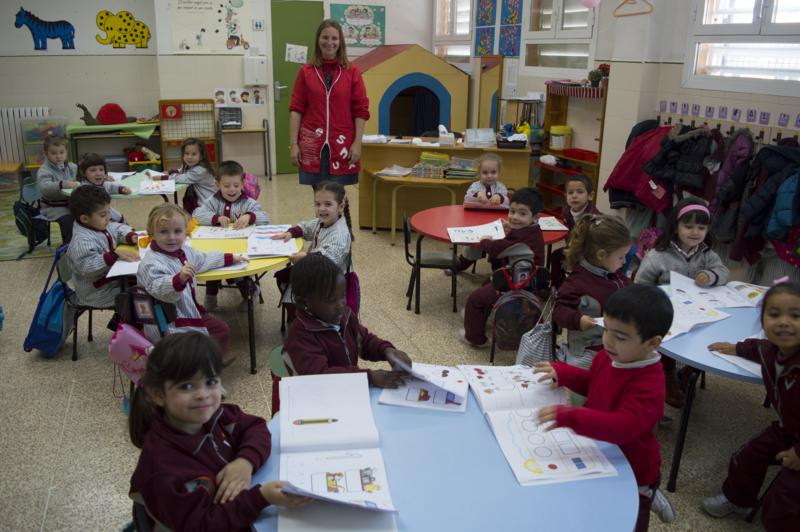
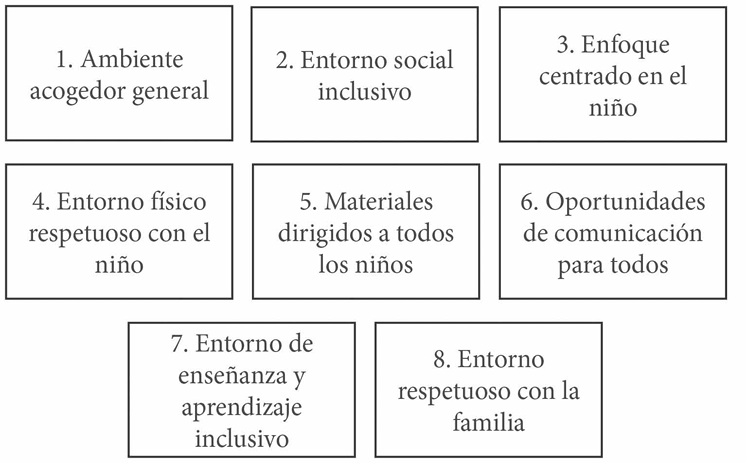
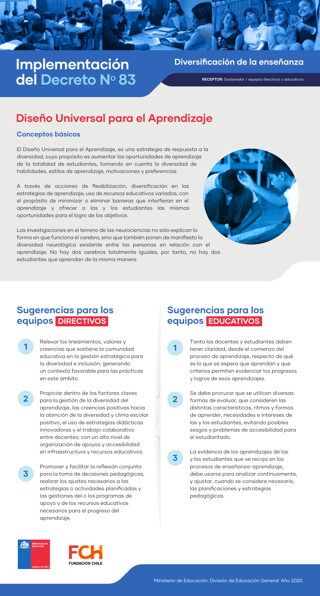

## 1.1. Fundamentos didácticos y Diseño Universal del Aprendizaje

Esta unidad desarrolla una base **universitaria y aplicada** sobre inclusión educativa y Diseño Universal para el Aprendizaje (DUA). El objetivo es comprender cómo se conecta la teoría pedagógica con decisiones reales de planificación, intervención y evaluación en el aula.



_Contexto real de aula para situar la organización del aprendizaje inclusivo._

## Objetivos de aprendizaje

- Explicar la inclusión educativa como derecho, principio ético y criterio de calidad.
- Relacionar el DUA con la planificación curricular y la evaluación formativa.
- Analizar barreras de acceso, participación y aprendizaje en contextos reales.
- Diseñar propuestas de aula con apoyos multinivel, cooperación y co-docencia.
- Argumentar decisiones didácticas con base normativa y evidencia pedagógica.

## Vocabulario clave

| Término | Definición didáctica |
|---|---|
| Inclusión educativa | Proceso de diseño y mejora escolar para que todo el alumnado participe, aprenda y progrese sin exclusión. |
| Barrera para el aprendizaje | Obstáculo del contexto (metodología, organización, evaluación o cultura) que dificulta participación y logro. |
| DUA | Marco de planificación curricular flexible que propone múltiples formas de implicación, representación y expresión. |
| Andamiaje | Ayuda temporal y ajustada que permite avanzar hacia mayor autonomía. |
| Co-docencia | Planificación, enseñanza y evaluación compartidas entre docentes en un mismo grupo. |
| Evaluación formativa | Recogida de evidencias y feedback durante el proceso para mejorar el aprendizaje. |

## 1. Educación inclusiva y calidad para todos

La inclusión educativa supone un **compromiso institucional** que va más allá de atender casos individuales. Implica revisar cultura, políticas y prácticas para garantizar la presencia, la participación y el progreso de todo el alumnado, con especial atención a quienes afrontan mayor riesgo de exclusión.

Desde este enfoque, la diversidad no es una excepción que corregir, sino una condición estructural de cualquier grupo humano. Una educación de calidad es la que anticipa esa diversidad y organiza apoyos para que nadie quede fuera del proceso de aprendizaje.

### 1.1. ¿Qué significa inclusión educativa?

La inclusión se entiende como un proceso continuo que persigue:

- Reducir barreras para aprender y participar.
- Aumentar oportunidades de éxito en condiciones de equidad.
- Reconocer la voz del alumnado y de las familias en la toma de decisiones.

No es una intervención puntual, sino un criterio para analizar todo el funcionamiento del aula y del centro.

### 1.2. Barreras habituales y respuestas educativas

En la práctica, las barreras pueden aparecer en:

- **La cultura escolar**: expectativas bajas, estereotipos o decisiones paternalistas.
- **La organización**: tiempos rígidos, agrupamientos cerrados o recursos de difícil acceso.
- **La metodología**: tareas homogéneas, una sola vía de explicación y una sola vía de evaluación.
- **La evaluación**: predominio de pruebas únicas y escaso feedback para mejorar.

La respuesta educativa consiste en **anticiparse**: diseñar contextos flexibles, graduar ayudas y ajustar la enseñanza sin bajar expectativas de aprendizaje.



_Imagen de referencia del tema base de la unidad._

## 2. Marco normativo y de derechos

La inclusión no depende solo de la buena voluntad docente; está respaldada por marcos internacionales y estatales que orientan la práctica educativa.

- **UNESCO (Salamanca, 1994):** plantea la escolarización inclusiva como principio de justicia educativa.
- **ODS 4 (Agenda 2030):** exige educación inclusiva, equitativa y de calidad.
- **LOMLOE (España):** refuerza el enfoque competencial, la equidad y la personalización del aprendizaje.
- **RD 95/2022 (Infantil):** promueve metodologías activas, observación sistemática y atención a la diversidad.

Este marco legitima decisiones organizativas como apoyos en aula ordinaria, flexibilización metodológica y evaluación formativa.

### 2.1. Tabla comparativa: integración vs inclusión

| Enfoque | Pregunta central | Respuesta educativa habitual | Riesgo pedagógico |
|---|---|---|---|
| Integración | ¿Cómo incorporamos a quien queda fuera? | Adaptaciones puntuales sobre currículo ya cerrado | Que la diversidad se trate como excepción |
| Inclusión | ¿Cómo diseñamos para que todos participen desde el inicio? | Planificación universal, apoyos multinivel y evaluación flexible | Requiere coordinación y reflexión docente continua |

La lógica inclusiva desplaza el foco desde la "adaptación posterior" hacia el diseño universal previo.

## 3. Diseño Universal del Aprendizaje (DUA)

El DUA propone diseñar el currículo de forma **flexible y accesible** para todo el alumnado. En lugar de adaptar después, se planifica desde el inicio para ofrecer **múltiples caminos** de acceso, participación y expresión.

El modelo se articula en tres principios:

1. **Múltiples formas de implicación** (motivación, interés, autorregulación).
2. **Múltiples formas de representación** (diversidad de formatos para acceder a la información).
3. **Múltiples formas de acción y expresión** (diversas formas de mostrar lo aprendido).



_Infografía en español para reforzar la comprensión de los principios del DUA._

### 3.1. Implicación: motivar para participar

La implicación se refiere a **cómo se engancha el alumnado** a la tarea. Se favorece mediante:

- Elección entre actividades o materiales.
- Metas claras y alcanzables.
- Ritmos flexibles y apoyos emocionales.
- Estrategias de autorregulación (rúbricas simplificadas, diarios de aprendizaje, metas personales).

### 3.2. Representación: múltiples formas de acceso

La representación consiste en ofrecer **diferentes canales** para comprender la información:

- Textos con apoyos visuales y auditivos.
- Material manipulativo.
- Lenguaje claro y ejemplos cercanos.
- Andamiajes cognitivos: organizadores gráficos, mapas conceptuales y modelado docente.

### 3.3. Acción y expresión: mostrar lo aprendido

El alumnado debe poder **demostrar su aprendizaje** de formas diversas:

- Respuestas orales, escritas o gráficas.
- Producciones manuales o digitales.
- Trabajo individual o en equipo.
- Evidencias multimodales (podcast breve, póster académico, microproyecto, portafolio).


_Visualización de un aula con múltiples formas de participación y acceso._

## 4. Fundamentos psicopedagógicos para diseñar inclusión

El DUA dialoga con marcos clásicos y contemporáneos de la didáctica:

- **Enfoque sociocultural (Vygotsky):** el aprendizaje se construye en interacción, con mediación y lenguaje.
- **Andamiaje (Bruner):** ayudas temporales para que el alumnado avance hacia la autonomía.
- **Constructivismo:** el conocimiento se reorganiza al conectar saber previo y experiencia.
- **Pedagogía crítica:** analizar desigualdades y transformar prácticas que excluyen.

En términos universitarios, esto exige justificar cada decisión metodológica con su fundamento teórico y su impacto esperado en la participación.

### 4.1. Tabla comparativa de fundamentos pedagógicos

| Marco teórico | Idea fuerza | Implicación didáctica |
|---|---|---|
| Sociocultural | Aprendemos en interacción mediada | Diseñar tareas dialogadas y andamiajes sociales |
| Andamiaje | La ayuda se retira gradualmente | Ajustar apoyos según progreso y autonomía |
| Constructivismo | El aprendizaje reorganiza conocimientos previos | Activar saberes iniciales y conflictos cognitivos |
| Pedagogía crítica | La educación puede reproducir o transformar desigualdad | Revisar prácticas y sesgos en evaluación y participación |

## 5. El aula como comunidad educativa

La inclusión se fortalece cuando el aula se entiende como una **comunidad** que cuida y acompaña. Esto requiere relaciones basadas en la cooperación, la participación y el respeto.

### 5.1. Cooperación y aprendizaje compartido

El aprendizaje cooperativo favorece la inclusión porque cada alumno aporta algo al grupo. Para que funcione:

- Se asignan roles claros.
- Las tareas requieren colaboración real.
- Se evalúa el proceso, no solo el resultado.
- Se incorporan estructuras cooperativas breves y frecuentes (folio giratorio, lápices al centro, tutoría entre iguales).


_Interacción cooperativa para mejorar participación y aprendizaje compartido._

### 5.2. Co-docencia y colaboración con familias

La co-docencia permite que el aula sea atendida por dos docentes que planifican juntos, lo que aumenta la capacidad de apoyo. Además, la participación de las familias fortalece el vínculo escuela-comunidad.

## 6. Evaluación inclusiva y toma de decisiones pedagógicas

La evaluación inclusiva no se centra solo en calificar, sino en mejorar el aprendizaje durante el proceso.

- **Evaluación diagnóstica:** identifica barreras de partida y necesidades de apoyo.
- **Evaluación formativa:** aporta feedback comprensible y orientado a la mejora.
- **Evaluación compartida:** incorpora autoevaluación y coevaluación guiadas.
- **Evaluación flexible:** admite múltiples evidencias y distintos tiempos de demostración.

## 7. Propuestas prácticas de inclusión para el aula

Siguiendo el enfoque del tema base, la inclusión se concreta en acciones sistemáticas y sostenidas. No se trata de medidas aisladas, sino de una cultura de centro y de aula que convierte valores inclusivos en práctica cotidiana.

### 7.1. Tabla de acciones prácticas (adaptada de enfoque Index for Inclusion)

| Línea de acción | Aplicación en aula de Infantil | Resultado esperado |
|---|---|---|
| Poner valores inclusivos en acción | Revisar lenguaje, normas y expectativas para todo el grupo | Mayor pertenencia y menor exclusión |
| Aumentar participación | Diseñar tareas con distintos niveles de acceso y expresión | Más implicación del alumnado diverso |
| Reducir barreras | Identificar obstáculos de cultura, metodología y evaluación | Mejora del acceso y del progreso |
| Reestructurar prácticas | Ajustar agrupamientos, apoyos y tiempos | Respuesta pedagógica más flexible |
| Vincular escuela y comunidad | Incorporar familias y entorno en proyectos | Mayor coherencia educativa |
| Aprender de las diferencias | Usar diversidad como recurso didáctico | Enriquecimiento mutuo del grupo |

Estas propuestas ayudan a pasar de una lógica de "adaptación puntual" a una lógica de transformación sostenida del entorno.

## 8. Comunidad educativa inclusiva: para todos y con todos

El documento de referencia insiste en que una comunidad educativa inclusiva exige redes de colaboración amplias: profesorado, alumnado, familias y entorno local. En esta perspectiva:

- Pertenecer no es una experiencia simbólica, sino una práctica diaria visible.
- Participar no se reduce a estar presente, sino a tener voz y capacidad de incidencia.
- Aprender se entiende como construcción compartida entre iguales y adultos.

### 8.1. Participación y sentido de comunidad

Para consolidar una comunidad educativa inclusiva se recomienda:

- Diseñar espacios de diálogo y corresponsabilidad con familias.
- Incorporar estrategias de apoyo entre iguales.
- Evitar segregaciones por rendimiento o por necesidad de apoyo.
- Promover proyectos cooperativos con impacto en la vida del centro.

## 9. Cooperación y co-docencia como ejes de inclusión

El aprendizaje cooperativo y la co-docencia aparecen en el PDF como elementos estructurales, no accesorios.

### 9.1. Aprendizaje cooperativo

La cooperación mejora aprendizaje y convivencia cuando existe:

- Interdependencia positiva.
- Responsabilidad individual dentro del grupo.
- Interacción promotora entre compañeros.
- Evaluación del proceso y del producto.

### 9.2. Co-docencia: modalidades de implementación

| Modalidad | Descripción breve | Ventaja principal |
|---|---|---|
| Apoyo en aula | Un docente lidera y otro apoya | Atención inmediata a diversidad |
| Enseñanza paralela | Dos grupos trabajan contenido similar | Mejor ajuste a ritmos |
| Estaciones | Docentes organizan tareas por rincones | Mayor participación activa |
| Enseñanza alternativa | Un docente atiende subgrupo específico | Apoyo focalizado sin exclusión |
| Enseñanza en equipo | Ambos docentes comparten liderazgo | Coherencia metodológica visible |

## 10. Educar para cuidar y cuidar para educar

En el enfoque inclusivo, cuidado y aprendizaje no se separan. Educar implica construir bienestar social y emocional para sostener la participación académica.

Claves didácticas:

- Reconocer emociones como parte del aprendizaje.
- Planificar acciones para fortalecer pertenencia, motivación y vínculo.
- Priorizar relaciones respetuosas y lenguaje no estigmatizante.
- Integrar el cuidado en la evaluación de la calidad educativa.

## 11. Estrategias organizativas inclusivas

Una organización inclusiva se concreta en decisiones prácticas sobre espacio, tiempo y metodología:

- **Espacios flexibles**: rincones, zonas de calma, materiales accesibles.
- **Rutinas claras**: anticipación visual y coherencia diaria.
- **Evaluación formativa**: feedback continuo para mejorar.
- **Apoyos visuales**: pictogramas, agendas y paneles.
- **Diseño multinivel**: una misma meta competencial con tareas de complejidad graduada.

## 12. Secuencia didáctica ejemplo (nivel universitario)

Caso: grupo de Infantil con alta heterogeneidad lingüística, ritmos dispares y diferentes niveles de autorregulación.

1. **Diagnóstico inicial**
   - Observación sistemática de participación.
   - Registro de barreras (comprensión oral, tiempo de tarea, interacción social).
2. **Planificación DUA**
   - Meta común: comprender y comunicar una rutina diaria.
   - Representación: cuento visual, audio y dramatización.
   - Acción y expresión: dibujo secuenciado, explicación oral y juego simbólico.
3. **Implementación**
   - Grupos cooperativos con roles.
   - Co-docencia para apoyo en tiempo real.
4. **Evaluación**
   - Rúbrica breve de desempeño.
   - Feedback inmediato y reajuste de apoyos para la sesión siguiente.

## 13. Ejemplos prácticos o casos reales

- Crear un panel de rutinas con pictogramas para anticipar el día.
- Diseñar actividades con tres niveles de dificultad y opciones de elección.
- Organizar grupos heterogéneos para proyectos cooperativos.
- Permitir que un mismo contenido se exprese con dibujo, oralidad o maqueta.
- Integrar minirrevisiones semanales con evidencias de progreso (portafolio simple).

### 13.1. Profundización con fuentes UNED y pedagogía especializada

Para elevar el nivel universitario del diseño inclusivo, conviene complementar los marcos generales con fuentes académicas del ámbito pedagógico en español. En particular, los recursos de la UNED y de revistas especializadas permiten pasar de la teoría del DUA a decisiones concretas de aula.

Una ruta formativa útil es triangular tres tipos de evidencias:

- Referentes institucionales (normativa y políticas de inclusión).
- Producción académica de facultades y revistas de educación.
- Repositorios especializados de innovación y práctica docente en Infantil.

| Tipo de fuente | Ejemplo recomendado | Uso didáctico en la unidad |
|---|---|---|
| UNED (docencia e investigación) | Facultad de Educación, Educación XX1, REOP | Fundamentar decisiones de planificación y evaluación inclusiva |
| Pedagogía especializada | Dialnet, RIE (OEI), literatura científica en español | Contrastar modelos de inclusión, cooperación y co-docencia |
| Educación Infantil aplicada | INTEF (DUA), REdIneD, AMEI-WAECE | Traducir teoría a actividades, recursos y secuencias de intervención |

## 14. Resumen (ideas clave)

- La inclusión es un proceso de mejora escolar y un derecho educativo.
- La calidad educativa se analiza por participación, aprendizaje y pertenencia.
- El DUA permite anticipar barreras y diseñar apoyos desde el inicio.
- Evaluar de forma inclusiva mejora decisiones pedagógicas y resultados.
- Organización, cooperación y co-docencia fortalecen una escuela justa.

## 15. Referencias y enlaces

- UNESCO - The Salamanca Statement and Framework for Action (1994): https://unesdoc.unesco.org/ark:/48223/pf0000098427
- Naciones Unidas - Objetivo de Desarrollo Sostenible 4: https://sdgs.un.org/goals/goal4
- CAST - UDL Guidelines 3.0: https://udlguidelines.cast.org/
- UNED - Grado en Educación Infantil: https://www.uned.es/universidad/inicio/estudios/grados/grado-en-educacion-infantil.html
- UNED - Facultad de Educación: https://www.uned.es/universidad/facultades/educacion.html
- UNED - Educación XX1 (revista): https://revistas.uned.es/index.php/educacionXX1
- UNED - REOP (revista): https://revistas.uned.es/index.php/reop
- INTEF - DUA TIC: https://intef.es/tecnologia-educativa/dua/
- REdIneD - recursos y literatura educativa: https://redined.educacion.gob.es/xmlui/
- Dialnet - base de literatura pedagógica: https://dialnet.unirioja.es/
- Revista Iberoamericana de Educación (OEI): https://rieoei.org/
- AMEI-WAECE - recursos especializados en Educación Infantil: https://www.waece.org/
- BOE - Ley Orgánica 3/2020 (LOMLOE): https://www.boe.es/buscar/act.php?id=BOE-A-2006-7899
- BOE - Real Decreto 95/2022 (ordenación y enseñanzas mínimas de Educación Infantil): https://www.boe.es/diario_boe/txt.php?id=BOE-A-2022-1654
- Booth, T. y Ainscow, M. - Index for Inclusion: https://www.eenet.org.uk/resources/docs/Index%20Spanish%20South.pdf
- Echeita, G. y Simón, C. (educación inclusiva): https://doi.org/10.4438/1988-592X-RE-2021-391-478
- Pujolàs, P. (aprendizaje cooperativo en inclusión): https://redined.educacion.gob.es/xmlui/handle/11162/86644
- Stainback, S. y Stainback, W. (aulas inclusivas): https://dialnet.unirioja.es/servlet/libro?codigo=7160
- Santos-Guerra, M. A. (educación emocional y cuidado): https://dialnet.unirioja.es/servlet/articulo?codigo=1118394
- Imagen Aula de Infantil (Wikimedia Commons): https://commons.wikimedia.org/wiki/File:Aula_de_Infantil.jpg
- Infografía DUA en español (Educarchile): https://centroderecursos.educarchile.cl/handle/20.500.12246/60731
- Imagen aprendizaje cooperativo (Wikimedia Commons): https://commons.wikimedia.org/wiki/File:Cooperative_learning_in_RiVER_classroom.jpg
- Imagen aula (Wikimedia Commons): https://commons.wikimedia.org/wiki/File:Wikimedia_in_Education_illustration_classroom.svg
- Material visual del tema base (PDF en español): `temas/Orga_ges_aula/Org_ges_Aula_tema_1.pdf`

## 16. Contenido textual de los PDF (sin extraer imagenes ni tablas)

Se muestra a continuación el texto OCR de los tres documentos proporcionados, incorporado directamente en la unidad.

### Documento 1 — Pautas-3-0-On-Inclusion-03-02-2026_10_48_AM.pdf
```text
A a E O E a ad A A A
Diseño de múltiples medios de Diseño de múltiples medios de Diseño de múltiples medios de
compromiso representación acción y expresión
El <<POR QUE>> del aprendizaje | | <<QUE>> del aprendizaj 3
mea es ’ z AT ; PET q »
Diseñar opciones para la Diseñar opciones para la percepción. Diseñar opciones para la interacción. |
aceptacion de intereses e identidades. on ————— rr
* Apoyar oportunidades para personalizar la visualización ‘ Diversificar y valorar los métodos de respuesta,
2 + Optimizar la elección y autonomía. de la información. orientación y movimiento.
2 * Optimizar la relevancia, el valor y la autenticidad. * Apoyar multiples formas de percibir información. * Optimizar el acceso a materiales accesibles, así como
+ Promover la alegría y el juego. + Representar diversas perspectivas e identidades de formas tecnologias y herramientas de asistencia y acceso.
* Abordar sesgos, amenazas y distracciones. aoe
Disenar opciones para Diseñar opciones para el b Diseñar opciones para la ee |
mantener el esfuerzo y la constancia. lenguaje y los simbolos. | expresión y la comunicación. |
« Aclarar el significado y el propósito de los « Aclarar vocabulario, símbolos y estructuras lingUisticas. + Usar múltiples medios para la comunicación . |
S objetivos. + Respaldar la comprensión de textos, notaciones * Usar multiples herramientas para la construcción,
> + Optimizar los desafíos y el apoyo. matemáticas y símbolos. composición y creatividad.
= + Fomentar la colaboración, la interdependencia y * Promover la comprensión y el respeto en todos los * Desarrollar habilidades con apoyo gradual para la práctica
el aprendizaje colectivo. ] idiomas y dialectos. y el desempeño.
+ Fomentar la pertenencia y la comunidad. + Abordar los sesgos en el uso del lenguaje y los símbolos. « Abordar los sesgos relacionados con los modos de
« Ofrecer comentarios orientados a la acción. * llustrar a través de múltiples medios. IN:
: re : A ¡de . Lee - a ea ea ae E .
Diseñar opciones para la Diseñar opciones para | Diseñar opciones para el |
EJ capacidad emocional. construir conocimientos. desarrollo de estrategias. :
= 7 A = — e A
4 * Reconocer expectativas, creencias y motivaciones. * Conectar el conocimiento previo con el nuevo aprendizaje. « Establecer objetivos significativos.
La] + Desarrollar conciencia de sí mismo y de los demas. * Resaltar y explorar patrones, características clave, ideas « Planificar y anticipar los desafíos.
= + Promover la reflexión individual y colectiva. relevantes y relaciones. * Organizar la información y los recursos.
pm i 7 E Fons . . me a
w * Fomentar la empatía y las prácticas reconfortantes. tad formas de conocimiento y creación de « Mejorar la capacidad para controlar el progreso.
A eee * Desafiar las prácticas excluyentes.
+ Maximizar la transferencia y generalización.
udiguidelines.cast.org | © CAST, Inc. 2024 || Suggested Citation: CAST (2024). Universal design for learning guidelines version 3.0 (graphic organizer).
Traducción y adaptación: PhD. Sergio Sánchez Fuentes - Editorial Caligrafix.
```

### Documento 2 — Pautas-3-0-On-Inclusion-03-02-2026_10_49_AM.pdf
```text
Comparación general entre DUA 2.2 y DUA 3.0
Optimizar la enseñanza y el ae
o Abordar barreras críticas y
aprendizaje para todos los rio err ereditiefiens Mayor enfoque en la inclusion y
; arraiga uici OS ;
Enfoque individuos basándose en a P ; y reconocimiento de la diversidad
o PO sistemas de opresión. Incorporar
General conocimientos científicos sobre cultural y personal en el
y la identidad como parte de la oe
cómo aprenden los seres o aprendizaje.
variabilidad.
humanos.
Múltiples medios de y
pa Representación
Representación ;
y y Terminología actualizada para
o, o y Acción y expresión, ] o ;
Principios Multiples medios de Acción y reflejar prócticas educativas más
expresión Compromiso, pero con inclusivas y contemporáneos.
o terminología actualizado.
Multiples medios de Compromiso.
Se cambió el lenguaje de "proveer"
a “diseñar” en los tres principios y
nueve directrices, utilizando
verbos que reflejan un uso más
aa PA ia flexible y compartido entre
o Proveer múltiples medios de Diseñar múltiples medios de
Eliminación de y y ie y estudiantes y educadores. Esto
. , representación, acción y representación, acción y A y
proveer y o, busca disminuir la percepción de
expresión, y compromiso expresión, y compromiso ]
las directrices como centradas
exclusivamente en los educadores
y promueve un enfoque más
colaborativo y menos jerárquico
en la educación.
La eliminación de la numeración
busca enfatizar la flexibilidad en la
aplicación de las directrices. El
cambio refuerza la idea de que las
directrices del DUA no deben
seguirse en un orden específico,
e sino que deben adaptarse al
Eliminación de os a | o
pa Directrices numeradas Eliminación de numeración contexto específico y a las
numeración
necesidades de los estudiantes.
Esto promueve una interpretación
más abierta y adaptativa de las
directrices, permitiendo a los
educadores y diseñadores
instruccionales utilizar las
estrategias que mejor se adapten
a sus situaciones particulares sin
sentirse constreñidos por un orden
prescrito.
Reemplazo de El cambio busca evitar la
puntos de A percepción de las directrices como
Uso del término "puntos de : . : pane
control’ por pear Reemplazo por "consideraciones una lista de verificación,
contro
consideracione permitiendo una aplicación más
s flexible y creativo.
"Construir se renombra como
] o e ; o o ener aprendizajes LG noción Ge
del etiquetado | Etiquetas ‘acceso’, "construir", Acceso’, ‘Apoyo’, "Funciones |
. oo A funciones ejecutivas se extiende a
de filas internalizar ejecutivas ) o
través de la fila inferior,
horizontales
cambiando el nombre de la fila a
Funciones ejecutivas” para reflejar
su naturaleza interconectado.
Los cambios reflejan una
evolución en la meta del
; , aprendizaje para abordar
Estudiantes expertos que son Autonomía del estudiante que es
o y preocupaciones sobre la
Aprendizaje intencionales y motivados, intencional y reflexiva, ingeniosa y Rigi o
ae . exclusividad y el fin definitivo del
Experto ingeniosos y conocedores, y auténtica, estratégica y orientada —
7 , e proceso de aprendizaje que el
estratégicos y orientados a metas. | a la acción. E ; a
término "experto" podría implicar.
Se enfatiza la generación de
conocimiento colectivamente y se
reconoce la brillantez inherente en
cada aprendiz, ajustando el
lenguaje para alinearse mas
plenamente con las características
de la autonomía del estudiante y
los temas ampliados a lo largo de
la actualización.
Tabla principios, pautas y consideraciones comparadas entre la versión actual y la versión 3.0
```

### Documento 3 — Pautas-3-0-On-Inclusion-03-02-2026_10_50_AM.pdf
```text
Tabla principios, pautas y consideraciones comparadas entre la versión actual y la versión 3.0
1. Compromiso
Las guías actualizadas para el compromiso se centran en diseñar estrategias que no solo capturen sino que también
mantengan el interés de los estudiantes mediante la inclusión y la empatía. Estas estrategias buscan promover un sentido de
pertenencia y reconocer la importancia de la interacción social y el apoyo emocional en el mantenimiento del esfuerzo y la
persistencia. Ademós, se enfatiza la autorregulación a través de prócticas reflexivas e inclusivas que permiten a los estudiantes
comprender y gestionar su propio aprendizaje de manera más autónoma y consciente, reforzando el objetivo de cultivar
aprendices autodirigidos y resilientes.
Proporcionar opciones para reclutar Diseñar opciones para acoger intereses | Ampliación para incluir identidades
interés (7) e identidades (7) ademas de intereses.
Optimizar elección individual y Optimizar elección y autonomía (7.1) Refinamiento en la formulación para
autonomía (7.1) promover autonomía.
Optimizar relevancia, valor y Optimizar relevancia, valor y Mantenimiento de la formulación con
autenticidad (7.2) autenticidad (7.2) ¡gual enfoque.
Minimizar amenazas y distracciones (7.3) | Abordar sesgos, amenazas y Cambio de enfoque hacia un abordaje
distracciones (/.4) mas inclusivo de sesgos.
Nuevo en 3.0: Fomentar la alegría y el Introducción de una nueva
juego (7.3) consideración para fomentar aspectos
positivos del aprendizaje.
2. Representación
Las Directrices del DUA 3.0 han sido actualizadas para enfatizar la importancia de la identidad y la representación cultural en
la percepción. Esto incluye diseñar opciones que integren diversas perspectivas y que utilicen un lenguaje y símbolos accesibles
para todos los estudiantes. Además, se busca profundizar la comprensión mediante el uso de contextos que sean culturalmente
relevantes, reconociendo y valorando las experiencias y conocimientos previos de los estudiantes. Estos cambios apuntan a un
enfoque mas inclusivo y holístico que promueve una educación mas equitativa y representativa.
Proporcionar opciones para la Diseñar opciones para la percepción (l) | Cambio de "proporcionar” a "diseñar"
percepción (1) para enfatizar la creación activa de
opciones.
Ofrecer formas de personalizar la Apoyar oportunidades para Cambio de ‘ofrecer’ a "apoyar para
visualización (1.1) personalizar la visualización (1.1) fomentar una participación más activa.
Ofrecer alternativas para información Apoyar múltiples formas de percibir Combinación de auditiva y visual en un
auditiva (1.2) información (1.2) enfoque unificado de percepción.
Ofrecer alternativas para información Nuevo en 3.0: Representar diversidad de | Inclusión de diversidad cultural y de
visual (1.3) perspectivas e identidades de manera identidades en la representación.
auténtica (1.3)
3. Acción y Expresión
En la versión 3.0, se ha expandido el enfoque de las guías de acción y expresión para incluir no solo interacciones físicas, sino
también digitales, adaptándose a las necesidades de los entornos educativos modernos. Se fomenta que los estudiantes se
expresen en múltiples formatos, apoyando así sus preferencias y fortalezas individuales. Además, se ha integrado el desarrollo
de funciones ejecutivas en todos las actividades de aprendizaje, enfocándose en estrategias que permitan a los estudiantes
gestionar y optimizar su propio aprendizaje de manera efectiva, lo que incluye un importante componente emocional y
estratégico.
Proporcionar opciones para acción Diseñar opciones para interacción (4) Expansión del concepto de acción física
física (4) a interacción mas general.
Variar métodos para respuesta y Variar y honrar métodos para respuesta, | Inclusión de respeto por diferentes
navegación (4.1) navegación y movimiento (4.1) métodos de interacción.
Optimizar acceso a herramientas y Optimizar acceso a materiales y Ampliación para incluir materiales
tecnologías de asistencia (4.2) tecnologías accesibles y herramientas accesibles ademós de tecnologíos.
de asistencia (4.2)
Nuevo en 3.0: Abordar sesgos Reconocimiento de sesgos en la
relacionados con modos de expresión y | comunicación y la expresión.
comunicación (9.4)
4. Funciones Ejecutivas
Proporcionar opciones para funciones Diseñar opciones para desarrollo de Cambio de "proporcionar" a “diseñar”
ejecutivas (6) estrategias (6) para enfatizar estrategias proactivas.
Guiar la fijación de metas apropiadas Establecer metas significativas (6.1) Enfoque en la significatividad de las
(6.1) metas establecidas.
Apoyar la planificación y desarrollo de Anticipar y planificar para desafíos (6.2) | Enfoque proactivo en anticipación de
estrategias (6.2) desafíos.
liar estic e información v Oraanizar información v recursos {43} Refinamiento enla araanización de
ved Uma respuesta
Tu dirección de correo electrónico no será publicada. Los campos obligatorios están marcados
con *
Comentario
```

**Fecha de actualización:** 02/03/2026
