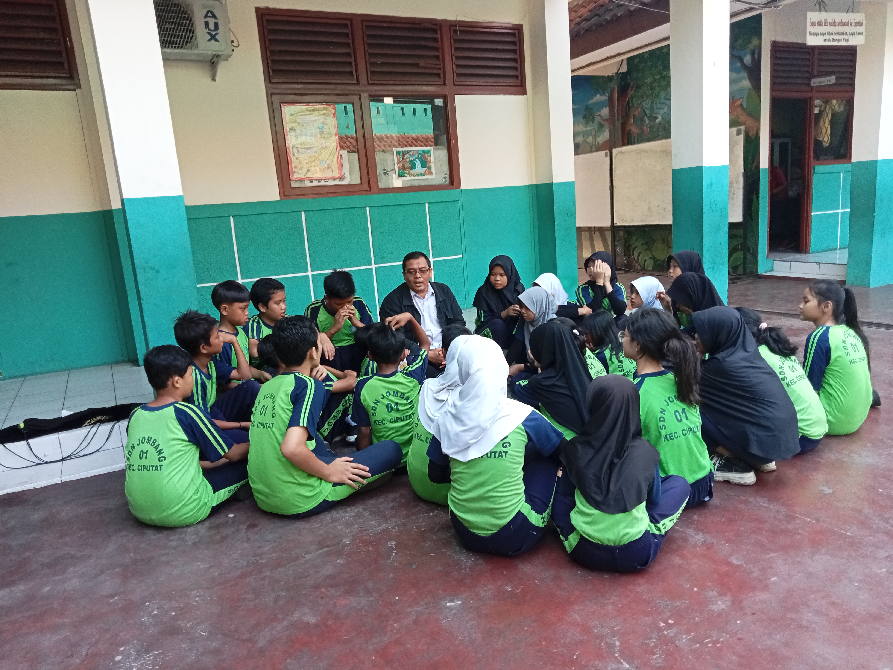
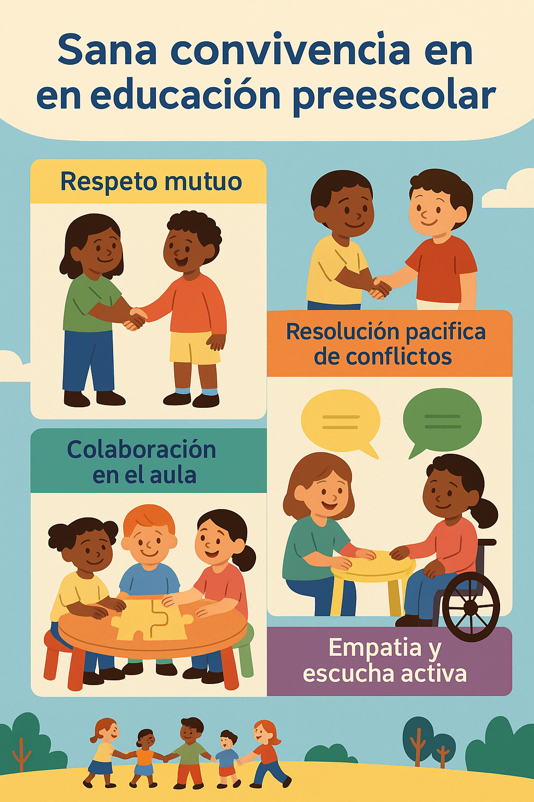

## 2.1. Clima y convivencia de aula

El clima de aula es un factor central para la calidad educativa en Infantil. No se limita a evitar conflictos, sino que implica diseñar un entorno donde el alumnado se sienta seguro, valorado y capaz de aprender con otras personas. Esta unidad desarrolla un enfoque universitario del tema con base teórica y aplicación práctica.

## Objetivos de aprendizaje

- Diferenciar modelo sancionador y modelo educativo de convivencia.
- Explicar las dimensiones interpersonal, instruccional y organizativa del clima de aula.
- Analizar conflictos desde una perspectiva intrapersonal, interpersonal y social.
- Aplicar estrategias de prevención, mediación y diálogo reflexivo.
- Diseñar actuaciones concretas para mejorar convivencia en 0-3 y 3-6.

## Vocabulario clave

| Término | Definición didáctica |
|---|---|
| Clima de aula | Calidad percibida de relaciones, organización y experiencias de aprendizaje dentro del grupo. |
| Convivencia escolar | Conjunto de prácticas, normas y relaciones que permiten vivir y aprender juntos con respeto. |
| Conflicto interpersonal | Desacuerdo entre personas por intereses, necesidades o percepciones incompatibles. |
| Mediación escolar | Proceso estructurado de diálogo, voluntario y guiado, para construir acuerdos entre partes. |
| Disciplina positiva | Enfoque que enseña límites y habilidades sin humillación ni castigo punitivo como eje central. |
| Justicia restaurativa | Respuesta educativa centrada en responsabilizar, reparar el daño y restaurar vínculos. |
| PBIS | Marco de apoyos conductuales positivos multinivel basado en prevención y análisis de datos. |

## 1. Marco conceptual de la convivencia escolar

La convivencia puede entenderse desde dos marcos:

- **Modelo sancionador:** prioriza la falta y el castigo; actúa de forma reactiva.
- **Modelo educativo:** prioriza prevención, responsabilidad, reparación y participación.

En la práctica educativa, ambos pueden coexistir, pero el enfoque actual de calidad apuesta por el modelo educativo por su impacto en desarrollo moral, regulación emocional y clima social estable.

### 1.1. Tabla comparativa: modelo sancionador vs modelo educativo

| Criterio | Modelo sancionador | Modelo educativo |
|---|---|---|
| Foco principal | Falta y castigo | Aprendizaje, reparación y convivencia |
| Momento de intervención | Reactivo | Preventivo y continuo |
| Rol del alumnado | Receptor de norma | Participante y corresponsable |
| Tipo de justicia | Retributiva | Restaurativa/formativa |
| Impacto esperado | Control inmediato | Mejora sostenida del clima y habilidades socioemocionales |

## 2. Clima de aula como constructo multidimensional

El clima de convivencia se analiza en tres dimensiones conectadas:

- **Interpersonal:** calidad de relaciones entre docentes y alumnado, y entre iguales.
- **Instruccional:** organización didáctica, claridad de objetivos, transiciones y participación.
- **Organizativa:** rutinas, normas, tiempos, espacios y coordinación del centro.

Cuando estas tres dimensiones se alinean, mejora la pertenencia al grupo, el ajuste emocional y la implicación académica.

_Escena de asamblea para contextualizar la regulación de la convivencia diaria._

## 3. Calidad de la interacción docente-alumnado

En Infantil, la relación educativa cotidiana tiene un efecto directo sobre autorregulación, lenguaje y funciones ejecutivas. La interacción de calidad combina:

- **Apoyo emocional:** cercanía, respeto, sensibilidad y reconocimiento de emociones.
- **Apoyo organizativo:** normas claras, transiciones fluidas y redirección de conducta.
- **Apoyo pedagógico:** andamiaje, lenguaje rico, preguntas abiertas y conexión con experiencias reales.

Una conclusión clave es que el alumnado coopera más cuando percibe vínculo, coherencia y expectativas claras.

## 4. Aceptación entre iguales y pertenencia

La convivencia positiva requiere que cada niño sea reconocido como compañero, independientemente de afinidades personales. Esto no significa amistad obligatoria, sino condiciones mínimas de:

- Respeto mutuo.
- Apertura a la interacción.
- Cooperación básica.
- No ridiculización.

Para el análisis del grupo, las técnicas sociométricas permiten detectar liderazgos, rechazos, subgrupos y oportunidades de reorganización cooperativa.

## 5. Tipos de conflictos en el aula

No todos los conflictos se abordan igual. Conviene diferenciar:

- **Conflictos primarios:** desajustes cotidianos de socialización (interrupciones, discusiones puntuales, desorden).
- **Conflictos interpersonales:** desacuerdos con intereses o necesidades percibidas como incompatibles.
- **Agresiones injustificadas con violencia:** conductas repetidas de daño y asimetría de poder.

Distinguirlos evita respuestas inadecuadas y mejora la eficacia de la intervención.

## 6. Resolución educativa de conflictos y mediación

La resolución educativa enseña procedimientos para afrontar conflictos sin escalar violencia. La mediación, cuando procede, sigue fases estructuradas:

1. Apertura y reglas del proceso.
2. Relato de las partes.
3. Clarificación del problema.
4. Búsqueda de soluciones.
5. Acuerdo y seguimiento.

La mediación no se aplica a cualquier situación: es útil en conflictos interpersonales, pero no en casos de violencia donde se requieren protocolos de protección y actuación institucional.

_El círculo de aula facilita escucha activa, expresión emocional y acuerdos grupales._

_Entorno de mediación para trabajar escucha, reparación y acuerdo._

## 7. Disciplina positiva y lenguaje de conexión

El enfoque de disciplina positiva se centra en enseñar conductas alternativas, no solo en frenar conductas inadecuadas. La diferencia práctica aparece en el lenguaje:

- **Frases de desesperación:** aumentan tensión, culpa y bloqueo.
- **Frases de conexión:** validan emoción, orientan a solución y entrenan autorregulación.

Ejemplos de frases de conexión:

- "Entiendo que estés enfadado; vamos a buscar una solución juntos."
- "Cuéntame qué necesitas y pensamos cómo hacerlo mejor."
- "¿Qué opción te ayuda a resolver esto sin hacer daño?"

## 8. Orientaciones prácticas para 0-3 y 3-6

### 8.1. Tramo 0-3

- Trabajar hábitos básicos de convivencia (turnos, cuidado del material, espera, saludo).
- Intervenir en situaciones cotidianas en el momento, sin "dejar pasar".
- Usar diálogo breve y concreto para modelar regulación emocional.
- Coordinar mensajes con familias para mantener coherencia educativa.

### 8.2. Tramo 3-6

- Planificar rutinas explícitas y expectativas observables de conducta.
- Aplicar análisis de conflictos con "tres gafas":
  - Intrapersonal (qué necesita y cómo se autorregula).
  - Interpersonal (cómo se relaciona con otros).
  - Social/cívica (normas y cultura de aula).
- Incorporar trabajo cooperativo y responsabilidades de grupo.

_La cooperación bien guiada mejora aceptación entre iguales y participación._

## 9. Evidencia internacional para fortalecer la convivencia

Las recomendaciones actuales de organismos internacionales y redes de evidencia convergen en varios puntos:

- Enseñar habilidades socioemocionales de forma explícita y continuada mejora regulación, convivencia y aprendizaje.
- Las normas funcionan mejor cuando son pocas, claras, enseñadas y revisadas en contexto.
- El apoyo universal (para todo el grupo) debe combinarse con apoyos adicionales para alumnado en mayor riesgo.
- La respuesta docente más eficaz combina estructura, vínculo y altas expectativas.
- La prevención sostenida reduce la necesidad de intervención reactiva o punitiva.

Estas conclusiones aparecen de forma consistente en marcos como UNESCO, OCDE (TALIS), EEF, CASEL y PBIS.

_Diagrama de referencia en español sobre convivencia escolar saludable._

### 9.1. Tabla comparativa de recomendaciones basadas en evidencia

| Fuente | Recomendación clave | Aplicación práctica en Infantil |
|---|---|---|
| UNESCO | Enfoque integral de prevención de violencia y acoso | Protocolos claros, cultura de respeto y trabajo con familias |
| OECD/TALIS | Liderazgo pedagógico y apoyo docente mejoran clima | Coordinación de equipo y coherencia metodológica |
| EEF | Enseñar conducta y autorregulación explícitamente | Rutinas entrenadas, modelado y feedback frecuente |
| CASEL | Integrar aprendizaje socioemocional en currículo | Trabajo sistemático de empatía, autocontrol y toma de decisiones |
| PBIS | Sistemas de apoyo multinivel y datos para intervenir | Prevención universal y apoyos intensivos para casos de riesgo |

## 10. Caso práctico de análisis docente

Situación: un grupo de 5 años presenta disrupción frecuente, burlas y baja cooperación.

Propuesta de intervención:

1. **Diagnóstico inicial (1 semana):** registro de incidentes, momentos críticos y redes de interacción.
2. **Ajuste organizativo:** normas de grupo coconstruidas, transiciones pautadas y roles cooperativos.
3. **Ajuste relacional:** microencuentros individuales de 3-5 minutos con alumnado de mayor riesgo.
4. **Ajuste instruccional:** tareas breves y activas con objetivos visibles y retroalimentación inmediata.
5. **Seguimiento:** revisión semanal con evidencias de mejora (participación, incidentes, clima percibido).

Este enfoque permite intervenir sobre causas y no solo sobre síntomas.

## 11. Resumen final (ideas clave)

- El clima de aula es una construcción pedagógica, no un resultado espontáneo.
- El modelo educativo de convivencia es preventivo, participativo y reparador.
- La interacción docente-alumnado determina gran parte del ajuste conductual.
- Diferenciar tipos de conflicto mejora la precisión de la respuesta educativa.
- La convivencia se enseña mediante hábitos, lenguaje, organización y coherencia institucional.

## 12. Referencias y enlaces

- UNESCO - School violence and bullying (marco global): https://www.unesco.org/en/school-violence-and-bullying
- OECD - TALIS (teaching and learning international survey): https://www.oecd.org/education/talis/
- Education Endowment Foundation - Improving Behaviour in Schools: https://educationendowmentfoundation.org.uk/education-evidence/guidance-reports/behaviour
- CASEL - Fundamentals of SEL: https://casel.org/fundamentals-of-sel/
- PBIS - Positive Behavioral Interventions and Supports: https://www.pbis.org/
- What Works Clearinghouse (IES): https://ies.ed.gov/ncee/wwc/
- Juvonen, J. (2007). Educational Psychologist: https://doi.org/10.1080/00461520701621046
- Lasky, S. (2005). Teaching and Teacher Education: https://doi.org/10.1016/j.tate.2005.06.003
- Loukas, A. y Murphy, J. (2007). Journal of School Psychology: https://doi.org/10.1016/j.jsp.2006.10.001
- Witherspoon, D. et al. (2009). Applied Developmental Science: https://doi.org/10.1080/10888690903288755
- Ibarrola-García, S. e Iriarte, C. (2012). La convivencia escolar en positivo. Pirámide.
- Monge, C. et al. (2022). Modelo integrado de gestión de la convivencia escolar. Pirámide.
- Imagen Circle Time Diskusi (Wikimedia Commons): https://commons.wikimedia.org/wiki/File:Circle_Time_Diskusi.jpg
- Imagen Cooperative learning in RiVER classroom (Wikimedia Commons): https://commons.wikimedia.org/wiki/File:Cooperative_learning_in_RiVER_classroom.jpg
- Imagen Asamblea Infantil (Wikimedia Commons): https://commons.wikimedia.org/wiki/File:Educaci%C3%B3n_Infantil_La_asamblea.JPG
- Imagen Sala de mediación educativa Ágora (Wikimedia Commons): https://commons.wikimedia.org/wiki/File:Sala_de_mediaci%C3%B3n_educativa_%C3%81gora.JPG
- Infografía SANA CONVIVENCIA (Wikimedia Commons): https://commons.wikimedia.org/wiki/File:SANA_CONVIVENCIA.png

**Fecha de actualización:** 14/02/2026
