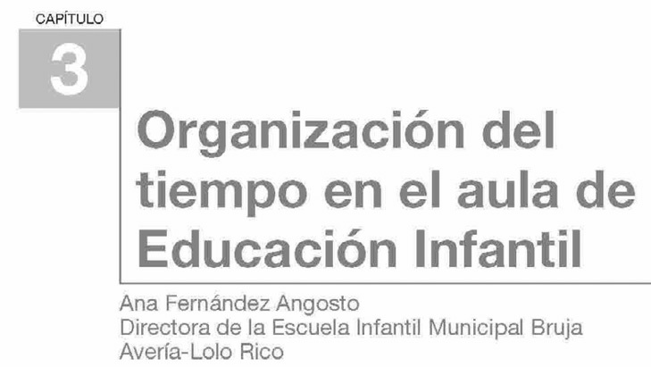

## 3.1. Organización del tiempo en el aula de Educación Infantil

La organización del tiempo en Educación Infantil no es una cuestión administrativa menor. Es una decisión didáctica con impacto directo en el desarrollo emocional, la autonomía, la participación y la calidad del aprendizaje.

_Infografía de apoyo en español para analizar planificación, prioridades y equilibrio temporal._

## Objetivos de aprendizaje

- Analizar la organización temporal del aula desde una perspectiva pedagógica e inclusiva.
- Diferenciar tiempo cronológico y tiempo cualitativo en la práctica educativa.
- Diseñar rutinas y horarios que respeten ritmos individuales y necesidades colectivas.
- Relacionar tiempos de cuidado, juego y aprendizaje con bienestar emocional y autonomía.
- Justificar decisiones de organización temporal con base normativa y evidencia educativa.

## Vocabulario clave

| Término | Definición didáctica |
|---|---|
| Tiempo cronológico | Tiempo externo, cuantificable, que organiza horarios y secuencias institucionales. |
| Tiempo cualitativo | Tiempo vivido con sentido pedagógico, vinculado a atención, profundidad y bienestar. |
| Ritmo individual | Velocidad y forma personal de maduración, adaptación y aprendizaje de cada niño. |
| Rutina educativa | Secuencia previsible de acciones que aporta seguridad y estructura temporal. |
| Anticipación | Estrategia de comunicar lo que va a ocurrir para reducir ansiedad y mejorar autonomía. |
| Escucha activa | Interacción donde el adulto observa, interpreta y responde con respeto a señales infantiles. |
| Pareja educativa | Presencia de dos profesionales en aula para mejorar acompañamiento y atención individual. |
| Educación lenta | Enfoque que prioriza profundidad, experiencia y sentido frente a velocidad y acumulación. |

## 1. Tiempo, cultura y escuela

La cultura contemporánea empuja hacia la inmediatez y la aceleración. En Infantil, esta lógica genera tensiones porque los niños no aprenden ni se regulan al mismo ritmo que los adultos. Organizar bien el tiempo supone desacelerar cuando es necesario para permitir:

- Observación y escucha real.
- Repetición y consolidación de aprendizajes.
- Transiciones cuidadas entre actividad, descanso y juego.
- Bienestar emocional sostenido durante la jornada.

_Imagen de contexto para trabajar la idea pedagógica de pausa, espera y proceso._

### 1.1. Tabla comparativa: tiempo cronológico y tiempo cualitativo

| Criterio | Tiempo cronológico (Cronos) | Tiempo cualitativo (Kairós) |
|---|---|---|
| Función principal | Ordenar jornadas, horarios y calendarios | Dar sentido y profundidad a la experiencia educativa |
| Enfoque | Cantidad de tiempo | Calidad del tiempo vivido |
| Riesgo si se usa en exceso | Rigidez y prisa pedagógica | Pérdida de estructura si no se planifica |
| Equilibrio recomendado | Marco estable y predecible | Flexibilidad para atender necesidades reales |

## 2. Marco normativo y organización temporal

El tiempo escolar debe organizarse de acuerdo con la normativa vigente y con los principios de equidad y personalización:

- **LOMLOE**: defiende flexibilidad y atención a la diversidad de necesidades.
- **RD 95/2022 (Infantil)**: exige adaptar enseñanza a ritmos y estilos de maduración individuales.
- **Normativa autonómica de calendario y horario**: concreta tiempos lectivos, organización del curso y márgenes de ajuste.

La clave profesional no es elegir entre norma y cuidado, sino articular ambos planos con coherencia pedagógica.

## 3. Calendarios, horarios y ritmos en 0-6

En la práctica educativa aparecen diferencias entre ciclos y centros (duración de curso, jornada, horario ampliado, tiempos de comedor y descanso). Estas diferencias impactan en:

- Relación escuela-familia.
- Capacidad de personalización.
- Carga de transición diaria para el niño.
- Oportunidades de juego libre y descanso real.

Por ello, toda propuesta horaria debe revisarse con criterios de calidad educativa y bienestar.

_Imagen extraída del material base para contextualizar la organización temporal en Infantil._

### 3.1. Tabla comparativa: enfoque rígido vs enfoque flexible de horario

| Aspecto | Enfoque rígido | Enfoque flexible con criterio pedagógico |
|---|---|---|
| Ritmos de aprendizaje | Uniformes para todo el grupo | Ajustados a diferencias individuales |
| Transiciones | Rápidas y cerradas | Acompañadas y con anticipación |
| Actividad y descanso | Distribución fija sin ajustes | Ajustes según observación del grupo |
| Rol del docente | Control del cumplimiento | Regulación pedagógica y cuidado del proceso |

## 4. Anticipación y seguridad emocional

La anticipación organiza la experiencia infantil. Cuando el niño sabe qué va a pasar, con quién y para qué, aumenta su seguridad y su capacidad de autorregulación.

Estrategias concretas:

- Avisos verbales claros antes de cambios de actividad.
- Referentes visuales de secuencia diaria.
- Lenguaje respetuoso que invite a la participación.
- Tiempos de transición sin prisa excesiva.

## 5. Momentos de vida cotidiana con valor educativo

En Infantil, alimentación, higiene, descanso y juego no son tiempos “logísticos”; son tiempos pedagógicos.

- **Alimentación**: autonomía progresiva, comunicación y hábitos saludables.
- **Higiene**: intimidad, cuidado corporal, vínculo y autoconcepto.
- **Descanso**: regulación fisiológica y emocional.
- **Juego**: vía principal para explorar, simbolizar y aprender.

La calidad educativa depende de cómo se acompañan estos momentos.

_Escena de organización grupal para trabajar turnos, escucha y referencias temporales._

## 6. Tiempo, creatividad y atención

El aprendizaje profundo necesita tiempos largos, repetición y margen para la exploración. La aceleración excesiva produce tareas superficiales y menor integración cognitiva.

Claves para favorecer creatividad y atención:

- Reducir fragmentación de actividades.
- Mantener materiales disponibles durante periodos amplios.
- Permitir investigación autónoma y repetición significativa.
- Incorporar pausas de observación y conversación reflexiva.

## 7. Ritmos colectivos frente a ritmos individuales

La escuela trabaja con grupo, pero educa personas. Esta tensión se gestiona con decisiones de organización:

- Mantener ejes temporales comunes (entrada, comida, salida).
- Abrir márgenes de adaptación para descanso, higiene o cierre de tareas.
- Observar sistemáticamente para no forzar ritmos madurativos.
- Ajustar ratios y apoyos para sostener atención individual.

## 8. Propuesta práctica de organización temporal (ejemplo)

### 8.1. Secuencia diaria orientativa con enfoque pedagógico

| Tramo | Finalidad principal | Criterios de calidad |
|---|---|---|
| Acogida | Seguridad emocional y transición hogar-escuela | Recepción calmada, observación y comunicación con familias |
| Propuesta central | Investigación y aprendizaje activo | Tiempo suficiente, materiales accesibles, apoyo ajustado |
| Cuidado corporal | Bienestar y autonomía | Interacciones personalizadas, lenguaje respetuoso |
| Juego y cierre | Integración de experiencia | Juego libre, recapitulación y anticipación del día siguiente |

### 8.2. Caso breve de toma de decisiones

Situación: un grupo de 3 años muestra fatiga y aumento de conflictos al final de la mañana.

Ajustes propuestos:

1. Adelantar una pausa breve de regulación antes del tramo final.
2. Reducir número de transiciones en una misma franja.
3. Anticipar verbalmente cambios de actividad.
4. Priorizar juego guiado cooperativo en vez de tarea fragmentada.
5. Registrar durante dos semanas indicadores de bienestar y participación.

## 9. Resumen final (ideas clave)

- Organizar el tiempo es organizar oportunidades de aprendizaje y cuidado.
- El equilibrio entre estructura y flexibilidad es central en 0-6.
- Anticipación, rutinas y escucha activa mejoran seguridad y autorregulación.
- Los momentos cotidianos (comida, higiene, descanso, juego) tienen alto valor educativo.
- Una gestión temporal de calidad exige observación, reflexión docente y coherencia institucional.

## 10. Referencias y enlaces

- BOE - Ley Orgánica 2/2006 y modificaciones (LOMLOE): https://www.boe.es/buscar/act.php?id=BOE-A-2006-7899
- BOE - Real Decreto 95/2022 (Educación Infantil): https://www.boe.es/diario_boe/txt.php?id=BOE-A-2022-1654
- UNESCO (es) - Atención y educación de la primera infancia: https://www.unesco.org/es/early-childhood-education
- INTEF - Infografía “Gestión del tiempo y planificación”: https://descargas.intef.es/recursos_educativos/RED_ES/03_Eso/4/S_4_030_2025_0677/infografa.html
- Imagen Aula escolar (Wikimedia Commons): https://commons.wikimedia.org/wiki/File:Aula_escolar.jpg
- Imagen Asamblea Infantil (Wikimedia Commons): https://commons.wikimedia.org/wiki/File:Educaci%C3%B3n_Infantil_La_asamblea.JPG
- Imagen Reloj de arena (Wikimedia Commons): https://commons.wikimedia.org/wiki/File:Reloj_de_arena.jpg
- Material base del tema 3 (PDF): `temas/Orga_ges_aula/org_ges_Aula_tema_3.pdf`

**Fecha de actualización:** 14/02/2026
