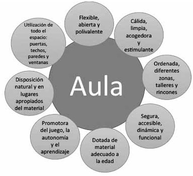
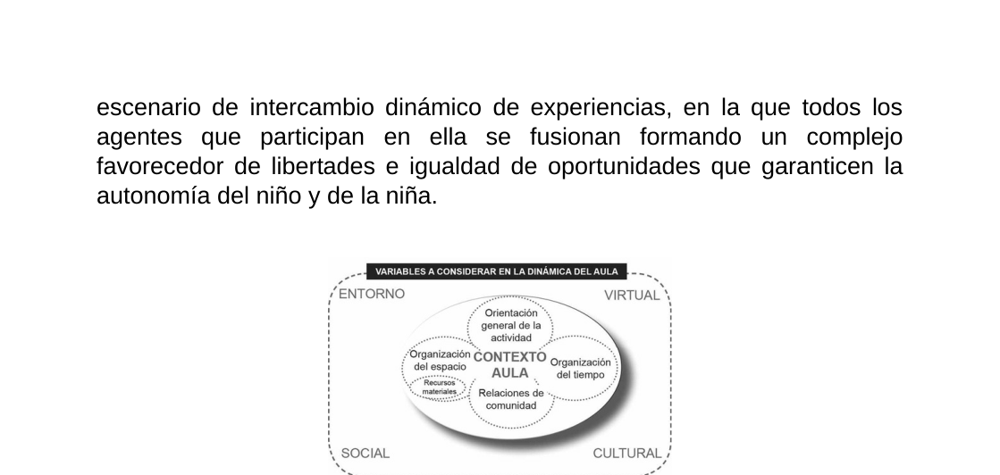
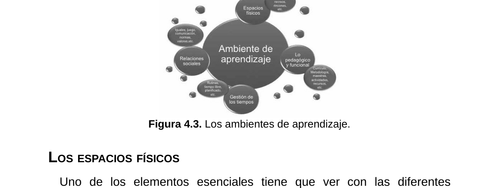
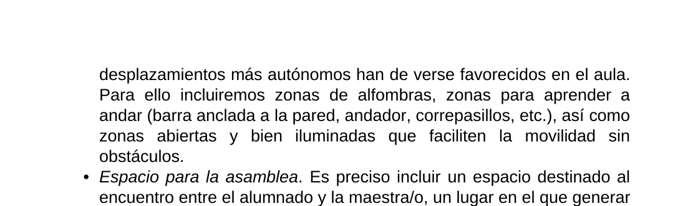
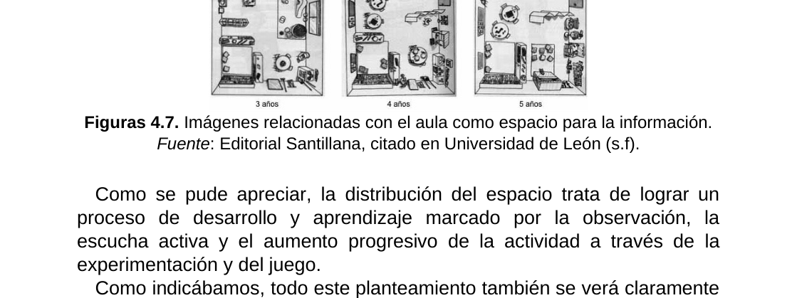
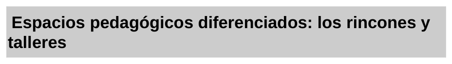
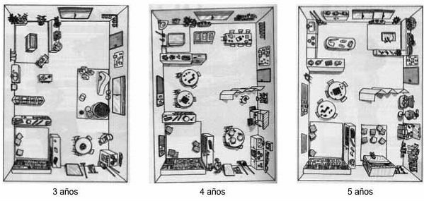
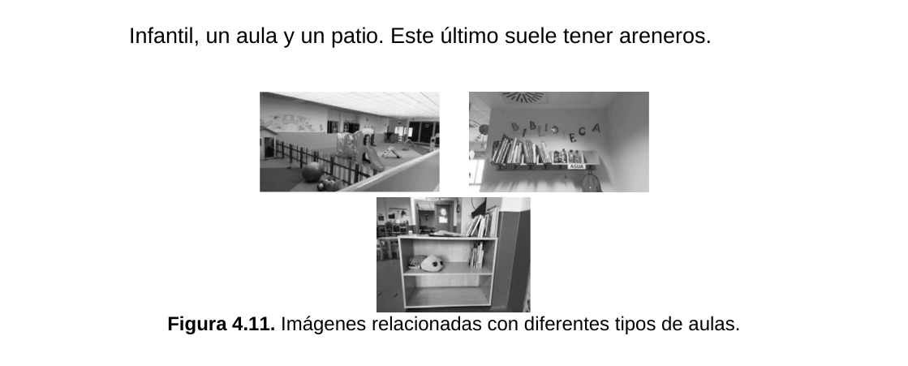
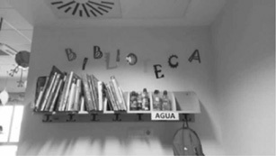
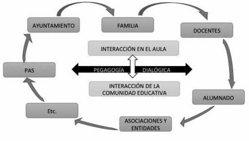

## 4.1. Organización de los espacios del aula

La organización de los espacios del aula en Educación Infantil es una decisión pedagógica estructural. El espacio condiciona el tipo de actividad que se puede realizar, las interacciones entre iguales, el papel docente y la calidad del aprendizaje. Diseñar bien los espacios implica articular seguridad, autonomía, juego, relación y sentido didáctico.

**Figura 4.0.** Presentación del tema y enfoque general sobre la organización de los espacios del aula.

**Figura 4.1.** Variables que intervienen en la dinámica del aula y en la organización educativa del espacio.

**Figura 4.1.b.** Relación entre contexto, organización espacial e interacción educativa.

## Objetivos de aprendizaje

- Comprender la relación entre espacio escolar y aprendizaje en la etapa de Educación Infantil.
- Identificar criterios para diseñar ambientes de aprendizaje seguros, inclusivos y estimulantes.
- Diferenciar la organización espacial en primer ciclo (0-3) y segundo ciclo (3-6).
- Analizar el trabajo por rincones y talleres como estrategias de organización didáctica.
- Diseñar una propuesta práctica de distribución espacial coherente con finalidades curriculares.

## Vocabulario clave

| Término | Definición didáctica |
|---|---|
| Ambiente de aprendizaje | Conjunto de condiciones físicas, sociales y pedagógicas que configuran cómo se aprende. |
| Espacio físico | Dimensión material del aula y del centro: distribución, mobiliario, zonas y accesibilidad. |
| Delimitación espacial | Grado de apertura o cierre de una zona de actividad dentro del aula. |
| Dinamicidad | Capacidad del espacio para transformarse según objetivos, tiempos y necesidades. |
| Rincón | Zona estable de actividad con finalidad concreta y materiales específicos. |
| Taller | Espacio de trabajo más dirigido para explorar contenidos o técnicas concretas. |

## 1. Ambientes de aprendizaje y sentido pedagógico del espacio

Organizar el aula no es solo distribuir mobiliario. Significa construir un entorno educativo intencional donde el alumnado aprende a través de la acción, la interacción y la exploración.

**Figura 4.2.a.** El espacio como medio para el aprendizaje y la interacción significativa.

**Figura 4.2.b.** Configuración del espacio y su influencia en las conductas de aprendizaje.

**Figura 4.2.** Representación del ambiente de aprendizaje como estructura que integra múltiples dimensiones.

**Figura 4.2.c.** Recurso visual complementario sobre el concepto de ambiente de aprendizaje.

### 1.1. Dimensiones del ambiente de aprendizaje

Los ambientes de aprendizaje se sostienen en tres planos que se retroalimentan:

- Plano físico: escenarios, materiales, recorridos, visibilidad y seguridad.
- Plano pedagógico: objetivos, tipos de actividad, mediación docente y secuenciación.
- Plano temporal-relacional: ritmos, transiciones, interacciones y clima afectivo.

**Figura 4.3.** Componentes del ambiente de aprendizaje y su relación con la práctica de aula.

**Figura 4.3.b.** Variables de configuración espacial: estructura, límites y dinamismo.

## 2. Los espacios físicos del aula de Infantil

El espacio físico debe favorecer movimiento, autonomía, juego y trabajo compartido. En Educación Infantil, la configuración espacial ha de evitar rigidez y permitir ajustes continuos.

### 2.1. Estructura, delimitación y dinamicidad

La literatura didáctica señala tres ejes para analizar el aula como espacio educativo:

- Estructura: cómo se organizan las zonas de actividad.
- Delimitación: qué zonas están más cerradas o más abiertas.
- Dinamicidad: en qué medida pueden transformarse según necesidades.

Estos ejes facilitan una distribución funcional y pedagógicamente coherente.

### 2.2. Espacios en el primer ciclo (0-3)

En el primer ciclo el diseño espacial se orienta al bienestar y a las necesidades básicas: alimentación, higiene, descanso, libre movimiento e interacción afectiva.

**Figura 4.4.** Zonas características para el primer ciclo de Educación Infantil.

**Figura 4.4.b.** Ejemplos de organización espacial para desplazamiento, asamblea y juego en 0-3.

**Figura 4.4.c.** Zonas de exploración, observación y construcción en el primer ciclo.

### 2.3. Espacios en el segundo ciclo (3-6)

En el segundo ciclo aumenta la diversidad de propuestas y el peso de la autonomía: asamblea, juego simbólico, exploración, lectura, representación y tareas cooperativas.

**Figura 4.5.** Ejemplos de organización espacial orientada al segundo ciclo.

**Figura 4.5.b.** Propuesta de zonas para encuentro, acción y vuelta a la calma en 3-6.

**Figura 4.5.c.** Distribución complementaria de espacios en aulas de segundo ciclo.

**Figura 4.5.d.** Ejemplo de configuración de zonas por finalidades de aprendizaje.

**Figura 4.5.e.** Variabilidad del espacio según propuesta metodológica y necesidades del grupo.

## 3. Espacios pedagógicos diferenciados: rincones y talleres

Los rincones y talleres permiten adaptar el espacio a distintas finalidades didácticas, favorecer agrupamientos flexibles y enriquecer las experiencias de aprendizaje.

**Tabla 4.1.** Comparativa didáctica entre trabajo por rincones y trabajo por talleres.

**Figura 4.6.** Relación entre tipos de espacios pedagógicos y formas de interacción.

**Figura 4.7.** Taller clásico, parcial e integral como formatos de organización didáctica.

**Figura 4.8.** Referente visual para seleccionar rincones según etapa educativa.

**Figura 4.9.** Recurso complementario para ajustar rincones a objetivos curriculares.

**Figura 4.10.** Ejemplo ampliado de agrupación de espacios y actividades en el aula.

### 3.1. Criterios para su implementación

- Vincular cada rincón o taller a objetivos curriculares claros.
- Garantizar materiales accesibles y seguros.
- Definir normas de uso comprensibles para el alumnado.
- Alternar actividades autónomas y guiadas.
- Revisar periódicamente su funcionalidad real.

**Tabla 4.2.** Propiedades del espacio y criterios de calidad para su uso educativo.

**Tabla 4.3.** Propuesta de rincones y usos según primer y segundo ciclo de Infantil.

## 4. Tipologías de aula y su impacto en la práctica docente

No existe una única configuración válida. El tipo de aula, su tamaño, la dotación material y la conexión con otros espacios del centro condicionan las decisiones metodológicas.

**Figura 4.11.** Ejemplos de tipologías de aula y su potencial didáctico.

**Figura 4.12.** Alternativas de distribución en aulas y patios para contextos de Infantil.

**Figura 4.13.** Visualización adicional de diferentes configuraciones físicas de aula.

## 5. Planificación práctica de espacios

La planificación del espacio debe concretarse en un diseño operativo que permita pasar de la intención pedagógica a la práctica diaria.

**Figura 4.14.** Relación entre diseño espacial, acción docente y calidad de la intervención educativa.

**Figura 4.15.** Competencias profesionales necesarias para organizar y dinamizar espacios educativos.

**Tabla 4.4.** Matriz para planificar objetivos, usos y organización de cada espacio del aula.

**Figura 4.16.** Recurso visual complementario para diseñar secuencias de uso de espacios.

**Tabla 4.5.** Instrumento de concreción para revisar la aplicación real de la planificación espacial.

**Figura 4.17.** Evidencias visuales para valorar la puesta en práctica de la planificación de espacios.

## 6. Aportes complementarios de fuentes en internet

La evidencia reciente refuerza tres ideas para la organización espacial en Infantil:

- El espacio, cuando está pedagógicamente diseñado, mejora interacción, autonomía y participación.
- La calidad del ambiente de aprendizaje depende de la coherencia entre espacio, tiempos y metodología.
- El diseño universal y la accesibilidad son condiciones necesarias para la inclusión real.

Implicaciones prácticas:

- Diseñar espacios con criterios de flexibilidad y uso evolutivo durante el curso.
- Introducir rutinas de observación para ajustar distribución y materiales.
- Garantizar accesibilidad física y cognitiva en todas las zonas de actividad.

## 7. Síntesis final

- El espacio del aula es un recurso curricular, no un elemento neutro.
- La calidad del ambiente de aprendizaje depende de decisiones físicas, pedagógicas y relacionales.
- En 0-3 y 3-6 se requieren configuraciones espaciales diferenciadas.
- Rincones y talleres favorecen una organización didáctica flexible y significativa.
- Planificar, evaluar y ajustar los espacios mejora de forma directa la práctica docente.

## Referencias básicas del tema

- Iglesias Forneiro, M. L. (2008). Observación y evaluación del ambiente de aprendizaje en Educación Infantil.
- Loughlin, C. E., y Suina, J. H. (2002). *El ambiente de aprendizaje: diseño y organización*.
- Zabalza, M. A. (2001). *Didáctica de la Educación Infantil*.
- Riera, J., Ferrer, M., y otros (2014). Aportes sobre organización de espacios en la infancia.

## Fuentes en internet consultadas

- INTEF. Recursos sobre diseño de ambientes y espacios de aprendizaje: https://intef.es/
- UNICEF. Child-friendly schools and learning environments: https://www.unicef.org/education/schools
- UNESCO. Learning environments and inclusion: https://www.unesco.org/en/education/inclusion

**Fecha de actualización:** 26/02/2026
