# UD04 - Organización de los espacios del aula

## Objetivos de aprendizaje

- Fundamentar la organización del espacio como decisión curricular en Educación Infantil.
- Relacionar diseño espacial, calidad de interacción pedagógica y desarrollo infantil.
- Diferenciar criterios de planificación espacial entre primer ciclo (0-3) y segundo ciclo (3-6).
- Diseñar propuestas de rincones y talleres con trazabilidad didáctica y evaluación.
- Aplicar marcos de mejora continua para revisar la eficacia del entorno de aula.

## Vocabulario clave

| Término | Definición didáctica |
|---|---|
| Ecología del aula | Perspectiva que analiza el aula como sistema de interacciones entre espacio, tiempo, materiales y personas. |
| Ambiente de aprendizaje | Conjunto de condiciones físicas, relacionales y metodológicas que hacen posible aprender con sentido. |
| Delimitación espacial | Definición funcional de zonas de actividad según objetivos, normas y tipo de interacción. |
| Dinamicidad espacial | Capacidad de reconfigurar el entorno para responder a diferentes actividades y necesidades del grupo. |
| Rincón pedagógico | Zona de actividad estable, con materiales y consignas para trabajo autónomo o semidirigido. |
| Taller | Dispositivo metodológico más estructurado, orientado a una producción o desempeño específico. |
| Accesibilidad universal | Diseño del entorno para que todo el alumnado participe con autonomía, seguridad y equidad. |
| Evaluación del espacio | Recogida sistemática de evidencias para valorar y mejorar la organización del aula. |

## Introducción

La organización de los espacios en Educación Infantil es una dimensión estratégica de la práctica docente. No se trata de una cuestión estética ni de simple distribución de mobiliario, sino de una decisión pedagógica que afecta a los procesos de socialización, autonomía, lenguaje, regulación emocional y construcción de conocimiento.

En términos universitarios, el espacio debe entenderse como una variable curricular de primer orden. Un diseño espacial coherente permite al profesorado articular mejor la atención a la diversidad, sostener metodologías activas y elevar la calidad de las interacciones educativas. Por el contrario, un diseño rígido, ambiguo o desalineado con los objetivos didácticos tiende a generar sobrecarga, conflictos de uso y pérdida de oportunidades de aprendizaje.

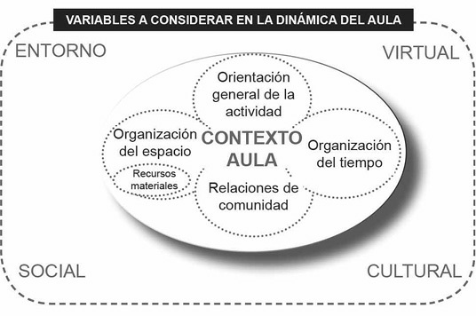

**Figura 4.1.** Relación entre contexto, organización del espacio y dinámica educativa.

## 1. Fundamentos conceptuales de la organización espacial

### 1.1. El espacio como mediador pedagógico

Las teorías socioculturales del aprendizaje sostienen que el desarrollo infantil emerge en interacción con el entorno. En este marco, el espacio no es neutro: organiza posibilidades de acción, distribuye poder pedagógico y condiciona qué experiencias pueden acontecer de manera habitual.

Desde esta perspectiva, cada decisión sobre el aula debe responder a tres preguntas: qué se quiere que ocurra, dónde se quiere que ocurra y qué evidencias permitirán comprobar que ha ocurrido. Este enfoque evita improvisaciones y convierte la planificación espacial en una práctica profesional deliberada.

### 1.2. Ambiente de aprendizaje y calidad educativa

La calidad del ambiente de aprendizaje depende de la integración de tres planos:

- Plano físico: seguridad, iluminación, ergonomía, circulación, visibilidad y materiales.
- Plano didáctico: intencionalidad, secuencia de actividades, gradiente de autonomía y evaluación formativa.
- Plano relacional: clima emocional, cooperación, pertenencia, escucha y participación.

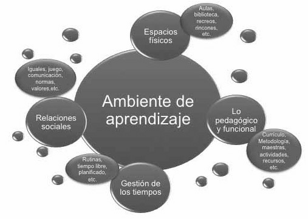

**Figura 4.2.** Lectura complementaria de la relación entre componentes del entorno educativo.

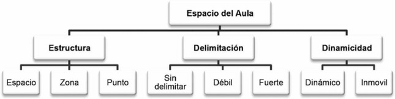

**Figura 4.3.** Ejes técnicos para analizar la configuración del aula.

## 2. Organización de espacios por ciclo educativo

### 2.1. Primer ciclo (0-3): cuidado, vínculo y exploración temprana

En 0-3, la organización espacial debe garantizar seguridad afectiva y fisiológica, además de oportunidades de exploración sensorial y motora. Las zonas de alimentación, higiene, descanso y movimiento han de estar integradas en la propuesta educativa, no separadas de ella como tareas meramente asistenciales.

Criterios operativos:

- zonas claramente identificables y predecibles para favorecer regulación;
- materiales de manipulación simple y segura;
- áreas de observación docente con buena visibilidad;
- transición suave entre cuidado, juego y descanso.

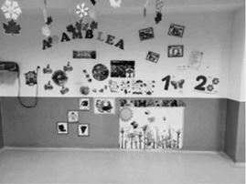

**Figura 4.4.** Ejemplo de organización espacial para interacción, asamblea y juego en 0-3.

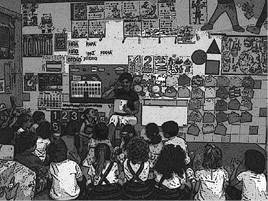

**Figura 4.5.** Zonas de exploración y construcción para el desarrollo temprano.

### 2.2. Segundo ciclo (3-6): diferenciación funcional y autonomía progresiva

En 3-6, el aula debe sostener mayor complejidad cognitiva y social: juego simbólico, lenguaje, representación, resolución de problemas y cooperación. El espacio requiere, por tanto, mayor diferenciación funcional y normas de uso más explícitas.

Criterios operativos:

- alternancia de formatos (individual, pequeño grupo, gran grupo);
- zonas para simbolización, lectura, experimentación y calma;
- materiales abiertos con distintos niveles de complejidad;
- dispositivos de autorregulación y mediación de conflictos.

**Figura 4.6.** Propuesta de distribución para encuentro, acción y regulación en 3-6.

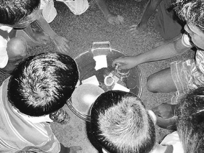

**Figura 4.7.** Organización de zonas según finalidades de aprendizaje.

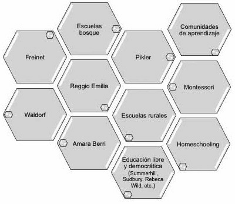

**Figura 4.8.** Relación entre zonas de aula y objetivos didácticos.

## 3. Rincones y talleres: decisiones didácticas avanzadas

Rincones y talleres son estrategias complementarias, no equivalentes. El uso de una u otra responde al tipo de objetivo, al nivel de autonomía del grupo y al tipo de evidencia que se desea recoger.

- El rincón favorece repetición significativa, elección y autorregulación.
- El taller favorece instrucción focalizada, secuenciación y producción compartida.

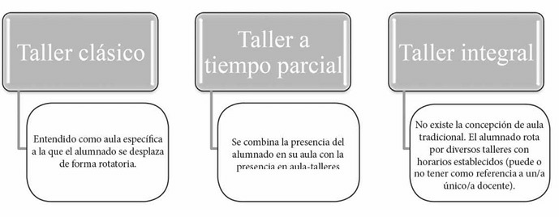

**Figura 4.9.** Taller clásico, parcial e integral: implicaciones organizativas y metodológicas.

### 3.1. Criterios de calidad para rincones y talleres

La calidad de implementación debe evaluarse con indicadores observables:

- propósito didáctico explícito;
- adecuación material a edad y objetivo;
- normas de uso comprensibles;
- autonomía real del alumnado;
- transferibilidad de lo aprendido a otros contextos.

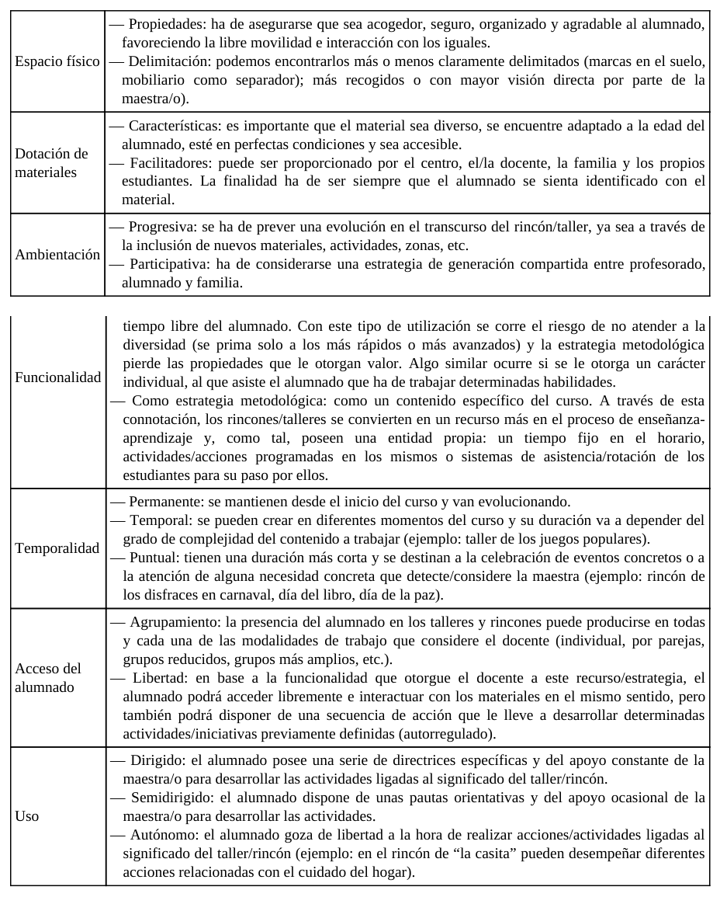

**Tabla 4.1.** Criterios de calidad para valorar el uso didáctico del espacio.

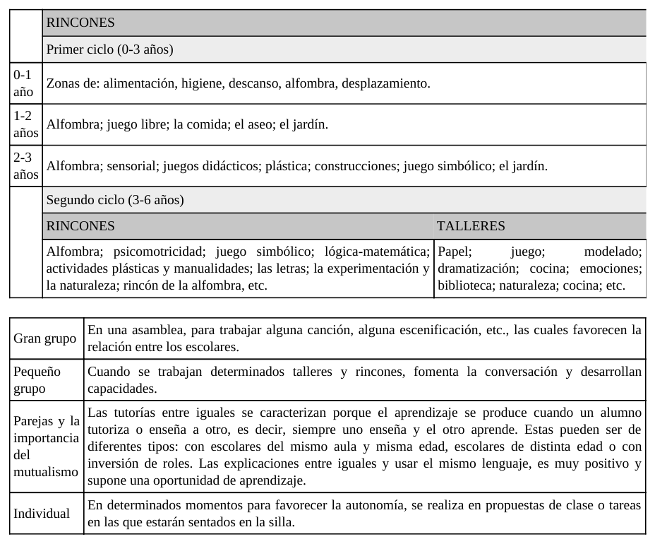

**Tabla 4.2.** Propuesta comparativa de rincones según ciclo y finalidad.

## 4. Inclusión y accesibilidad en el diseño espacial

La inclusión no se logra con adaptaciones puntuales al final del proceso, sino con un diseño universal desde el origen. Un aula inclusiva es aquella en la que el entorno reduce barreras físicas, cognitivas y comunicativas para todo el alumnado.

Criterios clave:

- señalización visual clara y comprensible;
- organización de materiales por niveles de acceso y complejidad;
- zonas para regulación sensorial y emocional;
- previsibilidad de rutinas y transiciones.

## 5. Planificación y evaluación del espacio en clave profesional

Una planificación de nivel universitario debe conectar: objetivos curriculares, configuración espacial, actividades, indicadores y revisión de resultados.

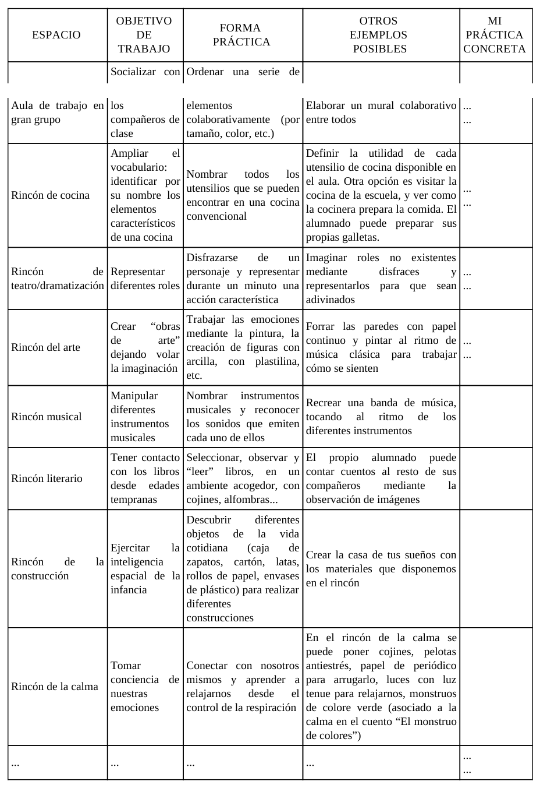

**Tabla 4.3.** Instrumento para alinear espacios, objetivos y práctica docente.

La evaluación del espacio debe basarse en evidencias, no en impresiones. Conviene registrar:

- ocupación y uso real de cada zona;
- tipo de interacción predominante;
- tiempos muertos y conflictos de circulación;
- niveles de autonomía y participación;
- impacto sobre clima y aprendizaje.

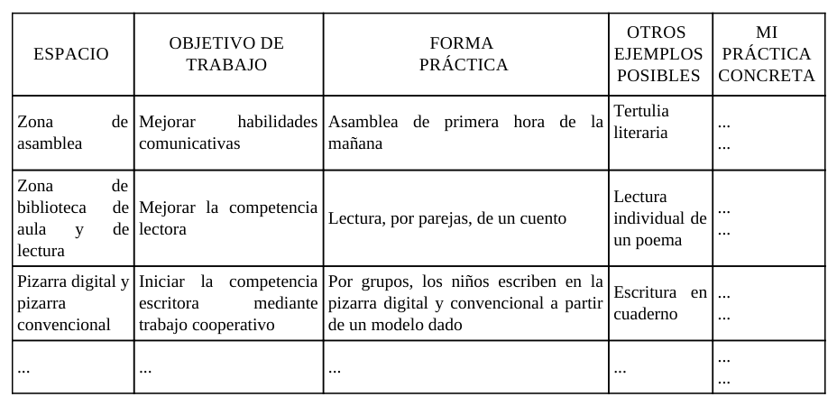

**Tabla 4.4.** Guía para revisar implementación y orientar mejora continua.

### 5.1. Cierre operativo de ciclo de mejora

El ciclo profesional recomendado es: diagnosticar, diseñar, implementar, observar, evaluar y reajustar. Esta lógica convierte el espacio en una herramienta viva de innovación docente y no en una estructura fija.

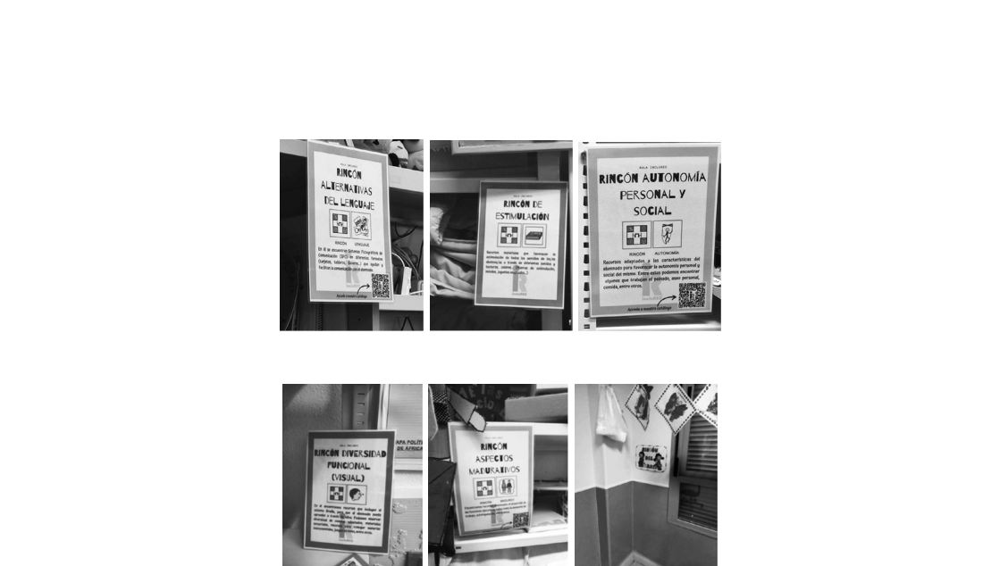

**Figura 4.10.** Recurso visual para secuenciar decisiones de organización espacial.

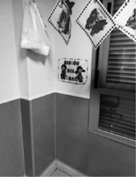

**Figura 4.11.** Referencia para documentar y contrastar decisiones de aula.

## 6. Integración de fuentes externas y marco normativo

El análisis de fuentes oficiales y literatura aplicada permite sostener tres conclusiones robustas:

- La normativa de Infantil exige propuestas pedagógicas orientadas al desarrollo integral, lo que obliga a una organización espacial intencional y evaluable.
- La evidencia comparada en educación infantil subraya que la calidad de las interacciones mejora cuando el entorno está bien diseñado y facilita participación activa.
- Los marcos internacionales de calidad e inclusión señalan que accesibilidad, bienestar y pertenencia son condiciones estructurales del aprendizaje.

### 6.1. Rectificación normativa incorporada (fe de erratas cap. 4)

De acuerdo con la fe de erratas del capítulo 4, en el marco del **Real Decreto 95/2022** (artículo 8), las áreas de Educación Infantil son:

- Crecimiento en Armonía.
- Descubrimiento y Exploración del Entorno.
- Comunicación y Representación de la Realidad.

Además, la formulación correcta sobre autonomía en la infancia no debe limitarse a la preparación para etapas posteriores. La redacción ajustada es:

> A estas edades, se debe promover la autonomía de la infancia al igual que en el resto de las etapas educativas.

Esta rectificación es relevante para la organización de espacios porque desplaza el foco desde una visión transicional (\"preparar para después\") hacia una visión de desarrollo pleno en la etapa presente, coherente con el enfoque de derechos y con la calidad educativa en Infantil.

## 7. Conclusiones universitarias

- El espacio es una variable curricular crítica en Educación Infantil.
- La calidad del aula depende de la coherencia entre diseño físico, metodología y clima relacional.
- Rincones y talleres requieren decisiones fundamentadas, no uso rutinario acrítico.
- La inclusión exige diseño universal desde la planificación inicial.
- La profesionalidad docente se expresa en la capacidad de justificar, evaluar y mejorar decisiones espaciales con evidencia.

## 8. Ampliación con fuentes UNED y pedagogía especializada

Para revisar y mejorar decisiones sobre organización espacial conviene trabajar con una matriz de fuentes que combine:

- documentación universitaria (UNED),
- investigación pedagógica en español,
- y recursos especializados de Educación Infantil.

Esta combinación facilita pasar del diseño general del aula a decisiones precisas sobre accesibilidad, circulación, interacción y evaluación del uso real de los espacios.

| Tipo de fuente prioritaria | Ejemplo | Utilidad para la organización del espacio |
|---|---|---|
| UNED | Grado en Educación Infantil, Facultad de Educación, revistas UNED | Fundamentación teórica y metodológica de decisiones espaciales |
| Pedagogía especializada | Dialnet, RIE (OEI), REdIneD | Evidencias comparadas sobre ambientes de aprendizaje |
| Educación Infantil aplicada | INTEF y AMEI-WAECE | Ejemplos transferibles de rincones, talleres y diseño inclusivo |

## Referencias básicas del tema

- Iglesias Forneiro, M. L. (2008). Observación y evaluación del ambiente de aprendizaje en Educación Infantil.
- Loughlin, C. E., y Suina, J. H. (2002). *El ambiente de aprendizaje: diseño y organización*.
- Zabalza, M. A. (2001). *Didáctica de la Educación Infantil*.
- Riera, J., Ferrer, M., y colaboradores (2014). Organización de espacios y ambientes de aprendizaje en la infancia.

## Fuentes en internet consultadas

- UNED - Grado en Educación Infantil: https://www.uned.es/universidad/inicio/estudios/grados/grado-en-educacion-infantil.html
- UNED - Facultad de Educación: https://www.uned.es/universidad/facultades/educacion.html
- UNED - Educación XX1 (revista): https://revistas.uned.es/index.php/educacionXX1
- UNED - REOP (revista): https://revistas.uned.es/index.php/reop
- BOE. Real Decreto 95/2022, de 1 de febrero, por el que se establece la ordenación y las enseñanzas mínimas de la Educación Infantil: https://www.boe.es/diario_boe/txt.php?id=BOE-A-2022-1654
- BOE. Ley Orgánica 3/2020 (LOMLOE): https://www.boe.es/eli/es/lo/2020/12/29/3
- INTEF - Tecnología educativa y DUA: https://intef.es/tecnologia-educativa/dua/
- REdIneD - recursos educativos en español: https://redined.educacion.gob.es/xmlui/
- Dialnet - documentación de pedagogía: https://dialnet.unirioja.es/
- Revista Iberoamericana de Educación (OEI): https://rieoei.org/
- AMEI-WAECE - recursos especializados de Educación Infantil: https://www.waece.org/
- OECD. *Starting Strong VI: Supporting Meaningful Interactions in Early Childhood Education and Care*: https://www.oecd.org/education/school/starting-strong-vi-f47a06ae-en.htm
- UNESCO - Educación y atención de la primera infancia: https://www.unesco.org/es/early-childhood-education
- UNICEF - Educación: https://www.unicef.org/es/educacion

**Fecha de actualización:** 28/02/2026
