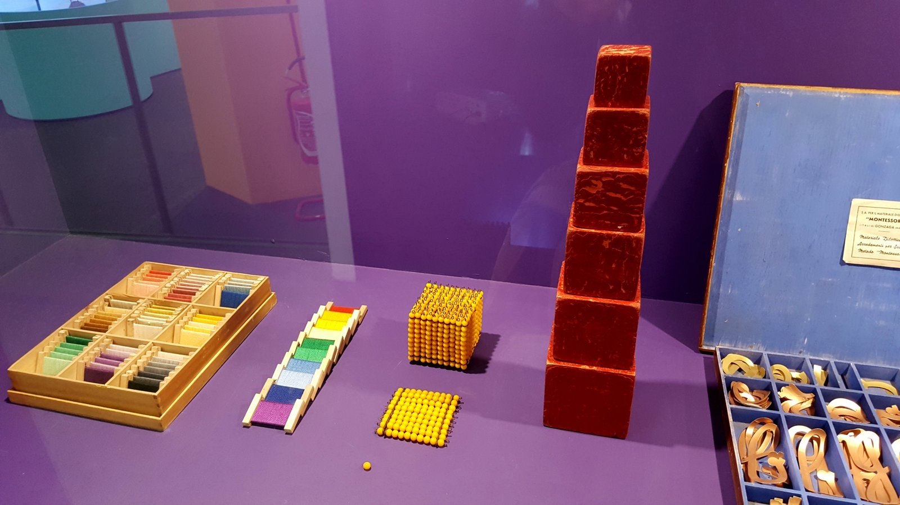
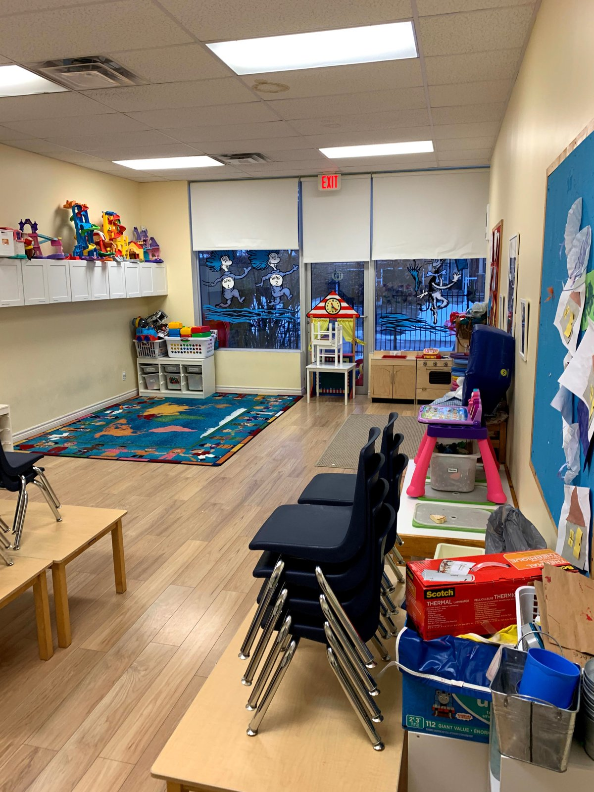
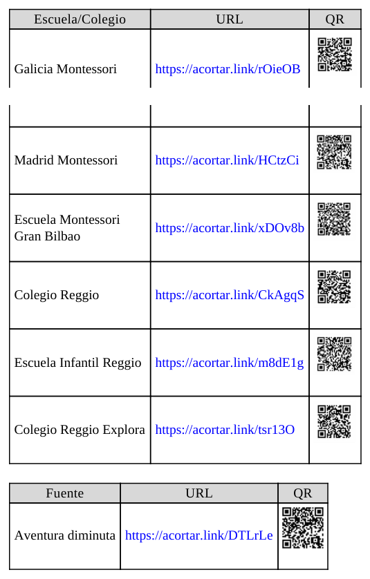
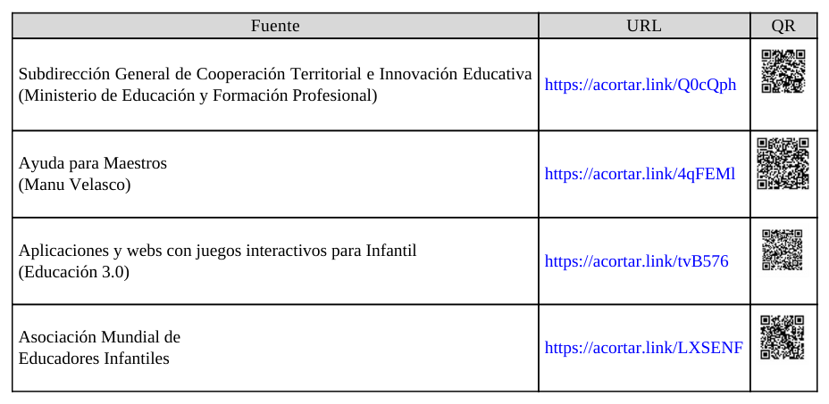
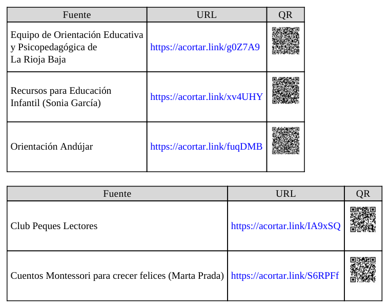

## 5.1. Organización de recursos didácticos en el aula

La organización de recursos didácticos en Educación Infantil no es un asunto secundario ni meramente logístico. Es una decisión pedagógica estructural que condiciona la calidad de las interacciones, la seguridad emocional del alumnado, el desarrollo de la autonomía y la viabilidad real de metodologías activas. En términos profesionales, organizar recursos significa diseñar condiciones de posibilidad para que el aprendizaje ocurra con sentido, continuidad y equidad.

La unidad se apoya en el tema base del capítulo 5 (organización de recursos didácticos), pero lo amplía desde un enfoque universitario y aplicado: clarificación terminológica, criterios de selección, condicionantes organizativos, pautas de implementación, referentes pedagógicos y estrategias específicas para 0-3 y 3-6 años, incorporando además marco normativo y evidencia reciente de organismos oficiales.

_Figura 5.1. Ejemplo de organización visible y accesible de materiales manipulativos (Wikimedia Commons, licencia abierta)._

## Objetivos de aprendizaje

- Analizar el concepto de recurso didáctico desde una perspectiva pedagógica, organizativa y curricular.
- Diseñar clasificaciones funcionales de materiales para optimizar accesibilidad, seguridad y autonomía en el aula.
- Aplicar criterios de Diseño Universal para el Aprendizaje (DUA) en la selección y uso de recursos.
- Diferenciar estrategias de organización para el primer ciclo (0-3) y el segundo ciclo (3-6).
- Elaborar pautas de planificación, mantenimiento, evaluación y mejora continua del ecosistema de recursos del aula.

## Vocabulario clave

| Término | Definición didáctica |
|---|---|
| Recurso didáctico | Medio físico, digital, natural o simbólico que facilita, media o potencia procesos de enseñanza-aprendizaje. |
| Material curricular | Recurso diseñado para apoyar objetivos, contenidos, metodologías y evaluación de una programación. |
| Taxonomía de recursos | Sistema de clasificación que organiza materiales según criterios pedagógicos y funcionales. |
| Accesibilidad | Posibilidad real de localizar, alcanzar, comprender y utilizar los recursos por parte de todo el alumnado. |
| DUA | Marco de diseño que propone múltiples formas de implicación, representación y acción/expresión para reducir barreras. |
| Catalogación | Registro estructurado de recursos para facilitar localización, mantenimiento y toma de decisiones. |
| Descentralización | Distribución de materiales en diferentes zonas para evitar saturación y favorecer autonomía. |
| Rutina organizativa | Secuencia estable y practicada para recoger, clasificar, conservar y reutilizar recursos. |

## 1. Fundamentación conceptual y terminológica

### 1.1. Por qué la terminología importa

La literatura especializada no ha utilizado históricamente un único término para hablar de los recursos en educación: medios educativos, medios didácticos, materiales curriculares, materiales educativos o recursos didácticos. Esta diversidad no es solo semántica; refleja marcos teóricos distintos sobre el papel de los materiales en el aprendizaje.

En Educación Infantil, una comprensión amplia y operativa es la más útil: el recurso puede ser un objeto manipulable, una secuencia de actuación, un entorno preparado, una tecnología o una combinación de todos ellos orientada a una meta de aprendizaje.

### 1.2. Clasificación útil para la práctica de aula

No existe una clasificación única universalmente válida. Lo profesional es seleccionar una taxonomía funcional para el propio contexto de aula y revisarla periódicamente.

| Criterio de clasificación | Ejemplos | Utilidad organizativa |
|---|---|---|
| Soporte | Material físico, analógico, digital, natural | Permite ordenar almacenamiento y mantenimiento |
| Sentido predominante | Visual, auditivo, táctil, multisensorial | Facilita diseño de propuestas inclusivas |
| Finalidad didáctica | Motivación, exploración, representación, evaluación | Alinea recursos con objetivos de aprendizaje |
| Riesgo/manipulación | Uso autónomo, uso supervisado, uso restringido | Mejora seguridad y prevención de accidentes |
| Ciclo y desarrollo | 0-3, 3-6, transición | Ajusta tamaño, complejidad y grado de autonomía |
| Temporalidad | Recurso estable, de rotación, de proyecto | Optimiza dosificación y evita saturación |

## 2. Criterios de selección pedagógica de recursos

En la etapa 0-6, la selección de recursos debe responder a un criterio de calidad educativa integral, no a disponibilidad comercial aislada. Un recurso apropiado para Infantil debería, como mínimo:

- ser seguro, higiénico y no tóxico;
- facilitar manipulación y exploración activa;
- promover interacción social y lenguaje;
- ofrecer valor lúdico y motivacional;
- evitar sesgos discriminatorios y mensajes violentos;
- permitir adaptación a ritmos y necesidades diversas.

### 2.1. Integración del DUA en recursos de aula

Aplicar DUA a los materiales implica diseñar redundancia pedagógica, no duplicación mecánica. En la práctica:

- múltiples formas de representación: visual, táctil, auditiva y experiencial;
- múltiples formas de acción/expresión: construir, dramatizar, señalar, verbalizar, clasificar;
- múltiples formas de implicación: elección guiada, retos graduados, objetivos comprensibles y feedback frecuente.

Esto reduce barreras y mejora participación, especialmente en aulas heterogéneas en desarrollo madurativo, lenguaje, regulación emocional o necesidades específicas de apoyo educativo.

## 3. Condicionantes organizativos del aula y del centro

La organización de recursos no depende solo del docente. Está condicionada por infraestructura, presupuesto, tiempos institucionales, cultura organizativa y coordinación de equipo.

### 3.1. Infraestructura y distribución

La distribución espacial expresa una concepción pedagógica. No es lo mismo un aula centrada en control frontal que un aula con zonas de actividad, materiales abiertos y circulación funcional.

Criterios técnicos recomendables:

- zonas duras y blandas de suelo según tipo de actividad;
- estanterías bajas para acceso autónomo y altas para material restringido;
- contenedores ligeros, etiquetados y estables;
- zonas visibles para normas y secuencias de uso;
- áreas de descanso y regulación emocional.

_Figura 5.2. La organización del mobiliario y los materiales condiciona la autonomía y la convivencia (Wikimedia Commons, licencia abierta)._

### 3.2. Gestión institucional: inventario, estado y reposición

Una organización profesional exige un sistema mínimo de gestión:

1. Inventario actualizado por tipología y localización.
2. Registro de estado de conservación.
3. Revisión periódica (seguridad, higiene, integridad).
4. Previsión de necesidades por trimestre.
5. Priorización de reposición según valor pedagógico y riesgo.

Sin este sistema, los recursos se acumulan, se invisibilizan o se deterioran sin aportar valor al aprendizaje.

## 4. Pautas operativas para organizar recursos en el aula

### 4.1. Modelo organizativo y flujo de uso

No existe un único modelo válido. En Infantil conviene combinar estructuras claras con flexibilidad contextual:

- Inicio de curso: mayor estructuración y reglas simples.
- Progresión del curso: más autonomía, rotación y corresponsabilidad.
- Cambios de trimestre/proyecto: reajuste de accesibilidad y exposición.

### 4.2. Reglas de uso comprensibles y visibles

Las normas para uso de recursos deben ser pocas, explícitas y practicables. Deben representarse con lenguaje breve e iconografía comprensible para la edad. Su función no es sancionar, sino facilitar convivencia, cuidado y continuidad de la actividad.

### 4.3. Organización por zonas, no por acumulación

La organización por rincones/zonas reduce conflictos de demanda puntual y favorece transiciones más fluidas. La acumulación de materiales fuera de contexto genera sobreestimulación, pérdida de foco y más tiempos muertos.

## 5. Referentes pedagógicos de interés

En la organización de recursos destacan dos tradiciones con aportes consistentes:

- Enfoques Montessori: ambiente preparado, materiales secuenciados, autonomía guiada, control de error en materiales.
- Enfoques Reggio Emilia: atelier, documentación pedagógica, exploración estética, materiales como lenguajes de expresión.

Junto a ellas, también aportan valor las pedagogías de naturaleza (escuelas bosque y pedagogía verde), que amplían la noción de recurso didáctico incorporando entorno natural, observación y experiencia directa.

_Figura 5.3. Tabla de referentes y recursos externos incluida en el material base del tema 5._

## 6. Orientaciones prácticas para el ciclo 0-3 años

### 6.1. Criterios prioritarios

En 0-3, la organización de recursos debe subordinarse a tres ejes: seguridad, vínculo y estimulación global. Los materiales no deben saturar la escena; deben invitar a exploración acompañada.

Prioridades operativas:

- recursos de gran tamaño, ligeros y robustos;
- predominio sensorial y manipulativo;
- alta supervisión en uso y recogida;
- dosificación gradual del material expuesto;
- rutinas breves y repetidas para ordenar y guardar.

### 6.2. Recursos recomendados por finalidad

| Finalidad | Recursos orientativos | Clave organizativa |
|---|---|---|
| Motricidad gruesa | pelotas blandas, módulos, arrastres | zonas despejadas y seguras |
| Motricidad fina | encajes grandes, tapas, pinzas adaptadas | bandejas cortas y repetición guiada |
| Sensorial | texturas, sonidos, olores, cajas exploratorias | rotación frecuente y control higiénico |
| Lenguaje y vínculo | cuentos resistentes, marionetas, canciones | rincón estable de lectura/expresión |
| Autonomía | recipientes para guardar, perchas bajas, cestas | señalización visual simple |

### 6.3. Implicaciones metodológicas

En esta franja, las rutinas organizativas son aprendizaje en sí mismas. Recoger, clasificar y devolver materiales no son tareas auxiliares: son experiencias de autorregulación, coordinación motora, lenguaje funcional y pertenencia al grupo.

## 7. Orientaciones prácticas para el ciclo 3-6 años

### 7.1. Mayor autonomía, mayor complejidad organizativa

En 3-6 aumenta la capacidad de manipulación, planificación y cooperación del alumnado. Por ello, la organización puede incorporar:

- responsabilidades rotativas de equipo;
- materiales de proyecto con mayor permanencia;
- clasificación textual e icónica combinada;
- normas de préstamo y devolución de recursos;
- secuencias de uso por estaciones o rincones.

### 7.2. Gamificación y recursos didácticos

La gamificación puede mejorar compromiso, cooperación y persistencia, siempre que no sustituya el sentido pedagógico por una lógica de recompensa continua. El recurso debe servir a objetivos de aprendizaje claros, con retos ajustados y feedback formativo.

### 7.3. Recursos digitales con criterio educativo y de salud

En Infantil, lo digital debe ser complementario y con mediación adulta. La evidencia sanitaria y pedagógica actual sugiere evitar sobreexposición y priorizar interacción humana, juego activo y experiencias multisensoriales.

Criterios de uso digital en 3-6:

- sesiones breves y con finalidad explícita;
- integración con actividad manipulativa posterior;
- selección de contenidos sin publicidad invasiva;
- evaluación de impacto en atención, conducta y sueño;
- coordinación con familias sobre hábitos digitales.

## 8. Estrategias de almacenamiento, accesibilidad y conservación

Para el funcionamiento cotidiano del aula, resultan especialmente eficaces estas estrategias:

- **Descentralización:** recursos en varias zonas para evitar aglomeración y conflictos.
- **Accesibilidad visible:** ubicación a la altura de mirada/mano del alumnado cuando proceda.
- **Facilidad de recogida:** contenedores identificados por tipo y uso.
- **Traslado seguro:** recipientes de tamaño y peso adecuados a la edad.
- **Conservación activa:** revisión, limpieza e higiene planificadas.
- **Etiquetado textual e icónico:** favorece autonomía y alfabetización emergente.

_Figura 5.4. Repertorio de portales y recursos recogidos en el material base para ampliar propuestas de aula._

## 9. Organización de rutinas, lectura y hábitos

La construcción de hábitos organizativos exige consistencia temporal. No basta con enunciar normas; es necesario practicarlas, modelarlas y revisarlas.

Medidas de alto impacto:

- rutina encadenada de inicio, uso y cierre de materiales;
- organizador semanal visible con responsabilidades;
- lista de verificación simple para recogida;
- retroalimentación positiva sobre avances en autonomía;
- implicación progresiva de familias en coherencia de hábitos.

La biblioteca de aula y los cuentos requieren una organización específica por temática, formato o nivel de complejidad, evitando selección acrítica de contenidos y garantizando valor educativo, ético y emocional.

_Figura 5.5. Recursos prácticos sobre rutinas y selección de cuentos presentes en la documentación de referencia._

## 10. Propuesta de planificación organizativa anual

### 10.1. Fase 1: Diagnóstico inicial (septiembre)

- Inventario real de recursos y estado.
- Mapa de zonas y flujos de circulación.
- Definición de normas prioritarias por ciclo.
- Identificación de riesgos (seguridad/higiene/accesibilidad).

### 10.2. Fase 2: Implementación guiada (octubre-enero)

- Introducción progresiva de materiales por bloques.
- Entrenamiento de rutinas de uso y recogida.
- Ajustes de ubicación según observación de uso real.
- Coordinación quincenal del equipo docente.

### 10.3. Fase 3: Consolidación y mejora (febrero-junio)

- Rotación estratégica de recursos para evitar habituación.
- Incorporación de materiales coelaborados con alumnado.
- Evaluación de impacto en autonomía, convivencia y aprendizaje.
- Replanificación para el siguiente curso.

### 10.4. Rúbrica breve de evaluación de la organización

| Indicador | Nivel inicial | Nivel en desarrollo | Nivel consolidado |
|---|---|---|---|
| Accesibilidad | Recursos poco localizables | Localización parcial | Localización rápida y autónoma |
| Seguridad | Revisiones reactivas | Revisiones periódicas | Sistema preventivo estable |
| Autonomía infantil | Dependencia alta del adulto | Participación intermedia | Uso y recogida autónomos guiados |
| Coherencia didáctica | Material desalineado | Alineación parcial | Recursos alineados con objetivos |
| Sostenibilidad | Reposición improvisada | Reposición planificada | Reutilización y cuidado sistemáticos |

## 11. Conclusiones

- Organizar recursos didácticos es diseñar aprendizaje: no es una tarea auxiliar, es núcleo de la práctica docente en Infantil.
- La clasificación útil de materiales debe ser pedagógica, contextual y revisable, no rígida ni puramente administrativa.
- La calidad organizativa aumenta cuando se combinan accesibilidad, seguridad, normas comprensibles, participación infantil y revisión continua.
- En 0-3 prima la dosificación, el vínculo y la exploración sensorial acompañada; en 3-6 crece la autonomía, la corresponsabilidad y la complejidad metodológica.
- El uso de recursos digitales debe subordinarse al bienestar infantil, la mediación adulta y la finalidad educativa explícita.

## 12. Profundización con fuentes UNED, pedagogía y Educación Infantil

Para mejorar la planificación de recursos didácticos de forma sostenida, se recomienda una revisión documental periódica con tres capas:

- **Capa universitaria (UNED):** actualizar fundamentos teóricos y metodológicos.
- **Capa pedagógica especializada:** revisar evidencia sobre materiales, innovación e inclusión.
- **Capa de práctica en Infantil:** seleccionar propuestas y repertorios transferibles al aula 0-6.

Este enfoque evita dos riesgos frecuentes: organizar materiales desde la intuición sin evidencia, o aplicar marcos teóricos sin traducción operativa a la realidad del aula.

| Capa de revisión | Fuentes prioritarias | Pregunta profesional que ayuda a responder |
|---|---|---|
| UNED | Grado en Educación Infantil, Facultad de Educación, Educación XX1, REOP | ¿Con qué fundamento pedagógico justifico esta decisión organizativa? |
| Pedagogía especializada | Dialnet, RIE (OEI), REdIneD | ¿Qué evidencia comparada existe sobre uso de materiales y aprendizaje? |
| Especialización Infantil | INTEF y AMEI-WAECE | ¿Cómo traduzco esa evidencia en rutinas y recursos concretos de aula? |

## Referencias bibliográficas de base

- Cabero, J. (1989, 2001). Tecnología educativa y medios en la enseñanza.
- Castañeda, M. (1989). Los medios de la comunicación y la tecnología educativa.
- Díez, M. C. (2013). *10 ideas clave. La educación infantil*.
- Ferradas, L., Franco, J. P., y Llinares, C. (2019). Ambiente y currículo en escuela infantil.
- Gimeno, J. (1991). Materiales y enseñanza.
- Manrique, A. M., y Gallego, A. M. (2013). Material didáctico y aprendizaje significativo.
- Moreno Lucas, F. M. (2015). Función pedagógica de los recursos materiales en Infantil.
- Rodríguez Diéguez, J. L. (1995). Nuevas tecnologías aplicadas a la educación.

## Fuentes en internet consultadas y de ampliación

- UNED - Grado en Educación Infantil: https://www.uned.es/universidad/inicio/estudios/grados/grado-en-educacion-infantil.html
- UNED - Facultad de Educación: https://www.uned.es/universidad/facultades/educacion.html
- UNED - Educación XX1 (revista): https://revistas.uned.es/index.php/educacionXX1
- UNED - REOP (revista): https://revistas.uned.es/index.php/reop
- BOE. Real Decreto 95/2022 (ordenación y enseñanzas mínimas de Educación Infantil): https://www.boe.es/buscar/act.php?id=BOE-A-2022-1654
- BOE. Ley Orgánica 3/2020 (LOMLOE): https://www.boe.es/eli/es/lo/2020/12/29/3
- INTEF. DUA TIC: https://intef.es/tecnologia-educativa/dua/
- REdIneD - recursos educativos en español: https://redined.educacion.gob.es/xmlui/
- Dialnet - documentación de pedagogía: https://dialnet.unirioja.es/
- Revista Iberoamericana de Educación (OEI): https://rieoei.org/
- AMEI-WAECE - recursos especializados en Educación Infantil: https://www.waece.org/
- UNESCO. Educación y atención de la primera infancia: https://www.unesco.org/es/early-childhood-education
- OMS. Recomendaciones de actividad física, sedentarismo y sueño en primera infancia (nota divulgativa): https://www.who.int/es/news/item/24-04-2019-to-grow-up-healthy-children-need-to-sit-less-and-play-more
- AEP (EnFamilia). Recomendaciones sobre pantallas en infancia y adolescencia: https://enfamilia.aeped.es/noticias/nuevas-recomendaciones-sobre-pantallas-en-infancia-adolescencia
- OECD. *Starting Strong VI: Supporting Meaningful Interactions in ECEC*: https://www.oecd.org/education/school/starting-strong-vi-f47a06ae-en.htm
- EduCaixa. Banco de recursos educativos: https://educaixa.org/es/landing-recursos

## Créditos de imágenes externas (licencia abierta)

- Wikimedia Commons. *Traditional Montessori educational materials* (CC BY-SA).
- Wikimedia Commons. *Preschool Classroom* (CC BY-SA).

**Fecha de actualización:** 28/02/2026
