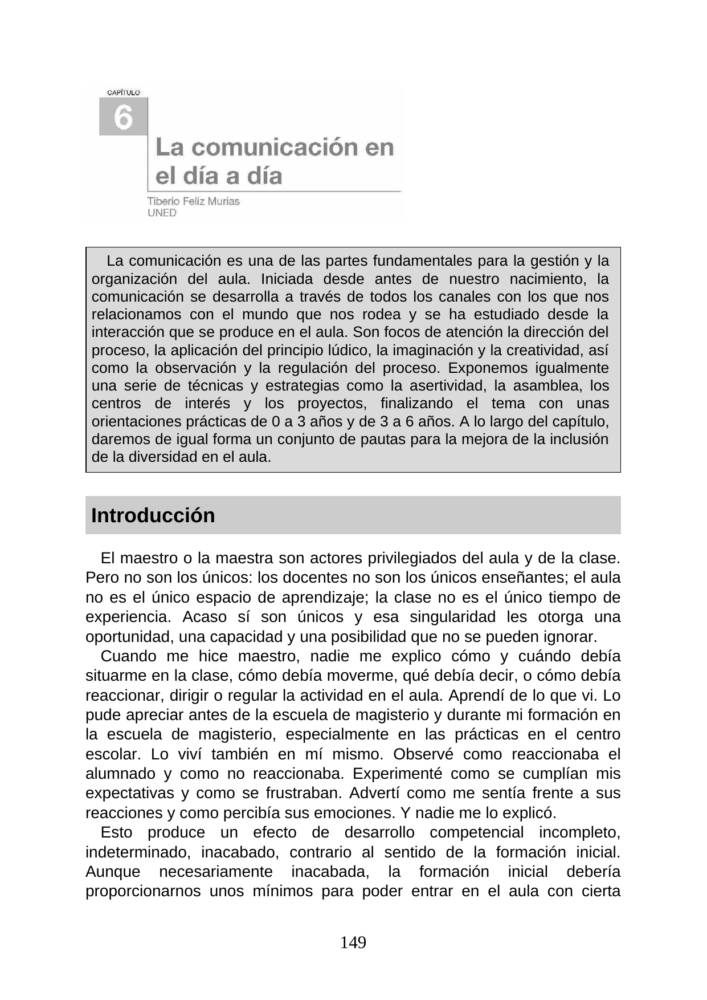
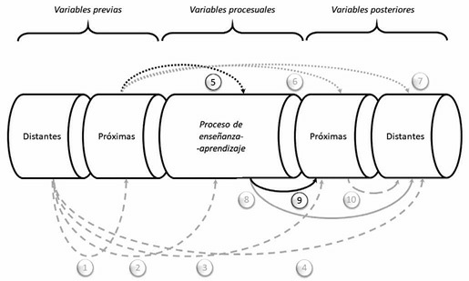
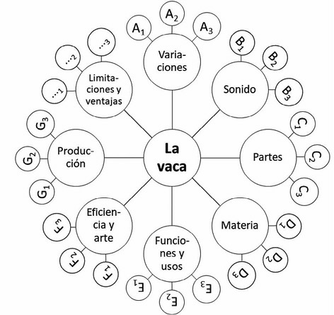
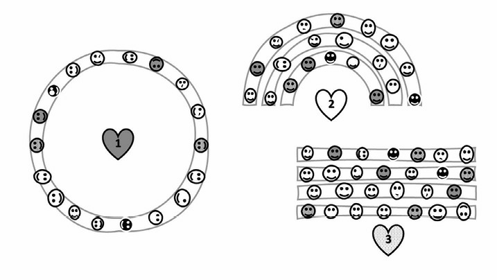

## 6.1. La comunicación en el día a día

La comunicación en Educación Infantil no es un complemento de la enseñanza: es el medio a través del cual se organiza la actividad, se construye vínculo, se regulan conductas y se posibilita el aprendizaje. En el aula de 0-6 años, cada decisión comunicativa del equipo educativo (qué se dice, cómo se dice, cuándo se dice y por qué canal se transmite) tiene efectos directos sobre la participación, la autonomía y la inclusión.

Este tema toma como base el contenido completo del capítulo 6 del material de referencia y lo amplía con enfoque universitario: marco conceptual, implicaciones pedagógicas, estrategias técnicas transferibles al aula y fundamentación normativa e institucional actual.

_Figura 6.1. Tema base: “La comunicación en el día a día” (material de referencia del módulo)._

## Objetivos de aprendizaje

- Comprender la comunicación como eje estructural de la organización y gestión del aula en Infantil.
- Analizar la comunicación desde una perspectiva multisensorial, relacional e inclusiva.
- Diseñar estrategias de interacción docente que combinen dirección pedagógica, clima afectivo y participación infantil.
- Aplicar técnicas concretas para regular la actividad: consignas, asamblea, centros de interés y proyectos.
- Diferenciar orientaciones de intervención para 0-3 y 3-6 años.
- Integrar marco normativo, evidencia pedagógica y criterios de calidad profesional en la práctica diaria.

## Vocabulario clave

| Término | Definición didáctica |
|---|---|
| Comunicación educativa | Proceso intencional de intercambio verbal, no verbal y contextual para enseñar, acompañar y regular aprendizaje. |
| Interacción didáctica | Conjunto de intercambios entre docente, alumnado, materiales y contexto que configuran la experiencia de aprendizaje. |
| Consigna | Instrucción clara y operativa para iniciar, sostener o cerrar una actividad. |
| Clima de aula | Percepción compartida de seguridad, respeto, participación y bienestar en la clase. |
| Asertividad docente | Estilo comunicativo que expresa límites y orientaciones con claridad, respeto y coherencia emocional. |
| Centro de interés | Eje temático significativo que organiza aprendizajes globalizados y contextualizados. |
| Proyecto de aprendizaje | Estrategia organizativa que integra intereses, currículo, investigación y producto final con sentido comunitario. |
| Documentación pedagógica | Registro sistemático de procesos y producciones para interpretar, evaluar y mejorar la práctica educativa. |

## 1. Marco conceptual de la comunicación en Infantil

### 1.1. Comunicación inicial y desarrollo temprano

La comunicación comienza antes del lenguaje verbal estructurado. En los primeros meses de vida, la interacción se sostiene principalmente en ritmos corporales, contacto, mirada, tono y sincronía afectiva. En términos educativos, esto implica que el trabajo en escuela infantil no empieza "cuando hablan": empieza desde la acogida, la disponibilidad emocional y la calidad de la presencia adulta.

Desde esta perspectiva, la comunicación inicial cumple tres funciones de alto impacto:

- construir seguridad emocional;
- permitir la primera lectura compartida del entorno;
- crear base para lenguaje, autorregulación y socialización posterior.

### 1.2. Comunicación como sistema multisensorial

El tema base organiza la comunicación a través de ocho sistemas de percepción y relación. Esta lectura resulta especialmente útil en Educación Infantil porque evita reducir la comunicación al habla y obliga a pensar el aula como ecosistema corporal, social y cultural.

| Sistema | Potencial comunicativo en el aula | Riesgo si se ignora |
|---|---|---|
| Oído | Atención grupal, consigna oral, ritmo y música | Sobrecarga sonora o instrucciones poco comprensibles |
| Vista | Gesto, mirada, señales visuales, anticipación | Falta de apoyo visual y mayor desorientación |
| Olor | Asociación emocional de espacios y rutinas | Ambientes poco regulados o sensorialmente hostiles |
| Sabor | Vínculo con hábitos, autonomía y lenguaje cotidiano | Oportunidades perdidas de vocabulario y socialización |
| Tacto | Seguridad, acompañamiento, reconocimiento corporal | Distancia excesiva o contacto invasivo no respetuoso |
| Propiocepción | Control postural, coordinación y autorregulación motriz | Inquietud motora mal interpretada como "mala conducta" |
| Vestibular | Equilibrio, orientación espacial y control del movimiento | Fatiga, inestabilidad y menor disposición a la tarea |
| Interocepción | Identificación de estados internos y regulación emocional | Baja conciencia corporal y mayor desajuste conductual |

### 1.3. Implicaciones profesionales

Considerar estos canales exige decisiones organizativas concretas: distribución del espacio, control de ruido, secuenciación de tareas, apoyos visuales, tiempos de transición y cuidado del lenguaje paraverbal. No es solo una cuestión de "habilidad personal" del docente: es una competencia técnica que debe planificarse y revisarse.

## 2. Formas de comunicación y competencia docente

### 2.1. El oído: voz, escucha y gestión sonora

La voz docente es recurso pedagógico y herramienta de cuidado grupal. En Infantil, una voz funcional no es la que "suena más fuerte", sino la que combina claridad, modulación, ritmo y coherencia emocional. Esto incluye:

- consignas breves y comprensibles;
- uso intencional de pausas y silencios;
- recursos rítmicos (canción, palmadas, fórmulas de transición);
- higiene vocal y prevención del sobreesfuerzo.

El canal auditivo es central en la gestión cotidiana, pero no debe monopolizar la comunicación. Cuanto más diverso es el perfil del grupo, más necesario es combinar voz con apoyos visuales y corporales.

### 2.2. La vista: cinesia, proxemia y estructuración visual

La comunicación visual incluye mirada, expresión facial, postura, distancia, movimiento y organización espacial. En Educación Infantil, la coherencia entre lo que se dice y lo que el cuerpo transmite es crítica: una consigna calmada con gestualidad tensa genera ruido comunicativo.

Estrategias de uso profesional del canal visual:

- mantener barrido visual de todo el grupo;
- alternar distancia grupal y proximidad individual;
- usar gestos estables para rutinas (silencio, espera, cambio de actividad);
- anticipar con apoyos visuales (secuencia, iconos, paneles de actividad).

### 2.3. Olor, sabor y tacto en la vida cotidiana

Aunque menos visibles en los manuales, estos canales participan en la construcción del clima de aula. La organización de comidas, higiene, descanso y juego sensorial activa experiencias de lenguaje y de convivencia. Un enfoque pedagógico sólido evita dos extremos: ignorar estos canales o convertirlos en sobreestimulación sin propósito.

### 2.4. Propiocepción, sistema vestibular e interocepción

Estos sistemas ayudan a comprender por qué determinados niños y niñas necesitan más movimiento, más pausas o más tiempo para regularse. En lugar de etiquetar rápidamente como "falta de atención", conviene leer la conducta desde necesidades sensoriomotrices y emocionales.

Claves prácticas:

- alternar momentos de activación y calma;
- introducir microtransiciones corporales;
- permitir estrategias de autorregulación;
- nombrar sensaciones internas para mejorar conciencia emocional.

### 2.5. Diversidad y comunicación aumentativa/alternativa

En grupos con necesidades específicas (auditivas, visuales, del desarrollo, del lenguaje o de regulación emocional), la comunicación debe diversificarse: apoyos visuales, sistemas pictográficos, demostración práctica, modelado entre iguales, tiempos ampliados y coordinación con orientación/familia.

No se trata de "adaptaciones excepcionales", sino de diseño de aula que reduce barreras desde el inicio.

## 3. Interacción en el aula y dirección del proceso

### 3.1. El idioma del aula y la realidad sociolingüística

La lengua de escolarización no es una variable neutra. En contextos monolingües, bilingües o multilingües, el aula necesita acuerdos claros de uso lingüístico, mediación y participación familiar. El objetivo pedagógico no es solo transmitir contenidos, sino garantizar comprensión, pertenencia y progreso comunicativo de todo el grupo.

En la práctica, esto implica:

- lenguaje simple, correcto y contextualizado en primeras edades;
- continuidad entre escuela, familia y comunidad cuando sea posible;
- estrategias de acogida lingüística para alumnado de nueva incorporación;
- coordinación de centro para sostener decisiones compartidas.

### 3.2. Reguladores comportamentales y normas de convivencia

Regular conducta no equivale a controlar de manera rígida. Significa crear un marco estable que combine seguridad, autonomía y participación. Las rutinas y normas funcionan mejor cuando son comprensibles, practicadas y coherentes entre adultos.

Elementos que mejoran la regulación:

- secuencias previsibles de entrada, actividad y cierre;
- normas breves formuladas en positivo;
- consistencia en la respuesta adulta;
- revisión periódica con el grupo.

### 3.3. Consignas de calidad didáctica

Una consigna eficaz reduce ambigüedad, ahorra tiempo y mejora autonomía. Conviene que cada consigna incluya finalidad, tarea, materiales, organización espacial, tiempo y criterio de cierre.

| Componente de la consigna | Pregunta de control docente |
|---|---|
| Activación de atención | ¿Tengo una señal común de inicio? |
| Qué hacer | ¿La acción principal está clara? |
| Con qué hacerlo | ¿Los materiales están identificados? |
| Dónde y con quién | ¿La organización espacial/social está definida? |
| Cuánto tiempo | ¿He indicado duración o referencia temporal? |
| Cómo cerrar | ¿He explicitado cuándo termina y qué hacer después? |

### 3.4. Estímulos emocionales, apego y autonomía

La interacción diaria combina dos movimientos educativos complementarios: ofrecer base segura y abrir oportunidades de exploración. Desde esta lógica, la respuesta docente puede activar, atenuar o redirigir comportamientos sin romper vínculo.

Buenas prácticas:

- validar emoción sin legitimar daño;
- reconducir conducta ofreciendo alternativa;
- acompañar con lenguaje verbal y no verbal congruente;
- mantener expectativa de capacidad, no de déficit.

### 3.5. Expectativas docentes y Efecto Pigmalión

La investigación clásica sobre expectativas docentes mostró que la percepción del profesorado puede influir en oportunidades de participación, calidad del feedback y rendimiento esperado del alumnado. En Infantil, la traducción práctica es directa: quienes reciben más apoyo, más tiempo y mejor andamiaje suelen progresar más.

_Figura 6.2. Esquema de variables previas, procesuales y posteriores en el análisis del Efecto Pigmalión (material de referencia)._

Para evitar sesgos de expectativa:

- distribuir preguntas y apoyos de forma equitativa;
- evitar etiquetas tempranas fijas;
- documentar progreso real, no impresiones aisladas;
- revisar lenguaje docente de feedback.

## 4. Principio lúdico, imaginación y creatividad

### 4.1. El juego como matriz comunicativa

El principio lúdico no significa trivializar el aprendizaje; significa reconocer que, en la primera infancia, el juego es forma principal de explorar, simbolizar, relacionarse y aprender. La organización del aula debe proteger tiempos y espacios de juego con intencionalidad didáctica.

### 4.2. Apertura, decisión y tolerancia a la incertidumbre

Cuando el docente deja margen de elección y no cierra todas las respuestas, el grupo desarrolla pensamiento divergente, participación y toma de decisiones. Esta apertura requiere planificación: libertad sin estructura puede derivar en dispersión; estructura sin apertura reduce iniciativa.

### 4.3. Condiciones para la creatividad

| Condición | Traducción al aula |
|---|---|
| Flexibilidad | Ajustar propuestas según respuesta real del grupo |
| Fluidez | Generar muchas ideas sin juicio prematuro |
| Elaboración | Revisar y mejorar producciones progresivamente |
| Originalidad | Admitir soluciones distintas con sentido |
| Autoconfianza | Validar aportaciones y sostener riesgo creativo |
| Proactividad | Plantear retos y problemas auténticos |

## 5. Observación, regulación y documentación pedagógica

### 5.1. Observar para comprender

La observación profesional combina atención a conducta manifiesta y a ausencia de respuesta esperada. Observar no es solo "mirar mucho": es recoger información relevante para decidir mejor.

### 5.2. Valorar, intervenir o inhibirse

Toda intervención debe calibrar contexto, momento y propósito. A veces conviene actuar de inmediato; otras, esperar, dar tiempo o retirar estímulo. El criterio docente se construye con formación, práctica reflexiva y trabajo de equipo.

### 5.3. Reforzadores y comunicación reguladora

El uso de reforzadores (sociales, simbólicos, de actividad) debe orientarse a autonomía y convivencia, evitando dependencia de premio constante. El silencio, la pausa y la espera también son recursos pedagógicos cuando se emplean con intención.

### 5.4. Documentación pedagógica e información compartida

Registrar procesos (anotaciones, fotografías de actividades, producciones, registros de observación) mejora evaluación y coordinación con familias y equipo. La documentación no es burocracia añadida: es instrumento de mejora del diseño didáctico.

## 6. Técnicas y estrategias para organizar la comunicación

### 6.1. Técnicas individuales: asertividad

La asertividad docente combina claridad normativa y respeto relacional. En Infantil, este estilo resulta especialmente eficaz para poner límites sin humillar, corregir sin descalificar y sostener autoridad pedagógica sin autoritarismo.

Principios operativos:

- describir conducta observable en lugar de etiquetar a la persona;
- expresar expectativa concreta de cambio;
- ofrecer alternativa viable;
- cerrar con acompañamiento y seguimiento.

### 6.2. Técnicas grupales: la asamblea

La asamblea es un dispositivo estructural de comunicación grupal: organiza participación, negociación de normas, resolución de conflictos y evaluación compartida. Su valor aumenta cuando se planifica con secuencia, roles y tiempos.

_Figura 6.3. Configuraciones espaciales de asamblea (circular, semicircular y lineal) para distintos objetivos de interacción._

### 6.3. Técnicas metodológicas: centros de interés

Los centros de interés permiten organizar comunicación y aprendizaje en torno a temas significativos para la vida del grupo. Su potencia está en conectar motivación, lenguaje, investigación y producción.

Ejemplo de aplicación:

- elegir tópico compartido;
- desglosar subtópicos;
- integrar lenguajes y áreas curriculares;
- documentar proceso y producto;
- evaluar transferencia a situaciones reales.

_Figura 6.4. Ejemplo de análisis de subtópicos para desarrollar un centro de interés de forma globalizada._

### 6.4. Técnicas organizativas: proyectos

El trabajo por proyectos organiza la comunicación del aula en fases con propósito compartido. Permite integrar currículo, intereses del alumnado y entorno social/familiar.

Comparativa sintética de fases habituales:

| Enfoque | Fases principales |
|---|---|
| Kilpatrick (tradición clásica) | Intención, preparación, ejecución, evaluación |
| Modelos actuales de aprendizaje por proyectos | Inicio/preguntas, desarrollo/investigación, cierre/socialización |
| Adaptación a Infantil | Motivación guiada, exploración activa, elaboración colectiva, devolución y celebración |

## 7. Orientaciones prácticas por tramo de edad

### 7.1. Orientaciones para 0-3 años

El primer ciclo requiere una comunicación altamente sensible al desarrollo sensoriomotor y al vínculo. Prioridades:

- enfoque holístico del desarrollo (cuerpo-emoción-cognición);
- diversificación sensorial en experiencias breves y seguras;
- peso del lenguaje paraverbal y no verbal;
- mediación adulta cercana y progresivamente menos directiva;
- uso de centros de interés en clave vivencial;
- modelado lingüístico correcto y contextualizado;
- equilibrio entre estimular y cobijar para sostener seguridad.

### 7.2. Orientaciones para 3-6 años

En segundo ciclo aumenta capacidad simbólica, cooperación y autorregulación incipiente. Prioridades:

- leer la clase como microsociedad de aprendizaje;
- combinar regulación, participación democrática y autonomía;
- gestionar estímulos emocionales y expectativas docentes;
- sostener el principio lúdico como vehículo de aprendizaje;
- observar y documentar para ajustar intervención;
- institucionalizar asamblea como estructura de gestión del grupo;
- impulsar proyectos que conecten aula, familia y contexto.

### 7.3. Inclusión de la diversidad como criterio transversal

La inclusión no se resuelve con medidas puntuales al final del proceso. Debe estar incorporada desde el diseño inicial de comunicación: variedad de canales, flexibilidad de respuesta, apoyos anticipados y cultura de participación real.

## 8. Propuesta de implementación trimestral

### 8.1. Fase 1: diagnóstico comunicativo del aula

- mapa de canales predominantes y barreras de acceso;
- observación de clima y rutinas de transición;
- detección de necesidades de apoyo comunicativo.

### 8.2. Fase 2: diseño de mejoras

- protocolo breve de consignas comunes de equipo;
- panel visual de rutinas y normas consensuadas;
- calendario de asambleas y mini-proyectos de interés.

### 8.3. Fase 3: seguimiento y ajuste

- registro semanal de incidencias y avances;
- revisión quincenal de participación de todo el alumnado;
- reunión periódica con familias para coherencia educativa.

## 9. Marco normativo y profesional de apoyo

La comunicación cotidiana del aula se alinea con el marco educativo vigente en España:

- la LOMLOE (Ley Orgánica 3/2020) refuerza equidad, inclusión y enfoque competencial;
- el Real Decreto 95/2022 regula la ordenación y enseñanzas mínimas de Educación Infantil, destacando desarrollo integral, interacción, bienestar y aprendizaje significativo.

Estos marcos exigen que la comunicación docente no sea improvisada: debe ser planificada, evaluable y coherente con el derecho a una educación inclusiva de calidad.

## 10. Conclusiones

- Comunicar en Infantil es organizar aprendizaje, convivencia y cuidado.
- El aula exige una lectura multicanal de la comunicación más allá del habla.
- Consignas, asamblea, centros de interés y proyectos son técnicas estructurales, no accesorios metodológicos.
- La calidad comunicativa mejora cuando se integra observación sistemática, documentación y revisión de expectativas docentes.
- En 0-3 prima la seguridad vincular y sensoriomotriz; en 3-6 crece la autorregulación y la participación democrática.
- La inclusión se concreta en decisiones comunicativas cotidianas, sostenidas por el equipo y compartidas con familias.

## 11. Profundización con fuentes UNED, pedagogía y Educación Infantil

| Capa de profundización | Fuentes prioritarias | Pregunta profesional guía |
|---|---|---|
| Universitaria (UNED) | Grado en Educación Infantil, Facultad de Educación, Educación XX1, REOP | ¿Qué fundamento teórico sostiene mis decisiones comunicativas de aula? |
| Pedagogía e investigación | Dialnet, REdIneD, Revista Iberoamericana de Educación (OEI) | ¿Qué evidencia reciente respalda esta estrategia de interacción? |
| Especialización en Infantil | INTEF (DUA), AMEI-WAECE, UNESCO Primera Infancia | ¿Cómo traduzco la teoría en apoyos reales para la diversidad del grupo? |

## Referencias bibliográficas de base (tema 6)

- Blanchard, M., y Muzás, M. (2020). *Cómo trabajar con proyectos de aprendizaje en Educación Infantil*.
- Cárdenas, H. (2022). *Los chicos toman la palabra: cómo usar las asambleas de aula para la participación*.
- Chard, S., Kogan, Y., y Castillo, C. (2019). *El aprendizaje por proyectos en educación infantil*.
- Cummins, J. (2019). Enfoques sobre multilingüismo e inclusión lingüística.
- Flanders, N. (1977). *Análisis de la interacción didáctica*.
- García Madruga, J. A., Delval, J., y Sánchez Queija, I. (2010). *Psicología del desarrollo*.
- Huizinga, J. (1972). *Homo ludens*.
- Ibáñez Sandín, C. (2021). *El proyecto de educación infantil y su práctica en el aula*.
- Rinaldi, C. (2021). Documentación pedagógica y enfoque Reggio Emilia.
- Rosenthal, R., y Jacobson, L. (1968). *Pygmalion in the Classroom*.
- Zabalza, M. A. (2010). *Didáctica de la educación infantil*.

## Fuentes en internet consultadas y de ampliación

- UNED. Grado en Educación Infantil: https://www.uned.es/universidad/inicio/estudios/grados/grado-en-educacion-infantil/
- UNED. Facultad de Educación: https://www.uned.es/universidad/facultades/educacion.html
- UNED. Revista Educación XX1: https://revistas.uned.es/index.php/educacionXX1
- UNED. Revista Española de Orientación y Psicopedagogía (REOP): https://revistas.uned.es/index.php/reop
- BOE. Ley Orgánica 3/2020 (LOMLOE): https://www.boe.es/eli/es/lo/2020/12/29/3
- BOE. Real Decreto 95/2022, de 1 de febrero: https://www.boe.es/buscar/act.php?id=BOE-A-2022-1654
- INTEF. Diseño Universal para el Aprendizaje (DUA): https://intef.es/tecnologia-educativa/dua/
- REdIneD. Red de Información Educativa: https://redined.educacion.gob.es/xmlui/
- Dialnet (documentación en pedagogía): https://dialnet.unirioja.es/
- OEI. Revista Iberoamericana de Educación: https://rieoei.org/
- AMEI-WAECE. Asociación Mundial de Educadores Infantiles: https://www.waece.org/
- UNESCO. Educación y atención de la primera infancia: https://www.unesco.org/es/early-childhood-education

**Fecha de actualización:** 28/02/2026
