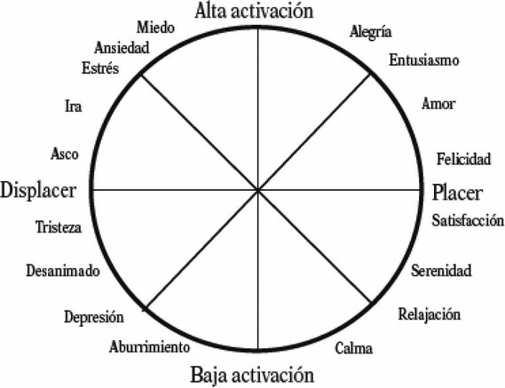
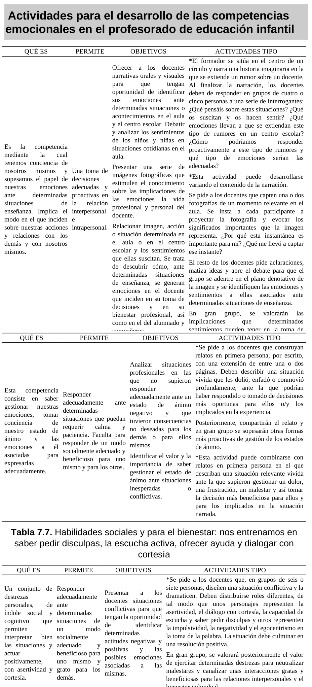

## 7.1. Competencias emocionales docentes en la enseñanza

La gestión emocional docente es una condición estructural de la calidad educativa en Educación Infantil. En esta etapa, donde el vínculo, la comunicación y la seguridad afectiva forman parte del núcleo del aprendizaje, las competencias emocionales del profesorado no son un añadido: son un requisito profesional.

El tema de base plantea una idea central: para educar emocionalmente al alumnado, el profesorado debe desarrollar previamente su propia competencia socioemocional. Esta unidad desarrolla todos los apartados del capítulo 7 y amplía su fundamentación pedagógica con referencias institucionales y académicas actuales.

## Objetivos de aprendizaje

- Analizar por qué las competencias emocionales docentes son clave en Educación Infantil.
- Diferenciar bienestar docente, malestar y síndrome de burnout en el ejercicio profesional.
- Comprender el papel del profesorado en la construcción del clima socioemocional del aula.
- Aplicar marcos prácticos de autoconciencia, autorregulación y habilidades sociales docentes.
- Diseñar estrategias formativas para fortalecer competencias emocionales en equipos educativos.
- Relacionar estas competencias con inclusión, convivencia y mejora de los aprendizajes.

## Vocabulario clave

| Término | Definición didáctica |
|---|---|
| Competencia emocional docente | Conjunto de saberes, habilidades y disposiciones para identificar, comprender, regular y expresar emociones en la práctica educativa. |
| Inteligencia emocional | Capacidad para percibir, comprender y gestionar emociones propias y ajenas de forma adaptativa. |
| Clima socioemocional de aula | Calidad de las interacciones afectivas, comunicativas y relacionales que sostienen el aprendizaje cotidiano. |
| Autoconciencia emocional | Habilidad para reconocer estados emocionales propios, sus detonantes y sus efectos sobre la práctica profesional. |
| Autorregulación emocional | Capacidad para modular respuestas emocionales y conductuales de forma ética, funcional y socialmente adecuada. |
| Bienestar docente | Estado de equilibrio personal y profesional que favorece motivación, eficacia educativa y relaciones saludables en la comunidad escolar. |
| Burnout | Síndrome asociado al estrés laboral crónico caracterizado por agotamiento emocional, despersonalización/cinismo y baja realización profesional. |
| Resiliencia profesional | Capacidad para afrontar adversidad laboral, aprender de ella y mantener compromiso pedagógico sostenido. |

## 1. Introducción a las competencias emocionales docentes

En las últimas décadas, la educación ha ampliado su foco desde una mirada centrada exclusivamente en contenidos cognitivos hacia una concepción integral del desarrollo humano. En ese marco, la dimensión emocional pasa a ser parte explícita del proceso educativo, especialmente en Educación Infantil.

La tesis principal del capítulo es clara: la escuela no puede limitarse a transmitir conocimientos disciplinares; debe crear condiciones para el desarrollo socioemocional del alumnado y de los propios adultos que educan. Desde esta perspectiva, la competencia emocional docente se convierte en una competencia profesional básica.

### 1.1. Por qué el aula infantil exige alta competencia emocional

En 0-6 años, el aprendizaje está estrechamente ligado a la experiencia afectiva: seguridad, vínculo, mirada del adulto, tono comunicativo, respuesta ante el error, regulación de conflictos y reconocimiento emocional. Por eso, la calidad de las interacciones del profesorado tiene impacto directo en:

- construcción de autoestima y autoconcepto infantil;
- desarrollo del lenguaje emocional;
- percepción de seguridad y pertenencia;
- disposición al aprendizaje y a la cooperación.

### 1.2. Inteligencia emocional y educación

El enfoque de inteligencia emocional (Mayer y Salovey; Goleman) resulta útil para traducir teoría en práctica docente. En términos operativos, implica tres planos de trabajo:

1. Identificar emociones con precisión.
2. Comprender sus causas y consecuencias en la relación educativa.
3. Regular respuestas para sostener interacción pedagógica de calidad.

## 2. Importancia de las emociones en educación

La enseñanza es una práctica relacional compleja. Cada decisión didáctica está mediada por procesos cognitivos y emocionales en estudiantes y docentes. Ignorar esta realidad debilita la acción educativa.

Razones pedagógicas para integrar la dimensión emocional:

- todo proceso de enseñanza-aprendizaje activa vivencias emocionales;
- el desarrollo integral exige trabajo cognitivo, social, afectivo y moral;
- la escuela funciona como red de relaciones humanas que requiere bienestar para sostenerse.

### 2.1. Emociones positivas en los primeros años de vida

El capítulo diferencia dos tramos con implicaciones prácticas:

- **0-3 años:** mayor peso de expresión emocional primaria y regulación heterónoma guiada por el adulto.
- **3-6 años:** progresivo desarrollo de conciencia de sí y aparición de emociones sociales más complejas (culpa, vergüenza, orgullo, timidez).

Esta progresión confirma la necesidad de un profesorado capaz de acompañar identificación, expresión y regulación emocional con lenguaje, modelado y prácticas relacionales seguras.

### 2.2. Aprendizaje social de la emoción

La expresión emocional no se desarrolla solo por maduración biológica. Requiere aprendizaje social: interacción con iguales, vínculo con adultos, normas de convivencia y contextos de diálogo. Esto refuerza el papel del aula como espacio intencional de educación emocional.

## 3. El rol docente como eje vertebrador de las relaciones

El profesorado organiza la red de interacciones entre alumnado, familias y equipo educativo. En Infantil, esta mediación es especialmente intensa porque gran parte de la autorregulación infantil aún está en desarrollo.

### 3.1. Efecto modelado

El alumnado observa y aprende del modo en que el adulto:

- afronta frustración e incertidumbre;
- responde al conflicto;
- escucha, valida y corrige;
- comunica límites y expectativas.

Por ello, la coherencia emocional del docente tiene valor formativo en sí misma.

### 3.2. Riesgo de desgaste emocional

La práctica docente incluye demandas múltiples: atención simultánea, coordinación con familias, trabajo de equipo, exigencias organizativas y burocráticas. Sin recursos emocionales suficientes, aumenta el riesgo de malestar y deterioro del clima de aula.

### 3.3. Formación inicial y permanente

El tema base insiste en una carencia recurrente: muchos docentes reconocen la importancia de educar emocionalmente, pero perciben insuficiente formación para hacerlo con solvencia. Esto justifica integrar competencias emocionales de forma explícita en la formación inicial y continua.

## 4. Competencias emocionales docentes prioritarias

Siguiendo el marco recogido en el capítulo (Bisquerra y López-Cassà), se proponen cinco competencias nucleares:

### 4.1. Conciencia emocional

Reconocer emociones propias y ajenas, ampliar vocabulario emocional y detectar cómo los estados afectivos modulan decisiones pedagógicas.

### 4.2. Regulación emocional

Gestionar emociones de forma socialmente adecuada, evitando respuestas impulsivas y sosteniendo comunicación profesional en situaciones de tensión.

### 4.3. Autonomía emocional

Incluye autoestima profesional, automotivación, responsabilidad, actitud positiva y resiliencia para mantener estabilidad en contextos complejos.

### 4.4. Habilidades socioemocionales

Escucha activa, cortesía, asertividad, empatía, gestión de desacuerdos y capacidad de cooperación con alumnado, familias y equipo.

### 4.5. Habilidades para la vida y el bienestar

Orientación a metas valiosas, toma de decisiones responsable, compromiso ético y construcción de entornos relacionales protectores.

## 5. Bienestar docente y clima educativo

El bienestar docente no es un asunto privado ajeno al aula: condiciona la calidad de la intervención educativa, el vínculo pedagógico y la convivencia escolar. Un profesorado con mayor bienestar muestra más flexibilidad, creatividad y capacidad de acompañamiento.

### 5.1. Regulación de emociones negativas y construcción de emociones positivas

Las emociones negativas son inevitables; la tarea profesional consiste en reconocerlas y regularlas. Las emociones positivas, en cambio, necesitan cultivarse activamente mediante prácticas conscientes (respiración, reflexión, diálogo, cooperación, reconocimiento de logros y sentido de propósito).

### 5.2. Modelo circunflejo de Russell y lectura del bienestar

El modelo circunflejo permite analizar la experiencia emocional según dos ejes: placer-displacer y alta-baja activación. Aplicado al trabajo docente, facilita leer estados de activación intensa (ansiedad, ira, entusiasmo) y de baja activación (calma, abatimiento), orientando decisiones de autorregulación.

_Figura 7.1. Modelo circunflejo de Russell para interpretar activación y valencia emocional en la práctica docente._

### 5.3. Emociones positivas como recurso protector

La literatura sobre psicología positiva sugiere que las emociones positivas amplían repertorios de pensamiento y acción, favoreciendo creatividad, afrontamiento y cooperación. En términos educativos, esto refuerza la necesidad de diseñar rutinas que protejan el bienestar del equipo docente y del alumnado.

## 6. El síndrome del burnout en educación

El capítulo aborda el burnout como riesgo profesional relevante cuando el malestar se cronifica. Se identifican factores de contexto (sobrecarga, incertidumbre normativa, baja valoración social, tecnificación del trabajo, falta de recursos) y sus efectos en la relación educativa.

### 6.1. Dimensiones principales del burnout

| Dimensión | Manifestaciones frecuentes | Consecuencias en el aula |
|---|---|---|
| Cansancio emocional | Fatiga persistente, irritabilidad, sensación de no poder dar más | Menor paciencia pedagógica, menor disponibilidad relacional |
| Despersonalización/cinismo | Distanciamiento afectivo, trato frío, etiquetas negativas | Deterioro del vínculo y del clima de convivencia |
| Baja realización personal | Sentimiento de ineficacia, desmotivación, pérdida de sentido | Descenso del compromiso y de la calidad de la intervención |

### 6.2. Relevancia en Educación Infantil

Aunque el burnout se ha investigado más en otras etapas, su análisis en Infantil es imprescindible por la alta demanda emocional del trabajo en primera infancia. Prevenirlo debe considerarse una medida de calidad educativa y de protección de la comunidad escolar.

### 6.3. Prevención desde competencias emocionales

El capítulo sostiene que las competencias emocionales actúan como factor preventivo porque:

- mejoran regulación del estado de ánimo;
- fortalecen afrontamiento de conflictos;
- reducen desgaste interpersonal;
- facilitan apoyo mutuo entre profesionales.

## 7. Actividades para desarrollar competencias emocionales docentes

La propuesta práctica del tema 7 incorpora actividades formativas aplicables en equipos de Infantil. A continuación se sistematizan en clave operativa:

| Competencia foco | Objetivo formativo | Ejemplo de actividad |
|---|---|---|
| Empatía | Analizar emociones en situaciones educativas reales | Dramatización de un caso de aula y debate de implicaciones emocionales y educativas |
| Autoconciencia | Identificar estados emocionales y su impacto en decisiones docentes | Narración guiada + análisis de fotografías de momentos relevantes de aula |
| Autorregulación | Revisar respuestas ineficaces y ensayar alternativas | Relatos en primera persona: “qué hice / qué podría haber hecho” |
| Habilidades sociales y bienestar | Entrenar comunicación interpersonal de calidad | Role-play con escucha activa, disculpa, cortesía y resolución cooperativa |

_Figura 7.2. Propuesta de actividades formativas (empatía, autoconciencia, autorregulación y habilidades sociales) para equipos docentes de Infantil._

## 8. Propuesta de implementación en centro (trimestral)

### 8.1. Fase 1: diagnóstico inicial

- autovaloración del equipo sobre competencia emocional percibida;
- identificación de situaciones de alta carga emocional recurrente;
- mapa de fortalezas y necesidades formativas.

### 8.2. Fase 2: formación aplicada

- microtalleres quincenales de 45-60 minutos;
- análisis de casos reales del centro;
- prácticas de comunicación asertiva, regulación y cooperación.

### 8.3. Fase 3: transferencia al aula

- incorporación de rutinas socioemocionales estables;
- revisión colegiada de decisiones conflictivas;
- seguimiento de indicadores de clima y bienestar.

### 8.4. Fase 4: evaluación y mejora

- autoevaluación individual y de equipo;
- reajuste del plan formativo según evidencias;
- consolidación en el proyecto educativo de centro.

## 9. Orientaciones específicas por ciclo

### 9.1. Primer ciclo (0-3 años)

Priorizar sensibilidad vincular, contención emocional, lenguaje afectivo simple y coordinación estrecha con familias. La regulación del adulto es la principal mediación para la regulación infantil.

### 9.2. Segundo ciclo (3-6 años)

Incrementar trabajo de identificación emocional, diálogo guiado, resolución cooperativa de conflictos y autonomía progresiva en estrategias de calma, espera y reparación relacional.

## 10. A modo de epílogo

Las competencias emocionales docentes no son un complemento metodológico opcional. Constituyen una base de profesionalidad pedagógica en Educación Infantil, porque sostienen la calidad de las relaciones que hacen posible el aprendizaje.

Un profesorado emocionalmente competente puede responder con mayor flexibilidad y creatividad a la incertidumbre, prevenir dinámicas de desgaste, mejorar la convivencia y ofrecer al alumnado modelos relacionales consistentes con una educación inclusiva y humanizadora.

## 11. Conclusiones

- La educación emocional del alumnado depende, en gran medida, de la competencia emocional del profesorado.
- Bienestar docente y calidad educativa forman una relación directa y bidireccional.
- El burnout es prevenible cuando el centro trabaja formación emocional, apoyo colegiado y condiciones organizativas saludables.
- Las competencias de autoconciencia, regulación, autonomía, habilidades sociales y bienestar deben enseñarse y evaluarse en la formación docente.
- En Educación Infantil, la dimensión emocional atraviesa toda la práctica: vínculo, comunicación, inclusión, convivencia y aprendizaje.

## 12. Profundización con fuentes UNED, pedagogía y Educación Infantil

| Capa de profundización | Fuentes prioritarias | Pregunta profesional guía |
|---|---|---|
| Universitaria (UNED) | Grado en Educación Infantil, Facultad de Educación, Educación XX1, REOP | ¿Qué fundamentos científicos sostienen la competencia emocional docente? |
| Pedagogía e investigación | Dialnet, REdIneD, RIE-OEI | ¿Qué evidencia aplicada existe sobre bienestar docente y aprendizaje? |
| Especialización en Infantil | AMEI-WAECE, UNESCO Primera Infancia, INTEF | ¿Cómo traduzco estas competencias en rutinas reales de aula 0-6? |

## Referencias bibliográficas de base (tema 7)

- Bisquerra, R. (2000, 2005, 2011). Trabajos sobre educación emocional y bienestar.
- Bisquerra, R., y López-Cassà, E. (2020). *Educación emocional. 50 preguntas y respuestas*.
- Cabello, R., Ruiz-Aranda, D., y Fernández-Berrocal, P. (2010). Competencias emocionales docentes.
- Extremera, N., y Fernández-Berrocal, P. (2004). Inteligencia emocional en profesorado.
- Jennings, P. A., y Greenberg, M. T. (2009). Competencia social y emocional docente.
- Marchesi, A. (2007). *Sobre el bienestar de los docentes*.
- Maslach, C., Schaufeli, W. B., y Leiter, M. P. (2001). *Job burnout*.
- Mayer, J. D., y Salovey, P. (1997). Fundamentos de inteligencia emocional.
- Moriana, J. A., y Herruzo, J. (2004). Estrés y burnout en profesorado.
- Palomera, R., Fernández-Berrocal, P., y Brackett, M. A. (2008). Inteligencia emocional en formación docente.
- Russell, J. A. (1980). Modelo circunflejo del afecto.
- Serrano, N., Pociño, M., y Aragón, E. (2018). Burnout y educación.

## Fuentes en internet consultadas y de ampliación

- UNED. Grado en Educación Infantil: https://www.uned.es/universidad/inicio/estudios/grados/grado-en-educacion-infantil/
- UNED. Facultad de Educación: https://www.uned.es/universidad/facultades/educacion.html
- UNED. Revista Educación XX1: https://revistas.uned.es/index.php/educacionXX1
- UNED. Revista Española de Orientación y Psicopedagogía (REOP): https://revistas.uned.es/index.php/reop
- BOE. Ley Orgánica 3/2020 (LOMLOE): https://www.boe.es/eli/es/lo/2020/12/29/3
- BOE. Real Decreto 95/2022, de 1 de febrero: https://www.boe.es/buscar/act.php?id=BOE-A-2022-1654
- REdIneD. Red de Información Educativa: https://redined.educacion.gob.es/xmlui/
- Dialnet. Base de documentación pedagógica: https://dialnet.unirioja.es/
- Revista Iberoamericana de Educación (OEI): https://rieoei.org/
- AMEI-WAECE. Asociación Mundial de Educadores Infantiles: https://www.waece.org/
- UNESCO. Educación y atención de la primera infancia: https://www.unesco.org/es/early-childhood-education
- INTEF. Recursos de tecnología educativa y DUA: https://intef.es/tecnologia-educativa/dua/
- OMS. Burn-out como fenómeno ocupacional (clasificación internacional): https://www.who.int/standards/classifications/frequently-asked-questions/burn-out-an-occupational-phenomenon

**Fecha de actualización:** 28/02/2026
