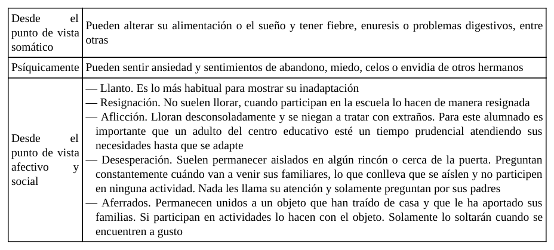
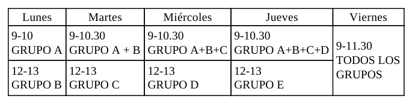
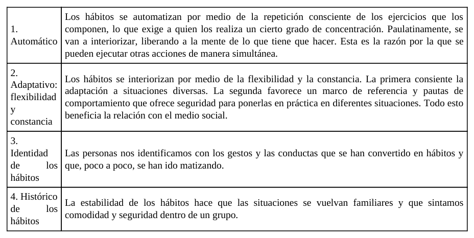
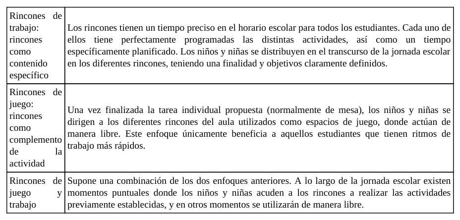
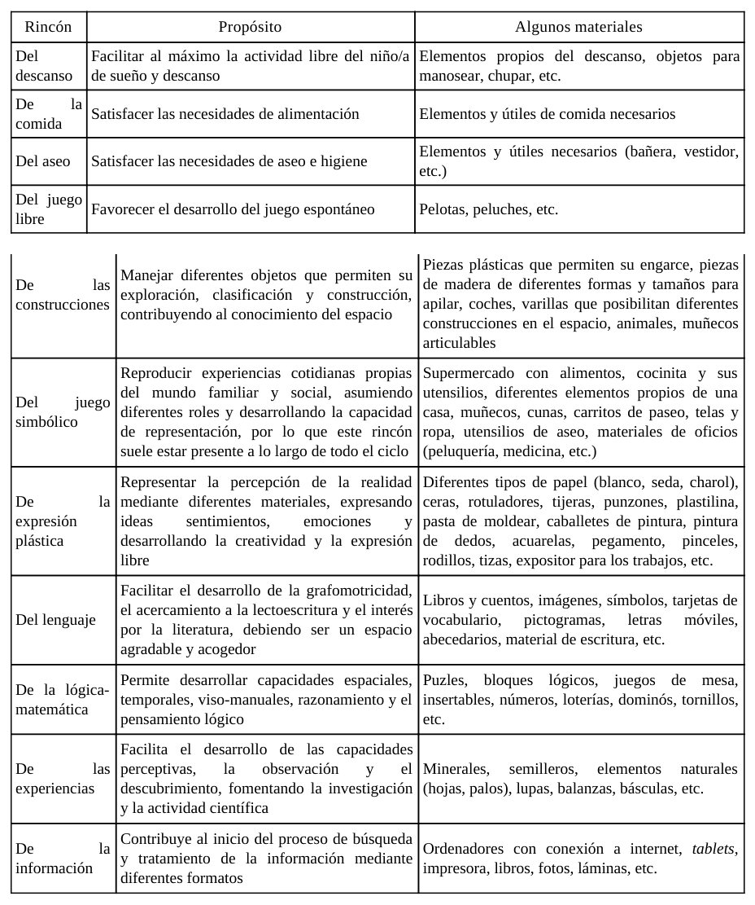
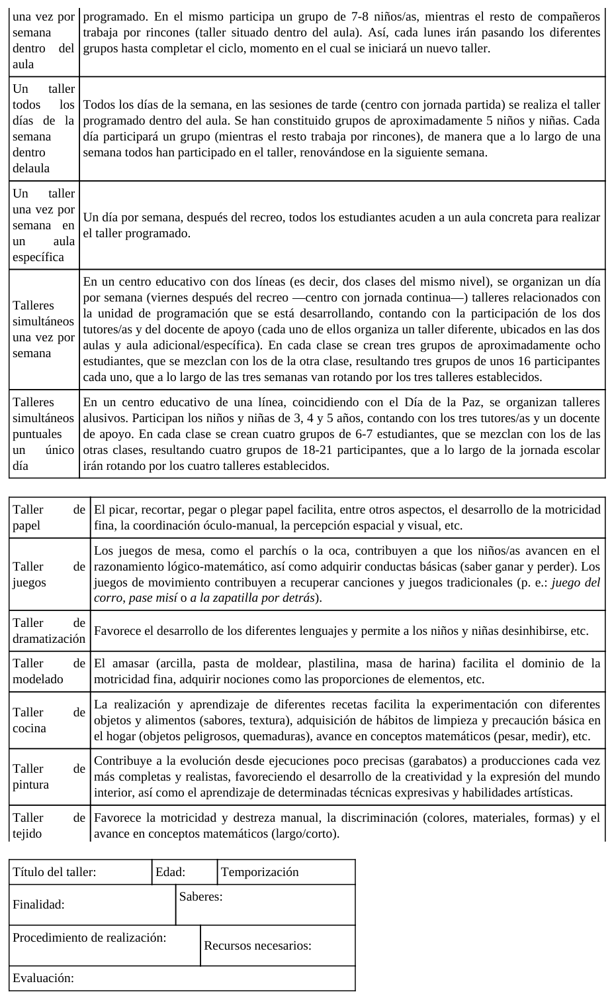

## 8.1. Estrategias metodológicas dentro del aula

La Educación Infantil exige estrategias metodológicas que articulen bienestar emocional, organización pedagógica y desarrollo integral. El tema 8 aborda cuatro ejes que, en conjunto, definen gran parte de la práctica diaria en el aula: periodo de adaptación, hábitos y rutinas, rincones y talleres.

Lejos de ser elementos aislados, estos cuatro ejes se conectan entre sí: una buena adaptación inicial facilita la creación de hábitos estables; esos hábitos sostienen un trabajo autónomo en rincones; y los talleres permiten sistematizar técnicas y aprendizajes que después se transfieren a otros contextos del aula.

## Objetivos de aprendizaje

- Comprender el periodo de adaptación como proceso pedagógico clave de entrada al centro.
- Analizar la función estructurante de los hábitos y rutinas en el desarrollo infantil.
- Diseñar el trabajo por rincones desde un enfoque metodológico y no solo espacial.
- Planificar talleres con criterios de secuenciación, recursos y evaluación.
- Conectar estas estrategias con inclusión, autonomía, socialización y aprendizaje significativo.
- Traducir la teoría a propuestas organizativas aplicables en 0-6 años.

## Vocabulario clave

| Término | Definición didáctica |
|---|---|
| Periodo de adaptación | Fase de transición en la que el niño o la niña asimila la separación de su figura de apego e integración progresiva en el contexto escolar. |
| Figura de apego | Persona de referencia afectiva que aporta seguridad emocional durante los primeros años de vida. |
| Hábito | Mecanismo estable y flexible que se interioriza mediante repetición y puede transferirse a situaciones diversas. |
| Rutina | Secuencia repetida y sistemática que estructura temporalmente la vida cotidiana del aula. |
| Rincones de trabajo | Metodología de organización del aula por espacios delimitados con actividades planificadas, finalidades y tiempos definidos. |
| Juego simbólico | Actividad de representación de roles y situaciones sociales que favorece lenguaje, imaginación y socialización. |
| Taller | Espacio educativo específico para desarrollar técnicas y actividades más dirigidas, sistematizadas y aplicadas. |
| Evaluación formativa | Recogida sistemática de información para ajustar procesos y mejorar la intervención educativa. |

## 1. Introducción: por qué estas estrategias son estructurales en Infantil

El contenido del tema muestra que estas estrategias no son complementos opcionales de la programación: son la base organizativa de la vida escolar en Infantil. El alumnado de 0-6 aprende en interacción con el entorno, con los adultos y con sus iguales; por ello, la calidad de la estructura cotidiana del aula condiciona la calidad de los aprendizajes.

Desde un enfoque profesional, trabajar estas estrategias implica:

- planificar situaciones de seguridad emocional;
- organizar tiempos y espacios de forma coherente;
- garantizar participación activa y progresiva autonomía;
- acompañar la diversidad de ritmos y necesidades.

## 2. Periodo de adaptación

### 2.1. Definición y relevancia pedagógica

Cuando un niño o niña accede por primera vez al centro, transita desde un entorno de alta familiaridad y protección hacia un contexto nuevo con personas, normas y espacios desconocidos. El periodo de adaptación es el proceso de resolución progresiva de ese conflicto inicial.

Su relevancia pedagógica es alta porque condiciona:

- actitud hacia la escuela;
- calidad de las relaciones sociales iniciales;
- disposición al aprendizaje;
- sensación de seguridad y pertenencia.

### 2.2. Fases habituales del proceso

La literatura del tema describe tres fases orientativas (no rígidas ni idénticas para todo el alumnado):

1. Protesta: llanto, búsqueda de la figura de apego, conductas regresivas o rechazo inicial.
2. Ambivalencia: disminución parcial de la protesta con respuestas variables.
3. Adaptación: integración progresiva en dinámica de aula, mayor participación y estabilidad emocional.

### 2.3. Apego y señales de dificultad

El apego funciona como base de seguridad para la exploración. En los primeros días pueden aparecer manifestaciones somáticas, psíquicas y socioafectivas que requieren observación profesional y respuesta sensible.

_Figura 8.1. Indicadores de posible inadaptación inicial desde dimensiones somática, psíquica y socioafectiva._

También existen indicadores de adaptación adecuada: conducta emocional estable, participación en actividades, asistencia sin rechazo intenso, continuidad de hábitos de sueño/comida y reducción de ansiedad en entradas y salidas.

### 2.4. Papel de la familia y del equipo docente

La adaptación no es un proceso exclusivamente infantil. Requiere coordinación estrecha entre familia y escuela. La actitud de los adultos de referencia influye directamente en cómo el menor interpreta la separación y la llegada al nuevo contexto.

Buenas prácticas de acompañamiento familiar:

- anticipar positivamente la entrada al centro;
- evitar amenazas o mensajes de miedo asociados a la escuela;
- favorecer autonomía progresiva y socialización previa;
- mantener comunicación frecuente con tutoría.

### 2.5. Planificación institucional del periodo

La preparación incluye acciones previas al inicio del curso: reuniones informativas, entrevistas individuales, recogida de datos de desarrollo y organización de incorporación escalonada.

Una planificación gradual de grupos y horarios facilita acogida individualizada y reduce sobrecarga emocional inicial.

_Figura 8.2. Ejemplo de entrada escalonada para favorecer una incorporación progresiva y segura._

## 3. Hábitos y rutinas

### 3.1. Marco conceptual

En el tema se diferencia la rutina del hábito. De forma sintética:

- la rutina organiza secuencias repetitivas de la vida diaria;
- el hábito implica interiorización más flexible y transferible.

Ambos son esenciales en Infantil porque estructuran el tiempo, anticipan lo que va a ocurrir y ofrecen seguridad psicológica.

### 3.2. Función educativa de hábitos y rutinas

Los hábitos y rutinas no deben considerarse tiempo “menor” frente a actividades “académicas”. Son oportunidades pedagógicas de alta densidad formativa: autonomía, comunicación, convivencia, autorregulación y construcción de identidad.

_Figura 8.3. Caracteres del hábito: automatización, adaptación, identidad y continuidad histórica._

### 3.3. Criterios de intervención docente

El trabajo profesional con hábitos exige:

- secuenciación en programación didáctica;
- observación de ritmos individuales;
- acompañamiento respetuoso y feedback positivo;
- coordinación con familias para coherencia de prácticas.

### 3.4. Principales hábitos y rutinas en Infantil

El tema desarrolla tres bloques prioritarios:

1. **Alimentación:** salud, autonomía y socialización; adquisición de normas de mesa e higiene asociada.
2. **Sueño y descanso:** alternancia actividad-pausa; creación de clima de calma y seguridad.
3. **Cuidado personal e higiene:** prevención, salud escolar, imagen corporal positiva y autonomía progresiva.

Estos hábitos tienen progresión por edades y requieren equilibrio entre guía adulta, práctica repetida y respeto a los tiempos de maduración.

## 4. Rincones

### 4.1. Aproximación metodológica

El trabajo por rincones no es solo distribución física del aula. Es una opción metodológica que organiza actividad, interacción y aprendizaje significativo desde una perspectiva globalizadora.

Los rincones permiten:

- protagonismo activo del alumnado;
- aprendizaje por manipulación, juego e investigación;
- avance en autonomía y cooperación;
- seguimiento más individualizado por parte del docente.

### 4.2. Concepciones de rincones

La literatura del tema distingue tres enfoques: rincón como contenido específico de trabajo, rincón como complemento tras tareas de mesa, y enfoque mixto juego-trabajo.

_Figura 8.4. Distinción entre rincones de trabajo, de juego y enfoque combinado._

Desde la perspectiva actual de Infantil, el enfoque de rincones de trabajo (con finalidades, tiempos y actividades planificadas) resulta más coherente con la personalización del aprendizaje y la inclusión.

### 4.3. Criterios para su diseño

Para organizar rincones con calidad pedagógica, deben cumplirse condiciones básicas:

- delimitación espacial clara e identificación visible;
- materiales suficientes, accesibles y ordenados;
- normas de funcionamiento comprensibles;
- número limitado de participantes por rincón;
- temporalización estable y flexible;
- visión global del docente para mediar e intervenir.

### 4.4. Tipología de rincones según edad

En primer ciclo (0-2) predominan rincones vinculados a necesidades básicas y juego espontáneo (descanso, comida, aseo, juego libre). En segundo ciclo (3-6) se amplían propuestas (construcciones, simbólico, plástica, lenguaje, lógico-matemática, experiencias, información).

_Figura 8.5. Ejemplos de rincones por etapa, propósitos formativos y materiales asociados._

### 4.5. Utilización y seguimiento

El uso de rincones requiere mecanismos para asegurar que todos los niños y niñas pasen por todas las propuestas (equipos rotativos, paneles con nombres/fotos, registros de actividades y control de progresión).

Además, cada rincón debe incorporar actividades con distintos niveles de dificultad para responder a la diversidad y facilitar participación real.

## 5. Talleres

### 5.1. Sentido pedagógico

Los talleres son espacios educativos específicos para trabajar técnicas, materiales y procesos más sistematizados, generalmente con mayor dirección docente que en rincones.

No se trata de elegir entre rincones y talleres como modelos excluyentes: ambos se complementan. Los talleres consolidan destrezas que luego pueden transferirse a contextos más autónomos.

### 5.2. Aportaciones formativas de los talleres

La metodología por talleres facilita:

- aprendizaje técnico-práctico aplicable;
- creatividad y pensamiento reflexivo;
- trabajo cooperativo y comunicación;
- motivación y exploración multisensorial;
- hábitos de orden, cuidado y limpieza.

### 5.3. Organización temporal y espacial

Existen múltiples formatos organizativos: talleres diarios, semanales, puntuales, simultáneos, multinivel, internos o externos al aula. Su configuración depende de finalidad, recursos, personal disponible y características del grupo.

### 5.4. Fases de desarrollo

El tema plantea tres fases para la secuencia didáctica de taller:

1. Detección de ideas previas y activación.
2. Investigación-experimentación guiada.
3. Expresión-acción y elaboración del producto final.

### 5.5. Propuestas de talleres y modelo de ficha

Las propuestas recogidas incluyen, entre otras: papel, juegos, dramatización, modelado, cocina, pintura, tejido, inventos e informática, además de alternativas como taller científico, musical o de reciclaje.

_Figura 8.6. Síntesis de opciones organizativas de talleres, ejemplos temáticos y estructura mínima de planificación._

## 6. Orientaciones para la implementación en centro

### 6.1. Fase 1: diagnóstico inicial

- análisis de características del grupo y contexto familiar;
- identificación de necesidades de adaptación y autonomía;
- revisión de espacios y recursos disponibles.

### 6.2. Fase 2: diseño metodológico

- secuenciar periodo de adaptación, hábitos, rincones y talleres;
- alinear propuestas con unidad de programación;
- definir criterios de participación, rotación y acompañamiento.

### 6.3. Fase 3: desarrollo y seguimiento

- observación sistemática y registros de progreso;
- ajustes de tiempos, agrupamientos y apoyos;
- coordinación continua entre profesorado y familias.

### 6.4. Fase 4: evaluación y mejora

- valorar logro de finalidades por parte del alumnado;
- evaluar funcionamiento real de estrategias implementadas;
- introducir mejoras para el siguiente ciclo o trimestre.

## 7. Marco normativo y profesional de referencia

Estas estrategias se alinean con el marco vigente en España:

- **Ley Orgánica 3/2020 (LOMLOE):** equidad, inclusión, desarrollo competencial e integral.
- **Real Decreto 95/2022 (Educación Infantil):** protagonismo de experiencias, bienestar emocional, autonomía y aprendizaje globalizado.

Desde este marco, las estrategias metodológicas del aula deben ser intencionales, evaluables y adaptadas a la diversidad real del grupo.

## 8. Conclusiones

- El periodo de adaptación es un proceso educativo central que condiciona integración, vínculo y actitud ante la escuela.
- Los hábitos y rutinas estructuran la vida diaria del aula y sostienen autonomía, seguridad y aprendizaje.
- Los rincones son una metodología de trabajo integral, no únicamente una distribución espacial.
- Los talleres aportan sistematización técnica y transferencia de aprendizajes a otros contextos educativos.
- La calidad de estas estrategias depende de su planificación, del seguimiento continuo y de la coordinación familia-escuela.

## 9. Profundización con fuentes UNED, pedagogía y Educación Infantil

| Capa de profundización | Fuentes prioritarias | Pregunta profesional guía |
|---|---|---|
| Universitaria (UNED) | Grado en Educación Infantil, Facultad de Educación, Educación XX1, REOP | ¿Qué base teórica sustenta esta organización metodológica del aula? |
| Pedagogía e investigación | Dialnet, REdIneD, RIE-OEI | ¿Qué evidencia comparada respalda adaptación, hábitos, rincones y talleres? |
| Especialización en Infantil | INTEF, AMEI-WAECE, UNESCO Primera Infancia | ¿Cómo traducir estos marcos en prácticas concretas y sostenibles de aula 0-6? |

## Referencias bibliográficas de base (tema 8)

- Bowlby, J. (1993). *El apego*.
- Cantero, M. J., y López, F. (2004). Factores predictores del periodo de adaptación.
- Castro, A., Ezquerra, P., y Argos, J. (2018). Transición entre Infantil y Primaria.
- Cruz, P., y Borjas, M. P. (2019). Diseño del periodo de adaptación en Infantil.
- Fernández, A. (2005). Hábitos en los primeros seis años de vida.
- Fernández, E., Quer, L., y Securún, R. M. (2021). *Rincón a rincón*.
- Gervilla, A. (2016). *Didáctica básica de la Educación Infantil*.
- Gutiérrez, J. J., y Romero, R. (2017). Metodología en Educación Infantil.
- Ibáñez, C. (2021). *El proyecto de Educación Infantil y su práctica en el aula*.
- Martínez, M., Pérez, M., y Sierra, B. (2014). Hábitos educativos y aprendizaje en Infantil.
- Quinto, B. (2005). *Los talleres en Educación Infantil*.
- Zabalza, M. Á. (2017). *Didáctica de la Educación Infantil*.

## Fuentes en internet consultadas y de ampliación

- UNED. Grado en Educación Infantil: https://www.uned.es/universidad/inicio/estudios/grados/grado-en-educacion-infantil/
- UNED. Facultad de Educación: https://www.uned.es/universidad/facultades/educacion.html
- UNED. Revista Educación XX1: https://revistas.uned.es/index.php/educacionXX1
- UNED. Revista Española de Orientación y Psicopedagogía (REOP): https://revistas.uned.es/index.php/reop
- BOE. Ley Orgánica 3/2020 (LOMLOE): https://www.boe.es/eli/es/lo/2020/12/29/3
- BOE. Real Decreto 95/2022, de 1 de febrero: https://www.boe.es/buscar/act.php?id=BOE-A-2022-1654
- INTEF. Recursos de tecnología educativa y DUA: https://intef.es/tecnologia-educativa/dua/
- REdIneD. Red de Información Educativa: https://redined.educacion.gob.es/xmlui/
- Dialnet. Base de documentación pedagógica: https://dialnet.unirioja.es/
- Revista Iberoamericana de Educación (OEI): https://rieoei.org/
- AMEI-WAECE. Asociación Mundial de Educadores Infantiles: https://www.waece.org/
- UNESCO. Educación y atención de la primera infancia: https://www.unesco.org/es/early-childhood-education
- OMS. Directrices sobre actividad física, sedentarismo y sueño en la primera infancia: https://www.who.int/publications/i/item/9789241550536

**Fecha de actualización:** 28/02/2026
