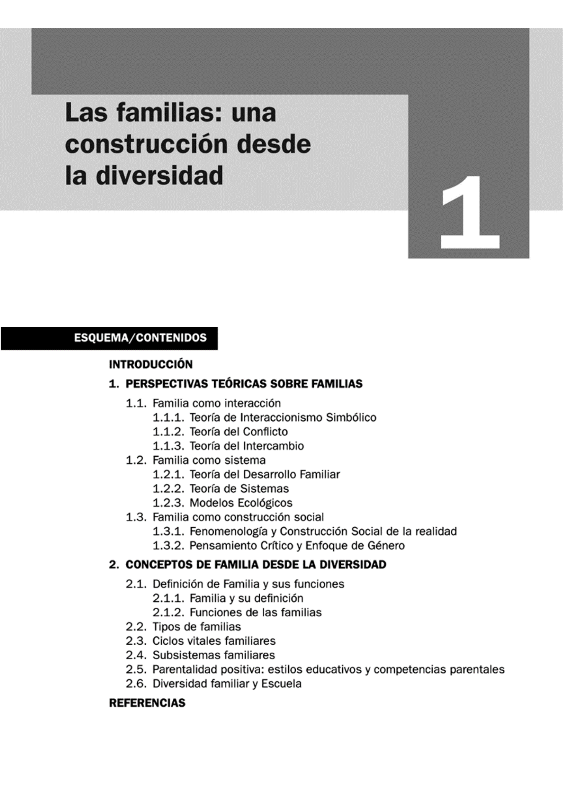
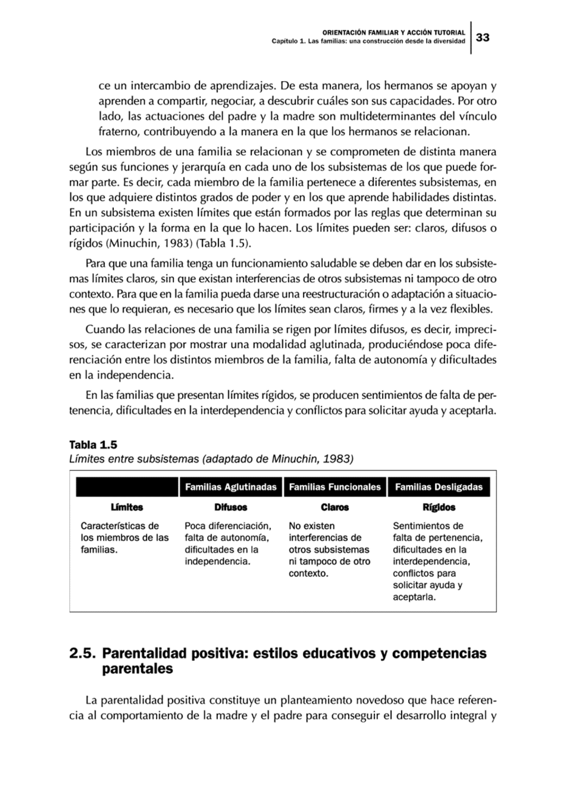

## 1.1. Las familias: una construcción desde la diversidad

Esta unidad aborda la familia como una realidad **plural, dinámica y en transformación**, y ofrece un marco teórico para intervenir en contextos familiares diversos desde la orientación familiar y la acción tutorial.

_Imagen extraída del material base del Tema 1._

## Objetivos de aprendizaje

- Reconocer las principales perspectivas teóricas para el estudio de las familias.
- Comprender la diversidad familiar y su impacto en la escuela.
- Analizar los ciclos vitales y los subsistemas familiares.
- Identificar los principios de la parentalidad positiva.
- Relacionar orientación familiar y acción tutorial con situaciones de riesgo y vulnerabilidad.

## Vocabulario clave

| Término | Definición didáctica |
|---|---|
| Diversidad familiar | Existencia de múltiples estructuras y dinámicas familiares, sin un único modelo válido. |
| Perspectiva sistémica | Enfoque que entiende la familia como un sistema de relaciones interdependientes. |
| Ciclo vital familiar | Secuencia de etapas por las que transita una familia a lo largo del tiempo. |
| Subsistemas familiares | Relaciones diferenciadas dentro de la familia (conyugal, parental y fraternal). |
| Parentalidad positiva | Ejercicio de la responsabilidad parental orientado al bienestar y desarrollo integral del menor. |
| Competencias parentales | Capacidades de madres y padres para cuidar, educar, proteger y orientar de forma ajustada. |

## 1. Perspectivas teóricas sobre familias

El estudio de las familias en Ciencias Sociales se ha enriquecido con marcos diversos. Esta pluralidad permite comprender mejor la complejidad de las relaciones familiares y diseñar intervenciones más ajustadas a cada contexto.

### 1.1. Familia como interacción

Este enfoque analiza la familia desde las interacciones cotidianas entre sus miembros, los significados compartidos y los roles que se negocian en la vida diaria.

#### 1.1.1. Interaccionismo simbólico

- Se centra en símbolos, identidad y construcción de roles.
- Explica que el comportamiento familiar se interpreta según significados compartidos.
- Permite analizar expectativas familiares y conflictos de rol.

#### 1.1.2. Teoría del conflicto

- Considera el conflicto como un elemento normal e inevitable en la interacción social.
- Distingue factores macrosociales (clase social, género, pobreza) y microsociales (dinámica cotidiana).
- Aporta herramientas para comprender tensiones familiares y su gestión educativa.

#### 1.1.3. Teoría del intercambio

- Interpreta las relaciones familiares en términos de costes, beneficios y reciprocidad.
- Ayuda a comprender por qué algunas relaciones se mantienen o se debilitan.
- Introduce nociones útiles en intervención: justicia distributiva, asimetría y endeudamiento relacional.

### 1.2. Familia como sistema

Desde esta perspectiva, la familia funciona como un sistema abierto en relación constante con su entorno, con capacidad de adaptación y reorganización.

#### 1.2.1. Teoría del desarrollo familiar

- Señala que la familia evoluciona por etapas y tareas evolutivas.
- Destaca la influencia de la historia familiar y las expectativas de futuro.
- Subraya la importancia de acompañar transiciones con apoyo educativo y orientación.

#### 1.2.2. Teoría de sistemas

- Analiza normas, límites, roles y patrones de comunicación.
- Entiende que un cambio en un miembro afecta al conjunto familiar.
- Es clave para diseñar intervenciones centradas en relaciones y no solo en individuos.

#### 1.2.3. Modelos ecológicos

- Sitúan a la familia dentro de redes y contextos (escuela, comunidad, políticas públicas).
- Explican que el bienestar infantil depende de factores interconectados.
- Refuerzan la necesidad de coordinación entre familia, escuela y servicios socioeducativos.

### 1.3. Familia como construcción social

Esta mirada interpreta la familia como una realidad social e histórica, configurada por valores culturales, cambios sociales y relaciones de poder.

#### 1.3.1. Fenomenología y construcción social de la realidad

- Propone comprender cómo las familias construyen sentido en su día a día.
- Pone el foco en la experiencia subjetiva y en la interpretación de cada situación.
- Resulta útil para una orientación basada en escucha, diálogo y acompañamiento.

#### 1.3.2. Pensamiento crítico y enfoque de género

- Analiza desigualdades, estereotipos y distribución de responsabilidades de cuidado.
- Ayuda a revisar prácticas educativas que pueden reproducir inequidades.
- Favorece intervenciones más inclusivas y equitativas en escuela y familia.

## 2. Conceptos de familia desde la diversidad

La familia no es una estructura fija. Cambia en su composición, en sus funciones y en sus relaciones internas según el momento vital y el contexto social.

### 2.1. Definición de familia y funciones

La familia puede definirse como un sistema de vínculos afectivos, de cuidado y de responsabilidad compartida. Entre sus funciones principales destacan:

- Protección y cuidado.
- Socialización y transmisión de valores.
- Apoyo emocional y construcción de identidad.
- Acompañamiento educativo.

### 2.2. Tipos de familias

En la realidad educativa encontramos diferentes configuraciones: nuclear, extensa, monoparental, reconstituida, homoparental, adoptiva, acogedora, entre otras. El criterio pedagógico no debe ser la forma familiar, sino su capacidad de cuidado, protección y vínculo.

### 2.3. Ciclos vitales familiares

Las familias atraviesan etapas y transiciones que generan cambios y ajustes. En estos procesos pueden aparecer crisis:

- Accidentales (imprevistas).
- Vitales (ligadas al desarrollo evolutivo).
- Estructurales (dificultades persistentes en la organización familiar).
- De cuidado (asociadas a dependencia, enfermedad o sobrecarga).

Comprender estas crisis permite intervenir de forma preventiva y educativa.

### 2.4. Subsistemas familiares

Los subsistemas principales son:

- Conyugal: vínculo entre adultos de la pareja.
- Parental: relación educativa y de cuidado con hijos e hijas.
- Fraternal: relación entre hermanos.

La calidad del funcionamiento familiar depende, en gran medida, de la existencia de **límites claros y flexibles**, que permitan autonomía, pertenencia y cooperación.

_Tabla extraída del material base sobre límites en subsistemas familiares._

### 2.5. Parentalidad positiva: estilos educativos y competencias parentales

La parentalidad positiva se orienta al interés superior del menor y combina afecto, guía, reconocimiento y límites adecuados. No equivale a permisividad.

Principios básicos:

- Afecto y vínculo seguro.
- Entorno estructurado con normas claras.
- Estimulación y apoyo al aprendizaje.
- Reconocimiento de necesidades y derechos.
- Capacitación progresiva para la autonomía.
- Educación sin violencia.

Las competencias parentales incluyen flexibilidad, comunicación, resolución de problemas y uso de redes de apoyo.

### 2.6. Diversidad familiar y escuela

La escuela debe asumir la diversidad familiar como una condición estructural de la comunidad educativa, no como excepción.

Claves para la acción tutorial:

- Evitar juicios y estereotipos sobre modelos familiares.
- Establecer comunicación respetuosa y bidireccional con todas las familias.
- Detectar situaciones de riesgo o vulnerabilidad de forma temprana.
- Coordinar respuestas con orientación y recursos comunitarios.
- Promover una cultura escolar inclusiva y corresponsable.

## 3. Síntesis final

- Las familias son realidades diversas y cambiantes.
- Ninguna teoría por sí sola explica toda la complejidad familiar.
- La parentalidad positiva mejora bienestar y desarrollo infantil cuando combina afecto y límites.
- Los subsistemas y sus límites son clave para comprender la dinámica familiar.
- La acción tutorial requiere enfoque inclusivo, preventivo y coordinado con la orientación familiar.

## Referencias orientativas del tema

- Barudy, J., y Dantagnan, M. (2009). Parentalidad y resiliencia.
- Gracia, E., y Musitu, G. (2000). Intervención familiar y modelos teóricos.
- Minuchin, S. (1983). Teoría estructural de la familia.
- Rodrigo, M. J., et al. (2010; 2015). Parentalidad positiva y competencias parentales.
- Watzlawick, P., et al. (2002). Comunicación y sistemas familiares.

**Fecha de actualización:** 23/02/2026
