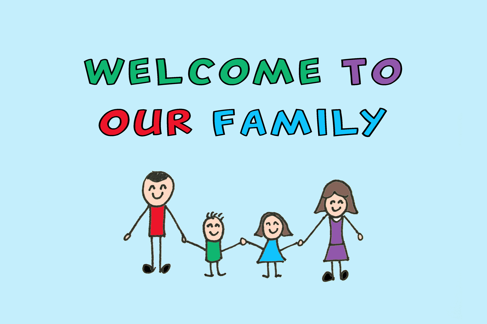
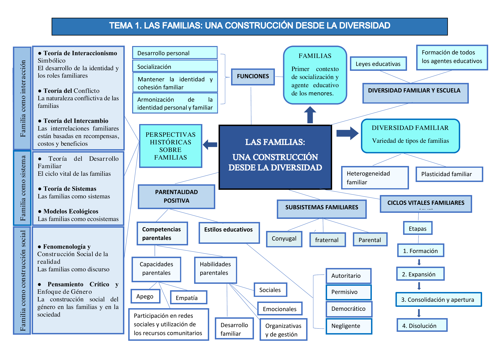
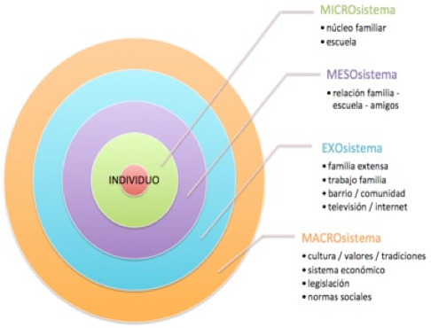
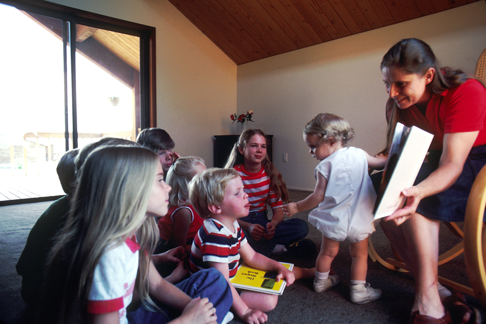

## Introducción

Esta unidad estudia la familia como una realidad plural, histórica y cambiante. El enfoque combina fundamentos teóricos con orientaciones prácticas para la intervención educativa, la orientación familiar y la acción tutorial en contextos de diversidad.

_Imagen de referencia sobre diversidad familiar y acogida. Fuente: Wikimedia Commons._

## Objetivos de aprendizaje

- Conocer las principales perspectivas teóricas para analizar la vida familiar.
- Comprender la diversidad de estructuras y dinámicas familiares actuales.
- Identificar fases del ciclo vital familiar y tipos de crisis.
- Analizar la parentalidad positiva y las competencias parentales.
- Diseñar líneas de acción tutorial para fortalecer la relación escuela-familia.

## Vocabulario clave

| Término | Definición didáctica |
|---|---|
| Diversidad familiar | Conjunto de formas de organización familiar existentes en una sociedad. |
| Ciclo vital familiar | Proceso de etapas y transiciones que vive una familia a lo largo del tiempo. |
| Subsistema familiar | Estructura relacional interna de la familia (conyugal, parental y fraternal). |
| Parentalidad positiva | Ejercicio de la responsabilidad parental basado en afecto, guía y límites no violentos. |
| Competencias parentales | Capacidades para cuidar, educar y promover el desarrollo integral de hijos e hijas. |
| Modelo ecológico | Enfoque que explica el desarrollo por la interacción entre persona, familia y entorno social. |

## 1. Esquema del tema

Este esquema organiza visualmente los bloques centrales de la unidad y facilita el estudio progresivo de contenidos.

_Esquema base del Tema 1 (documento proporcionado por la asignatura)._ 

## 2. Perspectivas teóricas sobre familias

El estudio de las familias requiere una visión multidimensional. Las teorías no compiten entre sí, sino que aportan lentes complementarias para comprender la complejidad de las relaciones familiares.

### 2.1. Familia como interacción

La familia se analiza desde los significados, roles y normas que se construyen en la vida cotidiana.

#### 2.1.1. Interaccionismo simbólico

- Examina cómo se construyen identidad y roles familiares mediante símbolos y comunicación.
- Ayuda a interpretar expectativas, acuerdos y conflictos dentro de la convivencia.

#### 2.1.2. Teoría del conflicto

- Considera el conflicto como fenómeno normal en toda relación social.
- Permite analizar el peso de factores sociales (clase, género, exclusión, empleo) sobre la dinámica familiar.

#### 2.1.3. Teoría del intercambio

- Analiza la permanencia o deterioro de relaciones según reciprocidad, costes y beneficios percibidos.
- Aporta criterios útiles para comprender desequilibrios y dependencia en vínculos familiares.

### 2.2. Familia como sistema

La familia se entiende como un sistema abierto: cuando cambia un miembro, cambia el conjunto.

#### 2.2.1. Teoría del desarrollo familiar

- Explica que cada etapa del ciclo vital exige tareas evolutivas específicas.
- Subraya la necesidad de adaptación ante transiciones y crisis.

#### 2.2.2. Teoría de sistemas

- Analiza estructura, límites, reglas y comunicación familiar.
- Permite diseñar intervenciones centradas en patrones relacionales y no solo en casos individuales.

#### 2.2.3. Modelos ecológicos

El modelo ecológico conecta familia, escuela, comunidad y cultura como sistemas interdependientes.

_Modelo ecológico de Bronfenbrenner en español (Teoría ecológica). Fuente: Wikimedia Commons._

### 2.3. Familia como construcción social

La familia también se configura por contextos históricos, normas culturales y relaciones de poder.

#### 2.3.1. Fenomenología y construcción social de la realidad

- Sitúa la experiencia subjetiva y el significado como claves para comprender la vida familiar.
- Favorece una orientación basada en escucha activa y comprensión contextual.

#### 2.3.2. Pensamiento crítico y enfoque de género

- Permite identificar desigualdades y estereotipos que afectan al reparto de cuidados y autoridad.
- Refuerza prácticas educativas inclusivas y respetuosas con la diversidad.

## 3. Conceptos de familia desde la diversidad

### 3.1. Definición de familia y funciones

La familia puede definirse como un sistema de vínculos de cuidado, socialización y apoyo mutuo.

Entre sus funciones principales destacan:

- Protección física y emocional.
- Socialización en valores y normas.
- Construcción de identidad y pertenencia.
- Acompañamiento del desarrollo y del aprendizaje.

### 3.2. Tipos de familias

En la práctica educativa conviven diferentes configuraciones familiares: nucleares, extensas, monoparentales, reconstituidas, homoparentales, adoptivas, acogedoras y otras. El foco pedagógico debe situarse en la calidad del cuidado y en la red de apoyos, no en un modelo único de familia.

### 3.3. Ciclos vitales familiares

Las familias cambian con el tiempo y atraviesan transiciones que pueden generar tensión. Se reconocen, entre otras, crisis:

- Crisis accidentales: aparecen de forma imprevista (por ejemplo, una enfermedad grave o una pérdida repentina) y exigen reorganización inmediata de roles, tiempos y apoyos.
- Crisis vitales o evolutivas: se vinculan a cambios esperables del ciclo de vida (nacimiento de un hijo, inicio de la adolescencia, emancipación) y requieren reajustes progresivos en normas, responsabilidades y estilos de relación.
- Crisis estructurales: se relacionan con patrones familiares rígidos o disfuncionales mantenidos en el tiempo, lo que suele dificultar la comunicación y la resolución colaborativa de conflictos.
- Crisis de cuidado o dependencia: se producen cuando un miembro necesita atención continuada; este escenario incrementa la carga familiar y hace imprescindible activar redes comunitarias y coordinación socioeducativa.

Comprender estos procesos facilita la prevención y la intervención temprana desde la escuela.

### 3.4. Subsistemas familiares

Los principales subsistemas son:

- Subsistema conyugal: integra la relación entre las personas adultas de la pareja. Su calidad influye en la estabilidad emocional del hogar, en la toma de decisiones y en el clima educativo cotidiano.
- Subsistema parental: organiza las funciones de cuidado, protección y orientación hacia hijos e hijas. Desde la acción tutorial, es clave para alinear pautas educativas entre familia y escuela.
- Subsistema fraternal: se construye entre hermanos y hermanas como primer espacio de aprendizaje entre iguales. Favorece competencias sociales como negociación, cooperación, manejo de conflictos y empatía.

Un funcionamiento saludable requiere límites claros, firmes y flexibles para favorecer autonomía, cooperación y sentido de pertenencia.

### 3.5. Parentalidad positiva: estilos educativos y competencias parentales

La parentalidad positiva se orienta al interés superior del menor y combina afecto, reconocimiento, guía y límites.

Principios clave:

- Afecto y seguridad emocional: el vínculo cálido y estable permite que niños y niñas desarrollen confianza básica, autorregulación y apertura al aprendizaje.
- Entorno estructurado y predecible: las rutinas y normas claras reducen incertidumbre, mejoran la convivencia y facilitan la interiorización de hábitos.
- Estimulación y apoyo al aprendizaje: acompañar con expectativas ajustadas y andamiajes favorece autonomía, motivación y progreso evolutivo.
- Comunicación y reconocimiento: escuchar, validar emociones y reconocer logros fortalece autoestima, pertenencia y competencia social.
- Educación sin violencia: la disciplina formativa, basada en límites coherentes y reparación del daño, protege derechos y promueve conductas prosociales.

La evidencia señala que prácticas parentales positivas se asocian con mejores indicadores de desarrollo y menor riesgo de retrasos conductuales y socioemocionales.

_Interacción familiar positiva en contexto de lectura compartida. Fuente: Wikimedia Commons._

### 3.6. Diversidad familiar y escuela

La acción tutorial debe integrar la diversidad familiar en el proyecto educativo del centro.

Líneas de actuación recomendadas:

- Comunicación respetuosa y bidireccional con todas las familias.
- Detección temprana de situaciones de riesgo y vulnerabilidad.
- Coordinación con orientación y recursos comunitarios.
- Prevención de estereotipos y sesgos en materiales y prácticas de aula.
- Formación docente específica en diversidad familiar.

## 4. Aportes complementarios de fuentes en internet

Para ampliar el tema, se incorporan marcos y recursos de referencia internacional:

- Consejo de Europa: definición institucional de parentalidad positiva y apoyo al ejercicio parental.
- CDC (Estados Unidos): guías prácticas de parentalidad positiva por etapas de desarrollo.
- UNICEF Parenting: orientaciones para acompañamiento familiar, vínculo y bienestar infantil.
- OMS y marco de cuidados de crianza: enfoque integral para desarrollo en primera infancia.

Estos recursos refuerzan la idea de que la intervención con familias debe ser preventiva, contextualizada y basada en evidencia.

## 5. Síntesis final

- Las familias son realidades diversas, dinámicas y culturalmente situadas.
- Las perspectivas teóricas permiten analizar interacciones, estructura y contexto social.
- La parentalidad positiva combina afecto, límites y acompañamiento educativo.
- La escuela tiene un papel clave en la inclusión de la diversidad familiar.
- La coordinación entre familia, tutoría, orientación y comunidad mejora el desarrollo infantil.

## 6. Anexos de la unidad

### 6.1. Guía para promover una parentalidad positiva

- [Abrir anexo 1 (PDF)](../anexos/Guia-para-promover-una-parentalidad-positiva.pdf)

### 6.2. Parentalidad positiva: ganar salud y bienestar de 0-3 años

- [Abrir anexo 2 (PDF)](../anexos/Parentalidad-positiva-ganar-salud-y-bienestar-0-3-guia-talleres.pdf)

### 6.3. Parentalidad positiva: cómo trabajar los estilos educativos en la familia

- [Abrir anexo 3 (MD)](../anexos/Parentalidad-positiva-como-trabajar-los-estilos-educativos-en-la-familia.md)

## Bibliografía básica

- Álvarez-González, B., Fernández Suárez, A. P. y González-Benito, A. (2023). *Las familias: una construcción desde la diversidad* (Capítulo 1, pp. 3-50). Editorial Sanz y Torres.

## Bibliografía recomendada

- Álvarez González, B. (2003). *Orientación Familiar. Intervención con familias en el ámbito de la diversidad*. Sanz y Torres.
- Aroca, C. y Cánovas, P. (2012). Los estilos educativos parentales desde los modelos interactivo y de construcción conjunta: Revisiones de las investigaciones. *Teoría de la Educación*, 24(2), 149-176.
- Barudy, J. y Dantagnan, M. (2009). *Los buenos tratos a la infancia. Parentalidad, apego y resiliencia*. Gedisa.
- Bertalanffy Von, L. (1976). *Teoría General de los Sistemas*. Editorial Fondo de Cultura Económica.
- Bronfenbrenner, U. (1987). *La ecología del desarrollo humano*. Paidós.
- Cprek, S. E., Williams, C. M., Asaolu, I., Alexander, L. A. y Vanderpool, R. C. (2015). Three positive parenting practices and their correlation with risk of childhood developmental, social, or behavioral delays: An analysis of the National Survey of Children’s Health. *Maternal and Child Health Journal*, 19(11), 2403-2411. https://doi.org/10.1007/s10995-015-1759-1
- Crisol, E. y Romero, M. A. (2018). *Intervención psicoeducativa en educación infantil*. Síntesis.
- Gómez, E. y Muñoz, M. M. (2014). *e2p Escala de Parentalidad Positiva*. Fundación Ideas para la Infancia.
- Gómez Rostoll, E., y Belda Torrijos, M. (2021). Los cuentos como recurso para trabajar la diversidad familiar en Educación Infantil. *Educación y Futuro Digital*, 22, 85-104.
- Gracia, E. y Musitu, G. (2000). *Psicología social de la familia*. Paidós.
- Hernández, R. M. (2017). Impacto de las TIC en la educación: Retos y Perspectivas. *Propósitos y Representaciones*, 5(1), 325-347. http://dx.doi.org/10.20511/pyr2017.v5n1.149
- Martínez, M. C., Álvarez, B. y Fernández, A. P. (2015). *Orientación Familiar. Contextos, evaluación e intervención*. Sanz y Torres.
- Rodrigo, M. J., Máiquez, M. L., Martín, J. C., Byrne, S. y Rodríguez, B. (2015). *Manual práctico de parentalidad positiva*. Síntesis.
- Santana, E. V. (2015). La familia del Siglo XXI. Fuente inagotable para la educación de personas. *Revista Digital A&H*, 1, 90-100.
- Simaes, A. Ch. y Mancini, N. (2021). Parentalidad Positiva y Competencias Parentales en cuidadores primarios de niños y niñas de 0 a 3 años. *Psicología del Desarrollo*, 2, 37-48.
- Suárez, P. A. y Vélez, M. (2018). El papel de la familia en el desarrollo social del niño: una mirada desde la afectividad, la comunicación familiar y estilos de educación parental. *Psicoespacios*, 12(20), 173-198.
- Terradellas, M. R. (2020). Aprendizaje basado en retos y procesos co-creativos. Una oportunidad para abordar la diversidad familiar y los estereotipos de género en la formación inicial de maestros de Educación Infantil. *Ciencia, Técnica y Mainstreaming Social*, 4, 49-59.
- Torío, S., Peña, J. V., García, O. y Inda, M. (2019). Evolución de la Parentalidad Positiva: Estudio longitudinal de los efectos de la aplicación de un programa de educación parental. *Revista Electrónica Interuniversitaria de Formación del Profesorado*, 22(3), 109-126.
- Urdiales, I., Caurcel, M. J. y Crisol, E. (2021). La diversidad familiar desde la perspectiva de los futuros docentes de Educación Infantil: necesidades docentes. *Revista Complutense de Educación*, 32(3), 349-359.
- Valarezo, Ch. M., Celi, S. Z., Rodríguez, D. B., y Sánchez, V. C. (2020). Caracterización general y evolución de la personalidad en la primera infancia. *Horizontes. Revista de Investigación en Ciencias de la Educación*, 4(16), 469-486.
- Vargas, I. (2013). *Familia y Ciclo Vital Familiar*. OMS.
- Vargas-Rubilar, J. y Arán-Filippetti, V. (2014). Importancia de la Parentalidad para el Desarrollo Cognitivo Infantil: una revisión teórica. *Revista Latinoamericana de Ciencias Sociales, Niñez y Juventud*, 12(1), 171-186.
- Yamaoka, Y. y Bard, D. E. (2019). Positive parenting matters in the face of early adversity. *American Journal of Preventive Medicine*, 56(4), 530-539.

## Fuentes en internet consultadas

- Consejo de Europa. Recomendación Rec(2006)19 sobre políticas de apoyo al ejercicio positivo de la parentalidad: https://www.coe.int/en/web/children/parenting-support
- CDC. Positive Parenting Tips: https://www.cdc.gov/parenting/
- UNICEF Parenting: https://www.unicef.org/parenting
- OMS. Nurturing Care Framework (primera infancia): https://nurturing-care.org/
- DOI (artículo sobre prácticas parentales y desarrollo infantil): https://doi.org/10.1007/s10995-015-1759-1

**Fecha de actualización:** 23/02/2026
