## Introducción

La orientación familiar es un ámbito esencial de la orientación educativa, porque permite intervenir de forma planificada ante necesidades de desarrollo, prevención y apoyo en las relaciones entre familia, escuela y comunidad. Esta unidad presenta el marco conceptual y los principales modelos de intervención para fundamentar una práctica profesional rigurosa y contextualizada.

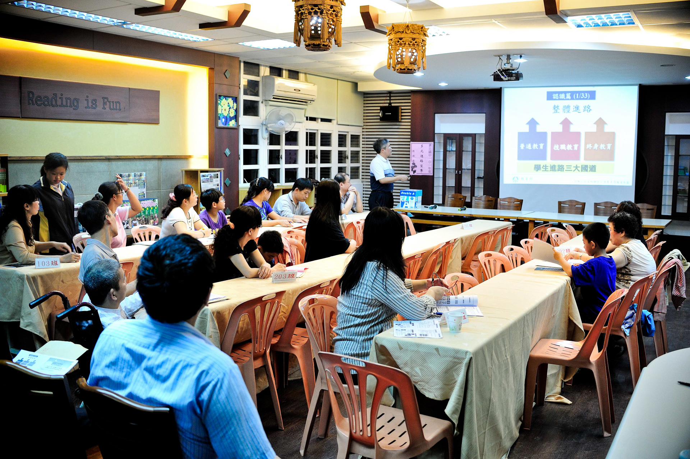
_Encuentro entre familias y centro educativo. Fuente: Wikimedia Commons._

## Objetivos de aprendizaje

- Comprender el concepto de orientación familiar y su evolución en el ámbito educativo.
- Identificar funciones, principios y niveles de intervención en orientación familiar.
- Diferenciar los principales modelos de intervención y sus aplicaciones prácticas.
- Analizar tendencias actuales para la intervención con familias en contextos escolares.
- Relacionar teoría y práctica mediante tablas de síntesis y criterios de toma de decisiones.

## Vocabulario clave

| Término | Definición didáctica |
|---|---|
| Orientación familiar | Proceso de ayuda planificado para mejorar el funcionamiento familiar y su función educativa. |
| Intervención preventiva | Actuaciones anticipadas para evitar la aparición o agravamiento de problemas. |
| Modelo de intervención | Marco teórico-práctico que guía la planificación, ejecución y evaluación de actuaciones. |
| Consulta | Modelo indirecto en el que el orientador asesora a profesionales o familias para intervenir mejor. |
| Programa | Intervención estructurada con objetivos, actividades, seguimiento y evaluación. |
| Enfoque sistémico | Perspectiva que analiza a la familia como sistema de relaciones interdependientes. |

## 1. Orientación familiar

### 1.1. Concepto y funciones

La orientación familiar puede definirse como una disciplina científica y profesional orientada a facilitar el desarrollo positivo de las personas vinculadas por relaciones familiares, a lo largo del ciclo vital y en distintos contextos de convivencia.

Funciones principales:

- Optimizar el desarrollo personal y familiar.
- Prevenir situaciones de riesgo, vulnerabilidad y conflicto.
- Facilitar la toma de decisiones y la resolución de problemas.
- Fortalecer la colaboración entre familia y escuela.

### 1.2. Niveles de intervención

El tema distingue tres niveles complementarios:

- Nivel educativo: dirigido a todas las familias para fortalecer competencias parentales y funciones socializadoras.
- Nivel de orientación: centrado en situaciones de dificultad concreta para mejorar recursos y ajustes del sistema familiar.
- Nivel terapéutico: orientado a problemáticas complejas cuando los niveles previos no resultan suficientes.

Cada nivel exige objetivos, técnicas y profesionales específicos, pero todos comparten la finalidad de mejorar bienestar, convivencia y desarrollo.

### 1.3. Perspectivas y principios

La intervención en orientación familiar integra perspectivas cognitivo-conductuales, sociales y sistémicas. Sobre esa base, se sostienen principios clave:

- Prevención: actuar antes de la cronificación de problemas.
- Desarrollo: potenciar recursos y fortalezas familiares.
- Intervención contextualizada: adaptar estrategias a realidad sociocultural y educativa.
- Colaboración: trabajo coordinado entre familias, profesorado y orientación.

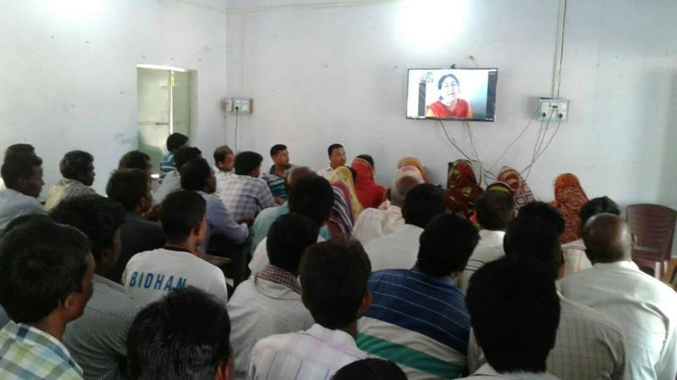
_Reunión de familias y profesorado en contexto escolar. Fuente: Wikimedia Commons._

### 1.4. Orientación familiar en el ámbito escolar

En el contexto escolar, la orientación familiar no se limita a actuaciones puntuales. Requiere planificación dentro del proyecto educativo, coordinación tutorial y evaluación continua de resultados.

Claves de implementación:

- Integrar objetivos familia-escuela en la acción tutorial.
- Diseñar protocolos de comunicación y seguimiento.
- Coordinar respuestas en situaciones de riesgo socioeducativo.
- Promover participación familiar desde una lógica de corresponsabilidad.

## 2. Modelos de intervención en orientación familiar

### 2.1. Modelo de Counseling

Se centra en la relación de ayuda y en el acompañamiento individualizado para clarificar problemas, explorar alternativas y favorecer decisiones ajustadas. Es especialmente útil cuando la familia necesita apoyo focalizado.

### 2.2. Modelo de Consulta

El orientador asesora a otros agentes educativos (tutores, equipos directivos, profesorado, familias) para mejorar la intervención indirecta con alumnado y entorno familiar. Es un modelo clave en centros educativos por su potencial multiplicador.

### 2.3. Modelo de Servicios

Organiza la intervención desde servicios especializados con funciones definidas. Suele responder a necesidades detectadas y puede resultar eficaz para casos específicos, aunque requiere coordinación para evitar fragmentación.

### 2.4. Modelo de Programas

Estructura la intervención en fases: análisis de necesidades, formulación de objetivos, diseño, ejecución y evaluación. Permite continuidad, seguimiento y medición de impacto.

### 2.5. Modelo de Servicios actuando por Programas

Combina la especialización de servicios con la lógica planificada de programas. Favorece una intervención más sistémica y sostenible al articular recursos, objetivos y evaluación.

### 2.6. Modelo Tecnológico

Integra recursos TIC para información, seguimiento, comunicación y formación familiar. Su eficacia depende del diseño pedagógico, la accesibilidad y el uso ético de los datos.

### 2.7. Modelo Educativo Constructivista

Prioriza la intervención colaborativa, preventiva y contextualizada. El orientador actúa como profesional experto-colaborador, promoviendo corresponsabilidad entre agentes educativos y construcción compartida de soluciones.

### 2.8. Tendencias actuales

Las tendencias actuales apuntan a modelos mixtos, intervención proactiva y trabajo interprofesional en red. El enfoque preventivo y la coordinación familia-escuela-servicios comunitarios son elementos nucleares.

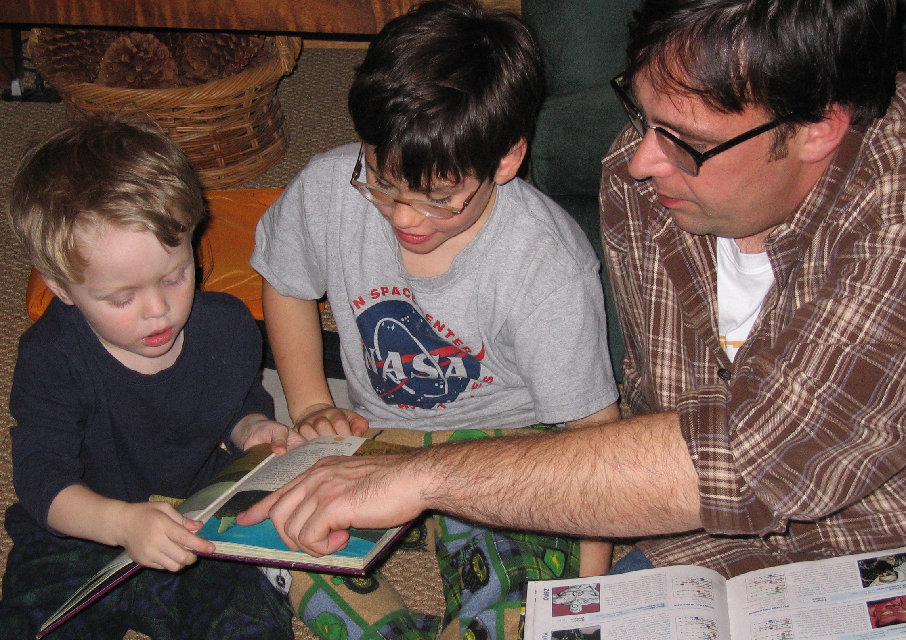
_Contexto de acompañamiento educativo en familia. Fuente: Wikimedia Commons._

## 3. Diagramas y esquemas del tema

Las siguientes imágenes corresponden a los diagramas y recursos visuales del tema 2 y se incorporan como apoyo directo al estudio.

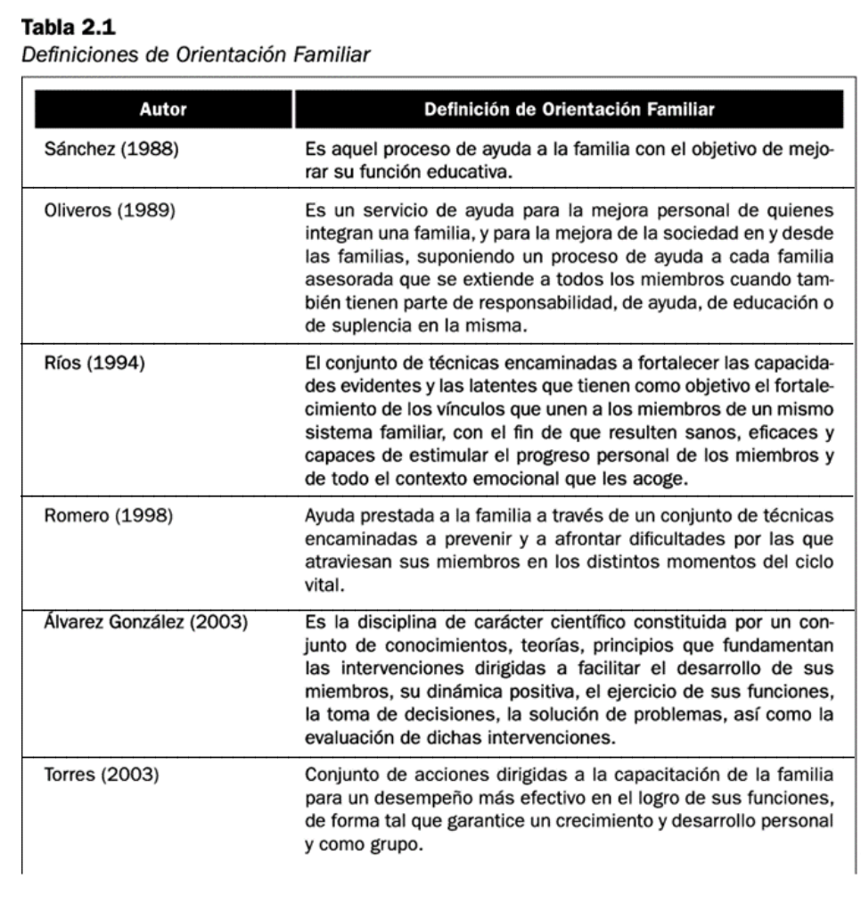
_Diagrama 1 del tema 2._

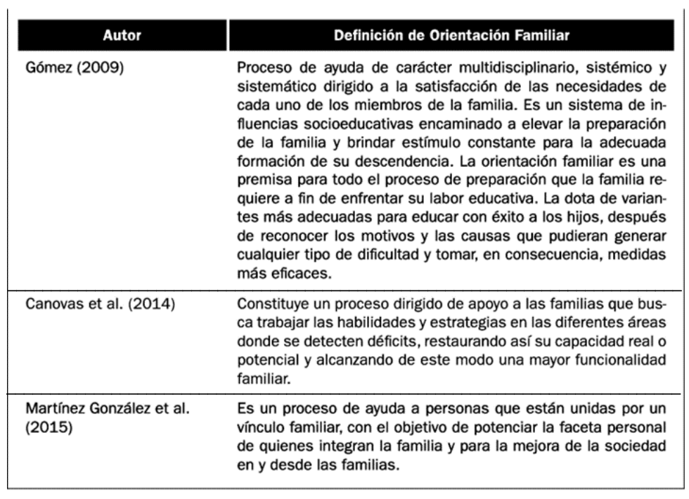
_Diagrama 2 del tema 2._

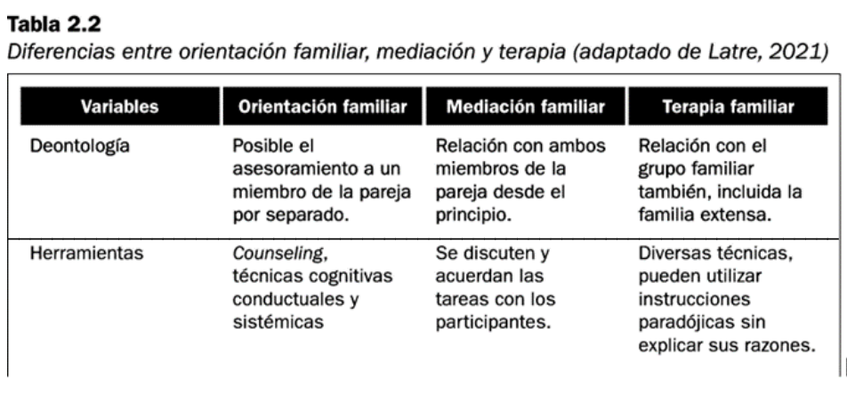
_Diagrama 3 del tema 2._

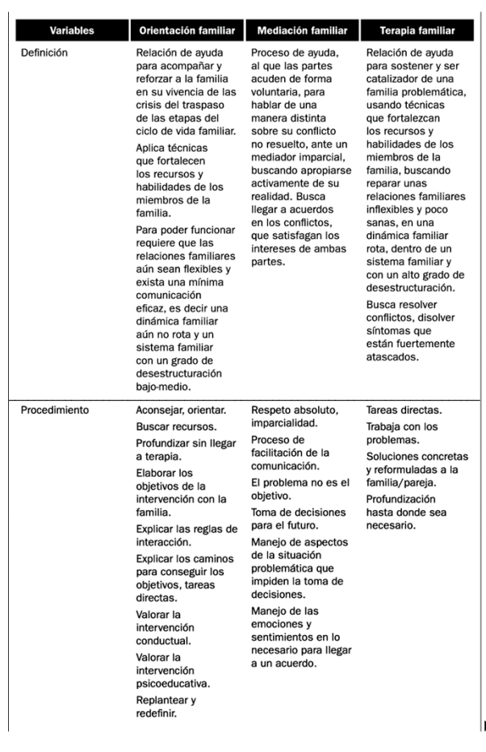
_Diagrama 4 del tema 2._

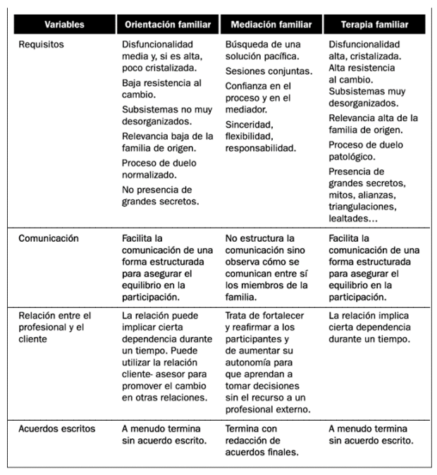
_Diagrama 5 del tema 2._

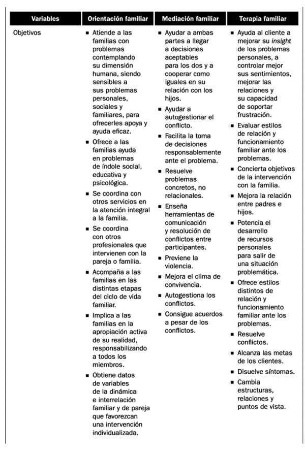
_Diagrama 6 del tema 2._

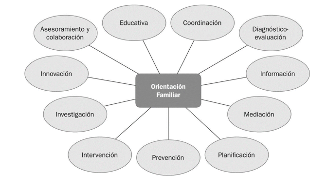
_Diagrama 7 del tema 2._

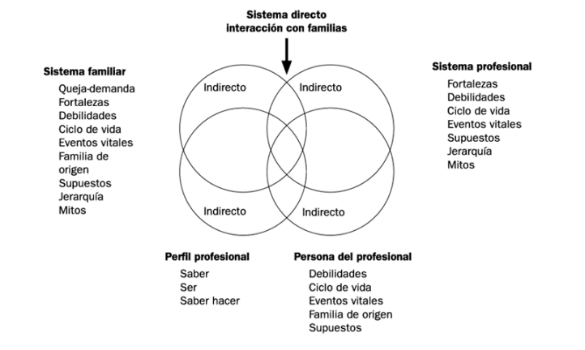
_Diagrama 8 del tema 2._

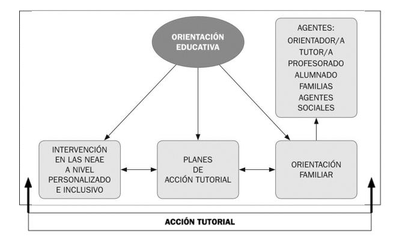
_Diagrama 9 del tema 2._

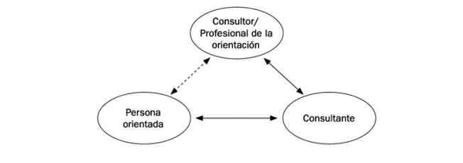
_Diagrama 10 del tema 2._

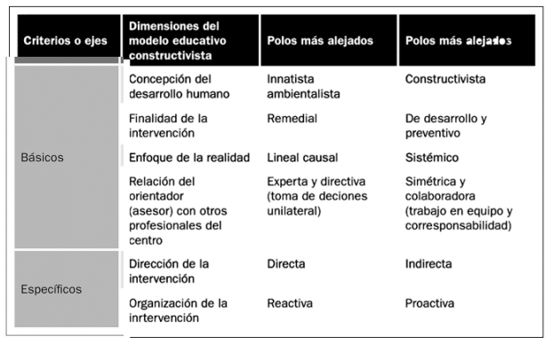
_Diagrama 11 del tema 2._

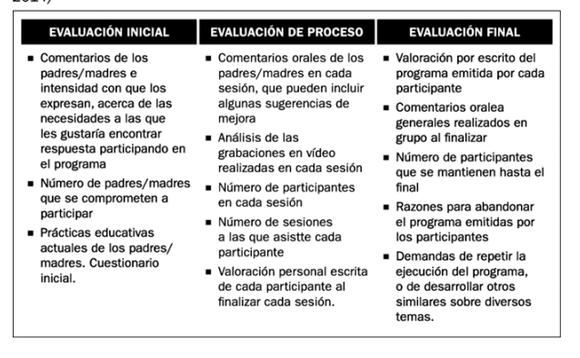
_Diagrama 12 del tema 2._

## 4. Aportes complementarios de fuentes en internet

Para ampliar el tema y actualizar su aplicabilidad, se incorporan referencias institucionales y académicas sobre parentalidad positiva, apoyo familiar y orientación educativa:

- Consejo de Europa: marco de apoyo al ejercicio positivo de la parentalidad.
- Campus FAD: recursos de intervención preventiva y formación para familias.
- Artículos con DOI sobre orientación educativa, intervención familiar y modelos de prevención.

Estos recursos consolidan la idea de una orientación familiar basada en evidencia, prevención y corresponsabilidad educativa.

## 5. Síntesis final

- La orientación familiar es una disciplina científica y aplicada con función preventiva, educativa y de apoyo al desarrollo.
- Los modelos de intervención ofrecen marcos complementarios y su combinación mejora la eficacia en contextos reales.
- El ámbito escolar exige coordinación estable entre tutoría, orientación y familias.
- Los diagramas y esquemas del tema permiten comparar enfoques y tomar decisiones fundamentadas.
- Las tendencias actuales priorizan intervención proactiva, trabajo colaborativo y uso pedagógico de tecnologías.

## Referencias básicas del tema

- Álvarez González, B. (2003). *Orientación Familiar. Intervención familiar en el ámbito de la diversidad*. Sanz y Torres.
- Martínez González, M. C., Álvarez González, B. y Fernández Suárez, A. P. (2015). *Orientación Familiar: contextos, evaluación e intervención*. Sanz y Torres.
- Vélaz de Medrano, C. (1998). *Orientación e intervención psicopedagógica: concepto, modelos, programas y evaluación*. Aljibe.
- Repetto, E. (2002). *Modelos de orientación e intervención psicopedagógica*. UNED.
- Bisquerra, R. (2006). Orientación psicopedagógica y educación emocional. *Estudios sobre Educación*, 11, 9-25.

## Fuentes en internet consultadas

- Consejo de Europa. Apoyo al ejercicio positivo de la parentalidad: https://www.coe.int/en/web/children/parenting-support
- Campus FAD. Recursos para familias: https://www.campusfad.org/descargas/familias/
- Campus FAD. En familia: educar para la vida: https://www.campusfad.org/programa/en-familia-educar-para-la-vida/
- Wikimedia Commons (imágenes de apoyo):
  - https://commons.wikimedia.org/wiki/File:Parent_teacher_meeting_at_the_Baozhong_Junior_High_School_20120411.jpg
  - https://commons.wikimedia.org/wiki/File:Parents_Teachers_Meeting_in_Jabarrah_High_School,_purulia,_west_bengal.jpg
  - https://commons.wikimedia.org/wiki/File:Family_Reading_Hour.jpg

**Fecha de actualización:** 23/02/2026
