## Introducción

La acción tutorial constituye una dimensión esencial de la función docente. No se limita a un espacio horario concreto, sino que articula el acompañamiento personal, académico y social del alumnado durante todo el proceso educativo. En esta unidad se estudian sus fundamentos históricos, su consolidación normativa, sus objetivos y la planificación del Plan de Acción Tutorial (PAT) desde un enfoque colaborativo.

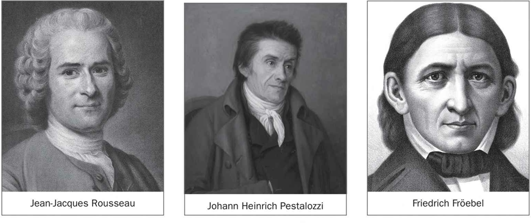

**Figura 3.1.** Esquema general de contenidos sobre concepto y fundamentos de la acción tutorial.

## Objetivos de aprendizaje

- Comprender la evolución histórica de la tutoría y su incorporación progresiva al sistema educativo.
- Identificar los principios y características que definen la acción tutorial actual.
- Analizar los objetivos de la tutoría en relación con la personalización, la educación integral y la coordinación de la comunidad educativa.
- Definir el perfil competencial del tutor o tutora en contextos educativos diversos.
- Diseñar el PAT con criterios de planificación, evaluación y mejora continua.

## Vocabulario clave

| Término | Definición didáctica |
|---|---|
| Acción tutorial | Conjunto de actuaciones de orientación y acompañamiento que forman parte de la función docente. |
| Tutoría | Intervención planificada para apoyar el desarrollo personal, social y académico del alumnado. |
| PAT | Documento de centro que organiza objetivos, actuaciones, tiempos, agentes y evaluación de la acción tutorial. |
| Coordinación educativa | Trabajo sistemático entre profesorado, orientación, familias y otros agentes para responder a necesidades del alumnado. |
| Educación integral | Enfoque que atiende dimensiones cognitivas, emocionales, sociales, éticas y vocacionales del desarrollo humano. |
| Seguimiento tutorial | Proceso continuo de observación, análisis y ajuste de las medidas de apoyo al alumnado y al grupo-clase. |

## 1. La tutoría desde sus inicios hasta la actualidad

### 1.1. Antecedentes y precursores de la tutoría

La función tutorial tiene raíces históricas en modelos educativos donde el docente actuaba como guía del aprendizaje y del desarrollo moral y social. Desde planteamientos clásicos hasta aportaciones pedagógicas modernas, la idea central se mantiene: enseñar implica acompañar.

Este enfoque evoluciona desde una relación centrada en la transmisión de contenidos hacia otra más amplia, en la que el profesorado orienta procesos de autonomía, convivencia, toma de decisiones y proyecto vital.

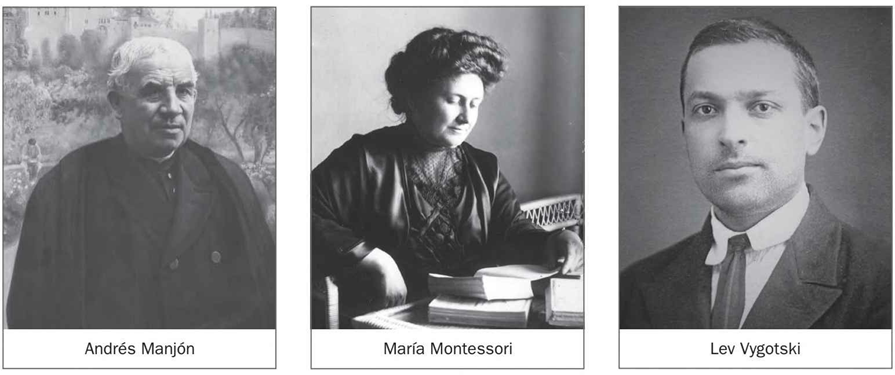

**Figura 3.2.** Representación sintética de antecedentes y evolución de la función tutorial.

### 1.2. Surgimiento del tutor o tutora en la legislación educativa

La formalización de la figura del tutor o tutora en España supuso un cambio estructural: la tutoría dejó de ser una práctica voluntarista y pasó a integrarse en la organización de centro, en la coordinación docente y en el derecho del alumnado a recibir orientación.

La normativa educativa consolidó esta figura en relación con funciones de seguimiento individual, coordinación de evaluación, comunicación con familias y mediación pedagógica entre etapas y agentes.

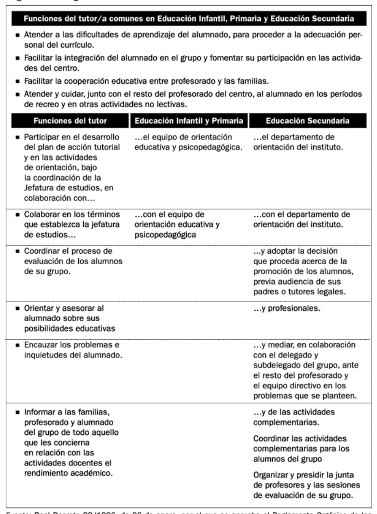

**Tabla 3.1.** Hitos normativos sobre tutoría y orientación educativa en el sistema español.

### 1.3. La función tutorial como parte de la función docente y como un derecho del alumnado

El marco actual asume que toda acción educativa incluye una dimensión tutorial. Esto implica que la personalización del aprendizaje, la prevención de dificultades y la respuesta a la diversidad no dependen de actuaciones aisladas, sino de una práctica docente coherente y sostenida.

Además, la orientación se entiende como derecho educativo. Por ello, la tutoría debe desarrollarse con criterios de equidad, inclusión, continuidad y coordinación institucional.

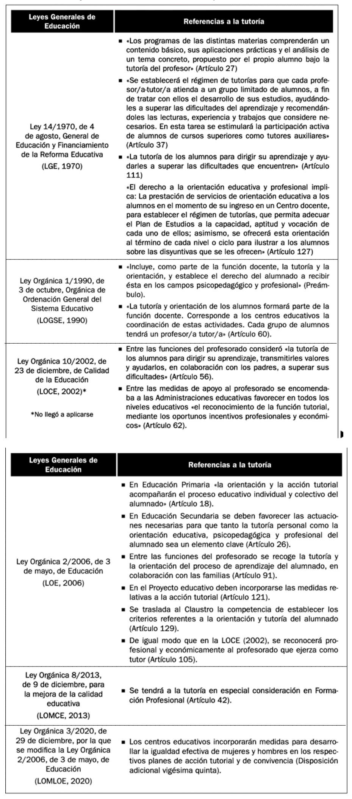

**Tabla 3.2.** Semejanzas y diferencias de las funciones tutoriales según etapa educativa.

### 1.4. Determinación de funciones y procedimiento de designación del tutorado

Las funciones tutoriales se estructuran en torno a cuatro ejes:

- Acompañamiento del alumnado en su proceso personal, académico y social.
- Coordinación de información relevante del grupo y del seguimiento individual.
- Relación educativa con las familias desde una lógica de corresponsabilidad.
- Articulación con el equipo docente y con orientación para tomar decisiones compartidas.

La designación del tutor o tutora requiere criterios pedagógicos, estabilidad razonable y disponibilidad real para el trabajo de coordinación.

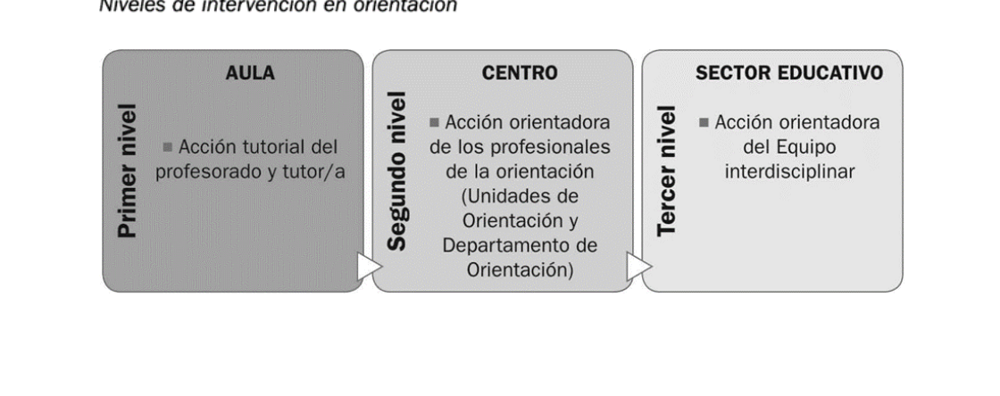

**Figura 3.3.** Funciones nucleares del profesorado tutor en el centro educativo.

### 1.5. Consolidación de la función tutorial como factor de calidad educativa

La calidad educativa mejora cuando la tutoría se integra en la cultura de centro y no solo en actuaciones puntuales. Un sistema tutorial sólido reduce discontinuidades, favorece la detección temprana de necesidades y fortalece el vínculo entre aprendizaje y bienestar.

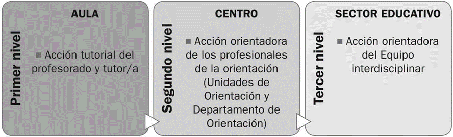

**Figura 3.4.** Relación entre calidad educativa, seguimiento tutorial y mejora del aprendizaje.

## 2. Delimitación, principios y características de la acción tutorial

La acción tutorial se delimita como un proceso planificado, preventivo y orientador que atraviesa la actividad educativa ordinaria.

Principios esenciales:

- Prevención y anticipación de dificultades.
- Personalización de la enseñanza y del acompañamiento.
- Integralidad del desarrollo del alumnado.
- Inclusión y equidad en la respuesta educativa.
- Coordinación entre escuela, familia y entorno.

Características operativas:

- Continuidad durante toda la trayectoria escolar.
- Evaluación formativa de decisiones tutoriales.
- Flexibilidad para adaptarse a contextos y necesidades.
- Trabajo en red con agentes internos y externos.

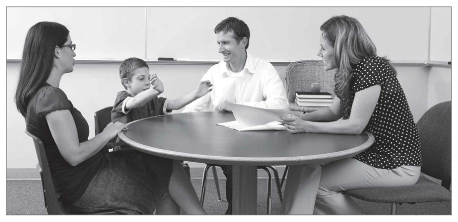

**Tabla 3.3.** Principios de la acción tutorial y su traducción práctica en el centro.

## 3. Objetivos de la tutoría y su desarrollo mediante la función tutorial

### 3.1. Favorecer la personalización de los procesos de enseñanza-aprendizaje

La tutoría permite ajustar metas, apoyos y ritmos de aprendizaje. Esto incluye analizar barreras, activar medidas de acompañamiento y revisar decisiones con el equipo docente.

La personalización no consiste en individualizar de forma aislada, sino en construir itinerarios educativos realistas, con seguimiento y evaluación de resultados.

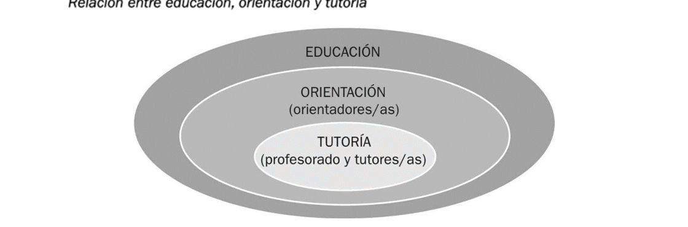

**Figura 3.5.** Ejemplo de relación entre diagnóstico tutorial, ajuste metodológico y progreso del alumnado.

### 3.2. Fomentar la educación integral del alumnado

La educación integral implica trabajar competencias académicas, socioemocionales, convivenciales y vocacionales. La tutoría conecta estos ámbitos con actividades planificadas, entrevistas, dinámicas grupales y coordinación con familias.

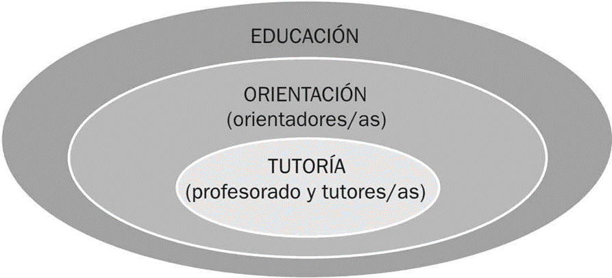

**Figura 3.6.** Dimensiones del desarrollo integral que orientan la intervención tutorial.

### 3.3. Contribuir a la coordinación e interacción adecuada de la comunidad educativa

La tutoría es un nodo de coordinación. Su eficacia depende de la coherencia entre profesorado, orientación, equipos directivos y familias. Sin esta coordinación, la intervención pierde continuidad y calidad.

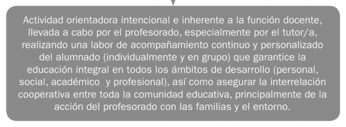

**Tabla 3.4.** Agentes, responsabilidades y canales de coordinación en la acción tutorial.

## 4. Perfil y competencias del tutor o tutora

El perfil tutorial combina competencias pedagógicas, comunicativas, organizativas y éticas.

Competencias clave:

- Escucha activa, comunicación clara y gestión de entrevistas educativas.
- Capacidad de análisis de información académica y socioeducativa.
- Liderazgo pedagógico para coordinar al equipo docente.
- Diseño de actuaciones preventivas y de seguimiento.
- Colaboración con familias y servicios de apoyo.

Estas competencias deben desarrollarse mediante formación continua, reflexión sobre la práctica y trabajo colaborativo entre profesionales.

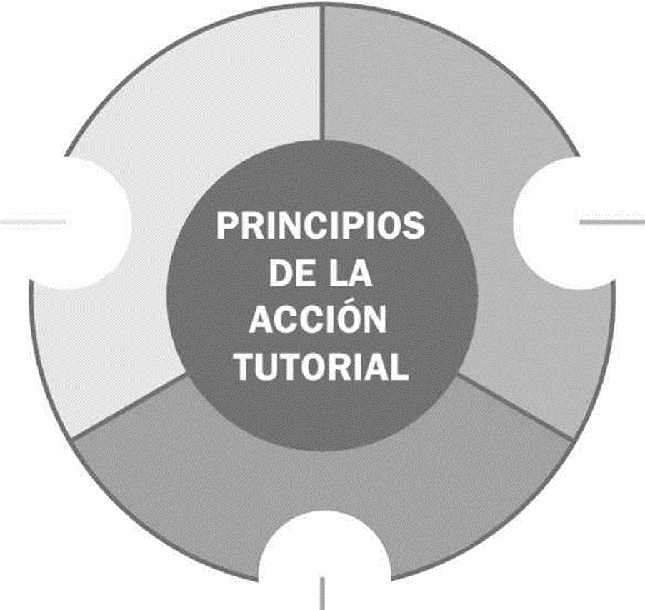

**Figura 3.7.** Competencias profesionales asociadas al desempeño tutorial.

## 5. Planificación de la acción tutorial

### 5.1. El Plan de Acción Tutorial: definición y características

El PAT es el instrumento organizador de la tutoría en cada centro. Debe concretar:

- Diagnóstico inicial y necesidades prioritarias.
- Objetivos tutoriales por etapa y nivel.
- Actuaciones con alumnado, familias y profesorado.
- Temporalización, responsables y recursos.
- Indicadores de seguimiento y evaluación.

Un PAT eficaz es contextualizado, viable y alineado con el proyecto educativo del centro.

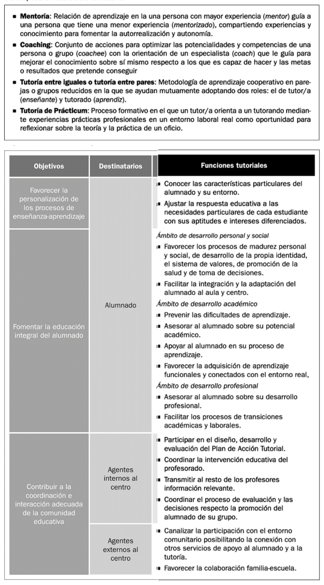

**Tabla 3.5.** Componentes básicos para el diseño del Plan de Acción Tutorial.

### 5.2. Fases de diseño, desarrollo y evaluación desde una perspectiva colaborativa

La planificación tutorial se organiza en un ciclo de mejora:

1. Diagnóstico compartido de necesidades.
2. Formulación de objetivos y criterios de éxito.
3. Diseño de actividades y protocolos de coordinación.
4. Implementación y seguimiento periódico.
5. Evaluación de procesos y resultados.
6. Ajuste del plan y retroalimentación para el siguiente ciclo.

El enfoque colaborativo convierte la tutoría en una responsabilidad institucional y no individual.

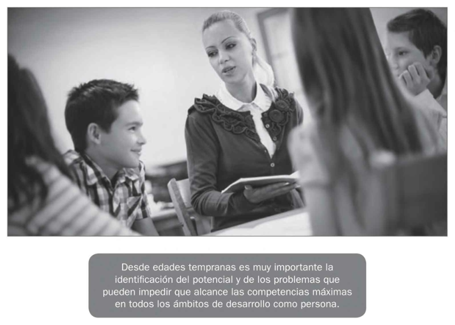

**Tabla 3.6.** Fases del PAT con enfoque colaborativo de diseño, implementación y evaluación.

## 6. Aportes complementarios de fuentes de internet

Para ampliar la unidad con evidencia actual y marcos normativos vigentes, se incorporan aportes de fuentes institucionales y académicas:

- La normativa educativa española consolida la tutoría y la orientación como elementos estructurales de la función docente y del derecho del alumnado.
- Los informes internacionales muestran que el apoyo docente y la interacción familiar sostenida se asocian con mejores estrategias de aprendizaje y motivación.
- Los enfoques contemporáneos de gobernanza educativa destacan la necesidad de alianzas estables entre familias, escuela y comunidad para sostener trayectorias de éxito.

Implicaciones prácticas para la Unidad 03:

- Reforzar la tutoría como política de centro y no como actuación periférica.
- Evaluar el PAT con indicadores de progreso académico, bienestar y convivencia.
- Aumentar la coordinación familia-escuela con protocolos claros de comunicación y seguimiento.
- Integrar el apoyo tutorial en marcos de inclusión y prevención temprana.

## 7. Síntesis final

- La acción tutorial es parte constitutiva de la función docente y eje de la orientación educativa.
- Su evolución histórica y normativa explica su papel actual como factor de calidad.
- Los objetivos tutoriales se concretan en personalización, educación integral y coordinación comunitaria.
- El perfil del tutor o tutora exige competencias técnicas y relacionales específicas.
- El PAT es la herramienta estratégica para planificar, implementar y evaluar la tutoría con enfoque colaborativo.

## Referencias básicas del tema

- Álvarez González, B. (2003). *Orientación Familiar. Intervención con familias en el ámbito de la diversidad*. Sanz y Torres.
- Martínez, M. C., Álvarez, B. y Fernández, A. P. (2015). *Orientación Familiar. Contextos, evaluación e intervención*. Sanz y Torres.
- Vélaz de Medrano, C. (1998). *Orientación e intervención psicopedagógica*. Aljibe.
- Bisquerra, R. (2006). Orientación psicopedagógica y educación emocional. *Estudios sobre Educación*, 11, 9-25.

## Fuentes en internet consultadas

- BOE. Ley Orgánica 2/2006, de Educación (texto consolidado): https://www.boe.es/eli/es/lo/2006/05/03/2/con
- BOE. Ley Orgánica 3/2020 (LOMLOE): https://www.boe.es/eli/es/lo/2020/12/29/3
- Ministerio de Educación (Revista de Educación). La construcción de la acción tutorial desde la investigación colaborativa: https://www.educacionfpydeportes.gob.es/revista-de-educacion/numeros-revista-educacion/numeros-anteriores/2006/re340/re340-33.html
- OECD. PISA 2022 Results (Volume V): parental and teacher support: https://www.oecd.org/en/publications/pisa-2022-results-volume-v_c2e44201-en/full-report/component-13.html
- OECD. PISA 2022 Results (Volume II): school climate and support: https://www.oecd.org/en/publications/pisa-2022-results-volume-ii_a97db61c-en/full-report/component-10.html
- UNESCO. Building partnerships where families, schools and communities stand together: https://www.unesco.org/sdg4education2030/en/knowledge-hub/building-partnerships-where-families-schools-and-communities-stand-together-sierra-leone

**Fecha de actualización:** 25/02/2026
