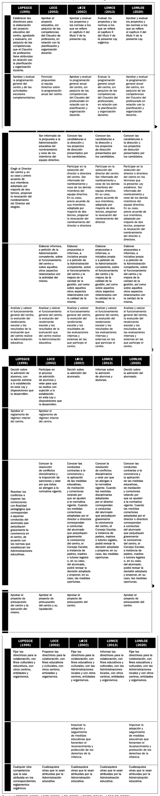
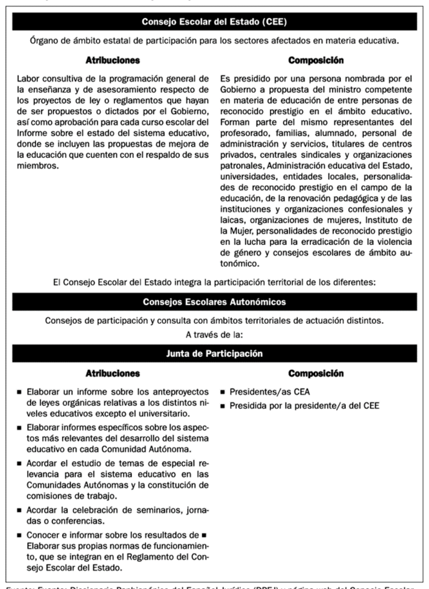
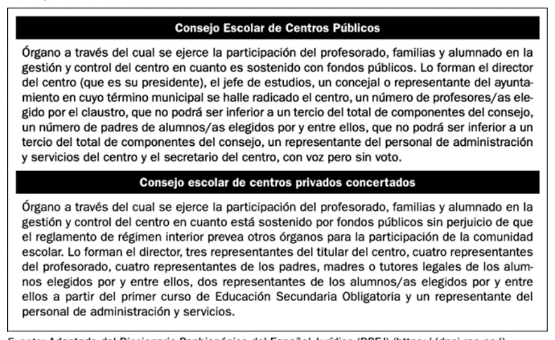
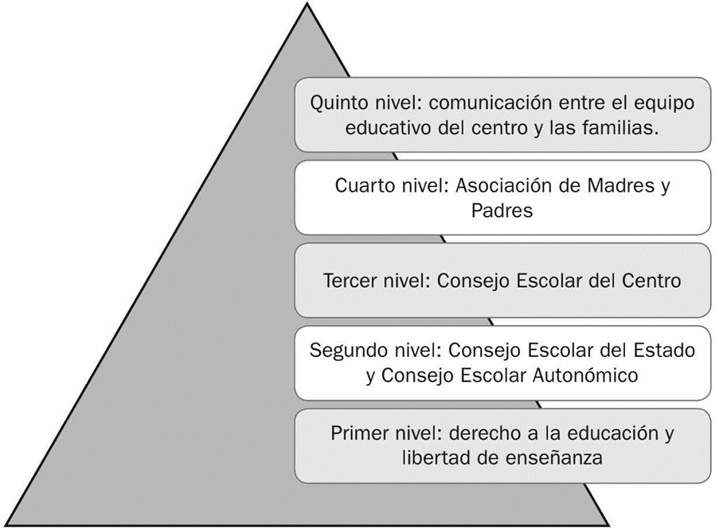
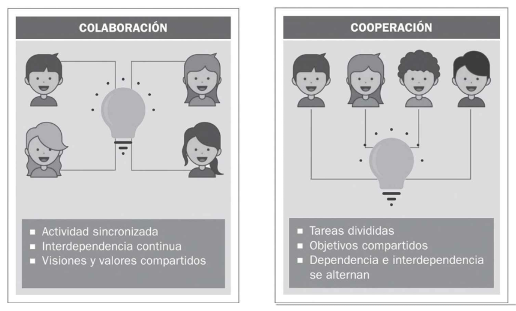
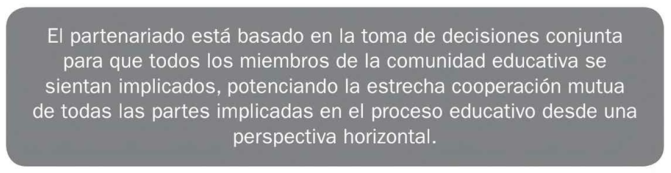
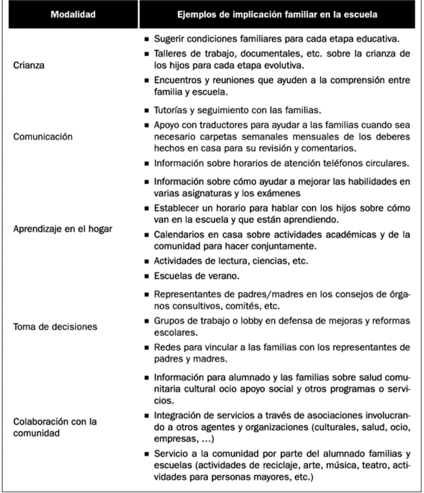
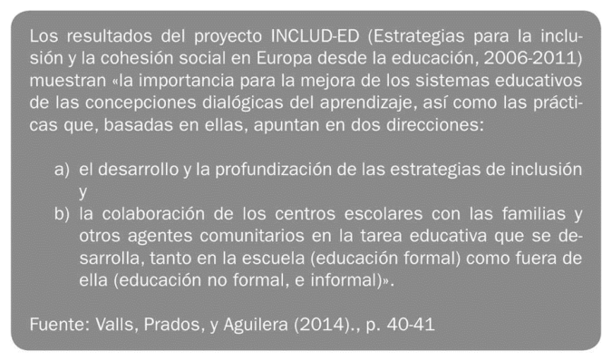
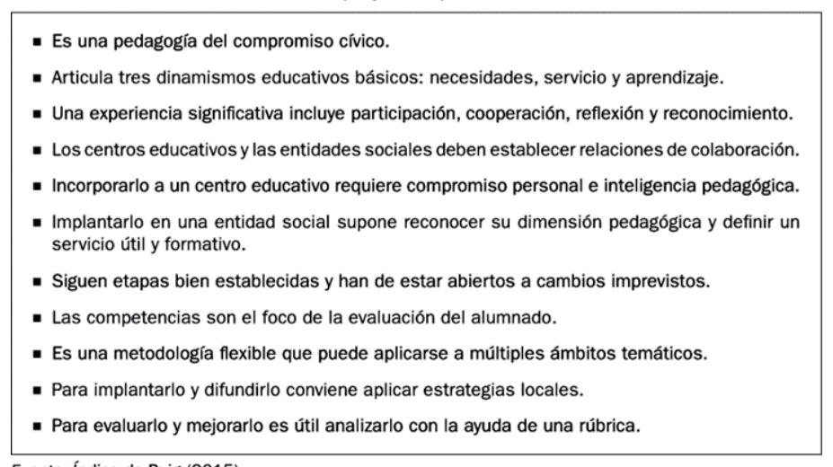
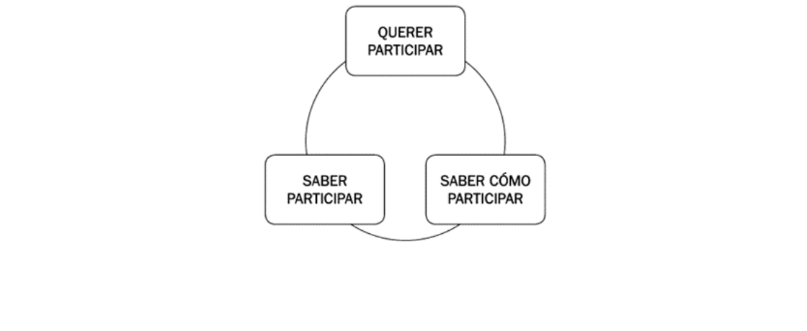

## 4.1. Comunicación y colaboración familia, escuela y comunidad

## Introducción

La calidad de la educación escolar no depende únicamente de lo que sucede en el aula. Se construye en la interacción entre tres contextos: la familia, la escuela y la comunidad. Desde esta perspectiva, la orientación familiar y la acción tutorial no pueden entenderse como actuaciones periféricas, sino como ejes estructurales para conectar expectativas, coordinar decisiones educativas y sostener trayectorias de aprendizaje con mayor equidad.

En esta unidad se aborda, con enfoque universitario y aplicado, la evolución normativa de la participación familiar, la distinción entre comunicación informativa y comunicación colaborativa, el valor de la implicación parental para la mejora de resultados y el concepto de partenariado como alianza horizontal entre agentes educativos. Se analizan además los principales obstáculos de implementación y un conjunto de prácticas de mejora transferibles a centros de Educación Infantil y Primaria, sin perder de vista la continuidad hacia etapas posteriores.

## Objetivos de aprendizaje

- Analizar la evolución histórica y legislativa de la participación familiar y comunitaria en el sistema educativo español.
- Diferenciar niveles y formas de participación parental en la vida escolar, valorando su impacto real en la toma de decisiones.
- Comprender la comunicación colaborativa y los canales formales, informales e institucionales de relación familia-escuela.
- Explicar el enfoque de implicación parental y su relación con la calidad educativa, el rendimiento y la convivencia.
- Aplicar el modelo de partenariado educativo para diseñar acciones compartidas entre escuela, familias y entorno.
- Identificar obstáculos habituales y proponer buenas prácticas sostenibles de mejora en centros educativos.

## Vocabulario clave

| Término | Definición didáctica |
|---|---|
| Participación educativa | Grado en que las familias intervienen en la información, consulta, decisión, evaluación y mejora de la vida escolar. |
| Comunicación colaborativa | Intercambio bidireccional y horizontal orientado a decisiones compartidas y corresponsabilidad educativa. |
| Implicación parental | Conjunto de prácticas familiares en el hogar y en la escuela que apoyan el aprendizaje y el desarrollo integral del alumnado. |
| Partenariado educativo | Alianza planificada entre escuela, familia y comunidad para alcanzar objetivos comunes, con reparto de responsabilidades y beneficios. |
| Consejo Escolar | Órgano colegiado de participación de los sectores de la comunidad educativa en el gobierno y organización del centro. |
| AMPA/AFA/AFE | Asociaciones de familias que canalizan participación colectiva, propuestas, apoyo comunitario y colaboración con el centro. |
| Escuela de familias | Espacio formativo y de acompañamiento para fortalecer competencias parentales y la coordinación con la escuela. |
| Aprendizaje-Servicio (ApS) | Metodología que integra aprendizaje curricular y servicio real a la comunidad mediante proyectos con sentido cívico. |

## 1. Marco normativo de la colaboración parental y comunitaria en el ámbito escolar

La historia normativa muestra una transición de modelos de participación simbólica o tutelada hacia marcos de participación progresivamente democrática. Este tránsito no ha sido lineal: incluye avances, retrocesos y reconfiguraciones competenciales.

### 1.1. Antecedentes: elección no democrática de «padres de familia»

Las primeras menciones a la presencia familiar en órganos educativos (siglo XIX) no implicaban representación democrática real. Los progenitores eran designados por autoridad administrativa y tenían funciones principalmente informativas o de supervisión menor. El foco no estaba en la corresponsabilidad pedagógica, sino en mecanismos de control institucional.

### 1.2. Creación de Consejos Escolares

Durante la Segunda República se produjo un salto cualitativo: se reconoció de forma más explícita el derecho de las familias a intervenir en el funcionamiento escolar. La creación de consejos escolares introdujo el principio de participación estructurada y no meramente ocasional.

### 1.3. Retroceso en la implicación de las familias en la toma de decisiones

En periodos posteriores, la participación familiar se redujo en algunos contextos a funciones consultivas, con escasa capacidad decisoria efectiva. Este retroceso evidencia una tensión histórica entre cultura jerárquica de centro y enfoque democrático de comunidad educativa.

### 1.4. Reconocimiento del derecho de las familias a intervenir en el control y gestión

Desde finales del siglo XX se consolidó en la legislación el derecho de las familias a participar en el control y gestión de los centros. La participación dejó de entenderse como concesión y pasó a configurarse como componente del derecho a la educación.

### 1.5. Participación activa y democrática de todos los sectores

La normativa más reciente enfatiza la participación de todos los sectores (profesorado, familias, alumnado y entorno) en clave de gobernanza compartida. Esta visión conecta con una escuela abierta al territorio y con responsabilidad social ampliada.

### 1.6. Vaivenes legislativos en las funciones atribuidas al Consejo Escolar

La trayectoria normativa muestra variaciones en el peso decisorio del Consejo Escolar según los periodos legislativos. Cuando se reduce su competencia, la participación familiar tiende a burocratizarse; cuando se refuerza, aumentan las posibilidades de corresponsabilidad real en el proyecto educativo.

**Tabla 4.1.** Síntesis histórico-normativa de la participación de las familias en los centros educativos.

**Tabla 4.2.** Variaciones en las atribuciones de los Consejos Escolares.

**Tabla 4.3.** Finalidad y composición general de los órganos colegiados de participación.

### 1.7. Nuevo impulso a la ampliación de la participación familiar

La LOMLOE (2020) vuelve a reforzar la colaboración con familias y entorno dentro del proyecto educativo de centro. Para la orientación y la tutoría esto implica:

- institucionalizar mecanismos estables de participación;
- garantizar canales de comunicación bidireccionales;
- pasar de una lógica informativa a otra decisoria y evaluativa;
- incorporar al entorno comunitario como agente educativo.

## 2. Comunicación y colaboración entre familia, escuela y comunidad

### 2.1. Concepto y formas de participación educativa

Participar no es solo "estar informado". En términos pedagógicos, la participación familiar puede situarse en distintos niveles: información, consulta, representación, toma de decisiones y corresponsabilidad educativa. El criterio de calidad no es la cantidad de contactos, sino el grado de influencia real en procesos educativos relevantes.

**Figura 4.1.** Gradiente de participación: de la presencia formal a la implicación educativa con capacidad de incidencia.

Una lectura crítica de estos niveles permite identificar riesgos frecuentes:

- representación sin capacidad de decisión sustantiva;
- participación concentrada en pocas familias;
- canales de contacto usados solo para incidencias y no para construir proyectos;
- baja conexión entre participación y mejora curricular.

### 2.2. Comunicación colaborativa en el contexto escolar

La comunicación escolar puede orientarse de forma unidireccional (informar) o colaborativa (construir decisiones compartidas). La diferencia es estructural, no meramente semántica.

- La comunicación unidireccional transmite mensajes, pero no necesariamente genera corresponsabilidad.
- La comunicación colaborativa organiza espacios de escucha mutua, negociación pedagógica y seguimiento conjunto.

**Tabla 4.4.** Distinción operativa entre colaboración y cooperación en contextos educativos.

En la práctica, la relación familia-escuela se articula por tres vías complementarias:

1. Formal: entrevistas, reuniones de tutoría, comunicados, agenda, informes.
2. Informal: interacciones breves de entrada/salida, encuentros no programados, intercambio cotidiano.
3. Institucional: Consejo Escolar, AMPA/AFA/AFE, comisiones y estructuras de participación.

**Figura 4.2.** Clasificación de canales de comunicación según nivel de formalización.

Desde la tutoría, la mejora pasa por diseñar protocolos de comunicación que combinen periodicidad, claridad, bidireccionalidad y seguimiento de acuerdos.

### 2.3. Implicación parental para la mejora de la calidad educativa

La evidencia acumulada en investigación educativa vincula una mayor implicación parental con mejores resultados académicos, mejor clima de convivencia y mayor bienestar del alumnado. Este enfoque no reduce la familia a "apoyo externo" del centro: plantea una alianza pedagógica basada en coherencia educativa entre hogar y escuela.

Elementos clave asociados a resultados positivos:

- expectativas parentales altas y realistas;
- ambiente de aprendizaje estructurado en el hogar;
- clima emocional familiar de apoyo;
- disciplina dialogada con normas claras;
- participación regular en procesos escolares.

Efectos observados sobre los distintos agentes:

- alumnado: mejor rendimiento, mayor motivación, menor absentismo;
- familias: mayor autoeficacia y comprensión de procesos escolares;
- profesorado: mayor satisfacción y mejor conocimiento del contexto del alumnado;
- centro: mejora organizativa y mayor legitimidad democrática.

### 2.4. Partenariado entre agentes educativos: reconocimiento mutuo horizontal

El partenariado educativo se entiende como alianza estratégica entre escuela, familias y comunidad para objetivos compartidos de desarrollo integral. Exige distribuir liderazgo, compartir responsabilidades y sostener decisiones conjuntas en plano de igualdad.

**Figura 4.3.** Núcleo del partenariado: toma de decisiones conjunta y cooperación horizontal.

El modelo de Epstein (1997) sigue siendo una referencia útil para organizar la implicación familiar en seis modalidades.

**Tabla 4.5.** Modalidades de implicación familiar (adaptación aplicada del modelo de Epstein).

Implicaciones para la acción tutorial:

- diseñar actuaciones diferenciadas por modalidad (no una única vía de participación);
- pasar de actividades puntuales a estrategias sostenidas;
- coordinar aportaciones de comunidad y servicios externos;
- evaluar impacto de la colaboración en aprendizaje, convivencia e inclusión.

## 3. Obstáculos y buenas prácticas para la mejora de la relación del centro con la familia y la comunidad

### 3.1. Obstáculos más frecuentes

Las barreras más reiteradas en centros educativos son:

- cultura participativa débil o burocratizada;
- comunicación cerrada y centrada en incidencias;
- percepción de baja utilidad de los órganos de participación;
- falta de tiempo y de conciliación en las familias;
- insuficiente formación específica del profesorado en comunicación y mediación;
- recursos institucionales limitados para sostener procesos participativos estables.

Estas barreras no son exclusivamente individuales; responden a factores organizativos y culturales del centro.

### 3.2. Buenas prácticas de mejora

La evidencia sobre inclusión y cohesión social subraya que la mejora no se logra con acciones aisladas, sino con estrategias sistémicas y dialógicas.

**Tabla 4.6.** Marco de referencia para vincular inclusión, diálogo y colaboración con familias y comunidad.

#### Aprendizaje-Servicio (ApS)

El ApS integra objetivos curriculares y servicio comunitario real, fortaleciendo vínculos entre escuela y entorno. Es especialmente potente cuando incluye diseño y evaluación compartidos con familias y agentes sociales.

**Tabla 4.7.** Criterios de calidad para proyectos ApS con impacto educativo y comunitario.

#### Comunidades de aprendizaje y participación colectiva

Las comunidades de aprendizaje amplían la participación a todos los actores y promueven diálogo igualitario. En este enfoque, las familias no son receptoras de información, sino coproductoras de mejora escolar.

#### Mediación escolar y tutoría

La mediación y la tutoría permiten prevenir y gestionar conflictos desde una lógica restaurativa y educativa. Su eficacia aumenta cuando existe coordinación entre equipo docente, familias y servicios comunitarios.

#### Escuelas de familias

Las escuelas de familias crean espacios formativos de reflexión compartida sobre desarrollo evolutivo, convivencia, límites, uso de tecnologías, acompañamiento académico y competencias parentales. Funcionan mejor cuando se adaptan a diversidad cultural, lingüística y de horarios.

### 3.3. Condiciones clave para una participación sostenible

La participación significativa requiere tres condiciones simultáneas:

- Querer participar (motivación y sentido).
- Saber participar (conocimiento de cauces y roles).
- Saber cómo participar (competencias comunicativas y organizativas).

**Figura 4.4.** Factores críticos para sostener una participación activa y armónica.

## 4. Ampliación con fuentes UNED, pedagogía y Educación Infantil

La literatura reciente y las fuentes institucionales permiten ampliar la unidad en cuatro líneas aplicadas:

### 4.1. Gobernanza democrática y participación efectiva

La normativa vigente refuerza la participación de las familias como parte del derecho a la educación y como criterio de calidad de centro. La mejora no depende solo de abrir órganos formales, sino de asegurar capacidad real de incidencia.

### 4.2. Comunicación escuela-familia con enfoque dialógico

La investigación pedagógica en etapas iniciales señala que la comunicación eficaz es bidireccional, planificada y contextualizada. Los canales digitales, entrevistas y reuniones deben orientarse a la toma de decisiones compartida y no únicamente al reporte académico.

### 4.3. Implicación parental y resultados educativos

Informes comparados de evaluación educativa muestran asociación entre apoyo familiar, clima de aprendizaje y mejores estrategias de estudio. En centros con mayor colaboración sostenida, suelen observarse mejores indicadores de convivencia y continuidad escolar.

### 4.4. Transferencia práctica a Educación Infantil y Primaria

En Infantil y Primaria, la relación familia-escuela tiene alto potencial preventivo. La tutoría temprana, las escuelas de familias y los proyectos comunitarios reducen discontinuidades entre hogar y escuela, especialmente en contextos de diversidad sociocultural.

## 5. Conclusiones

- La colaboración familia-escuela-comunidad es un componente estructural de la calidad educativa, no un complemento opcional.
- La evolución normativa muestra avances relevantes, pero la participación efectiva depende de la cultura organizativa de cada centro.
- La comunicación colaborativa exige bidireccionalidad, horizontalidad y seguimiento de acuerdos.
- El partenariado aporta un marco robusto para diseñar alianzas con objetivos compartidos y liderazgo distribuido.
- Las buenas prácticas más sólidas combinan participación institucional, mediación, tutoría, escuelas de familias y proyectos comunitarios con evaluación continua.

## Referencias básicas del tema

- Alfonso, C., Amat, R., D'Ángelo, E., et al. (2015). *La participación de padres y madres en la escuela*. Graó.
- Álvarez González, B. (2003). *Orientación familiar. Intervención familiar en el ámbito de la diversidad*. Sanz y Torres.
- Consejo Escolar del Estado (2014). *La participación de las familias en la educación escolar*.
- Consejo Escolar del Estado (2015). *Las relaciones entre familia y escuela. Experiencias y buenas prácticas*.
- Epstein, J. L. (2001). *School, Family and Community Partnerships*. Westview Press.
- Garreta, J. (2015). La comunicación familia-escuela en educación infantil y primaria. *RASE, Revista de Sociología de la Educación*, 8(1), 71-85.
- Martínez González, M. C., Álvarez González, B. y Fernández Suárez, A. P. (2015). *Orientación familiar. Contextos, evaluación e intervención*. Sanz y Torres.
- Valls, R., Prados, M. y Aguilera, A. (2014). El proyecto INCLUD-ED. *Investigación en la Escuela*, 82, 31-43.

## Fuentes en internet consultadas

- BOE. Ley Orgánica 2/2006, de Educación (texto consolidado): https://www.boe.es/eli/es/lo/2006/05/03/2/con
- BOE. Ley Orgánica 3/2020 (LOMLOE): https://www.boe.es/eli/es/lo/2020/12/29/3
- OECD. PISA 2022 Results, Volume II (clima y apoyo escolar): https://www.oecd.org/en/publications/pisa-2022-results-volume-ii_a97db61c-en/full-report/component-10.html
- OECD. PISA 2022 Results, Volume V (apoyo de familias y docentes): https://www.oecd.org/en/publications/pisa-2022-results-volume-v_c2e44201-en/full-report/component-13.html
- Revista REIFOP. Escuela y Familia como pilares de orientación educativa: https://www.redalyc.org/articulo.oa?id=217036214002
- Revista Investigación en la Escuela. INCLUD-ED: https://revistascientificas.us.es/index.php/IE/article/view/6970
- RASE. Comunicación familia-escuela en Infantil y Primaria: https://ojs.uv.es/index.php/RASE/article/view/8768
- Canal UNED. Recursos para familias y docentes: https://canal.uned.es/series/65d8d4eecdc8a3112f03ca14

**Fecha de actualización:** 01/03/2026
