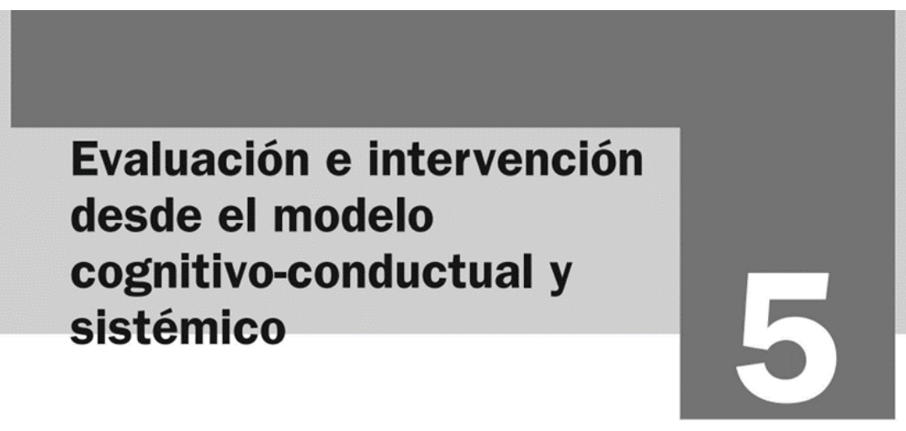
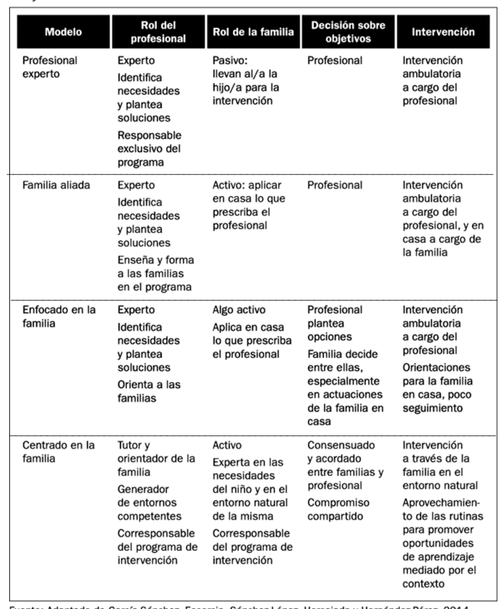
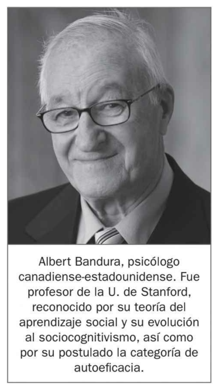
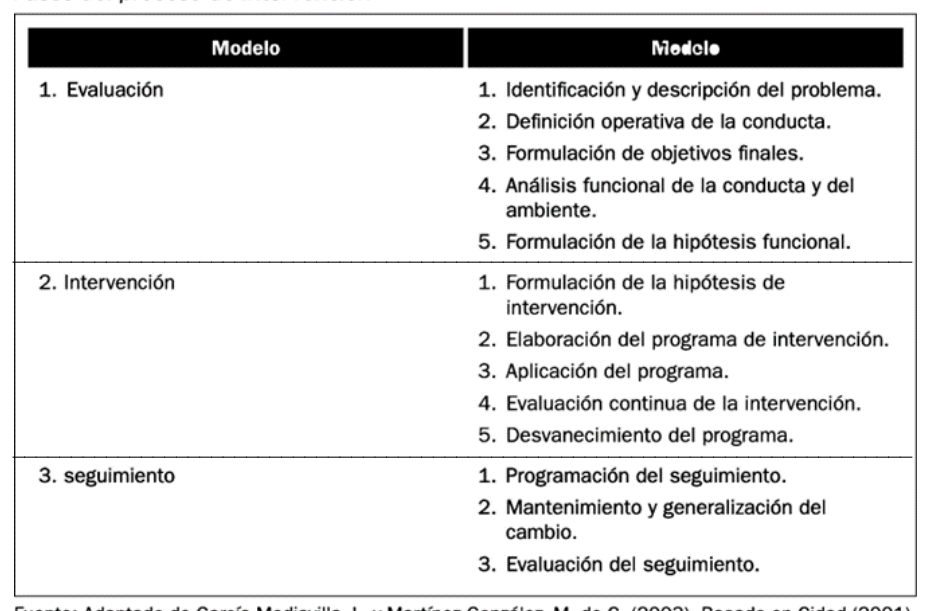
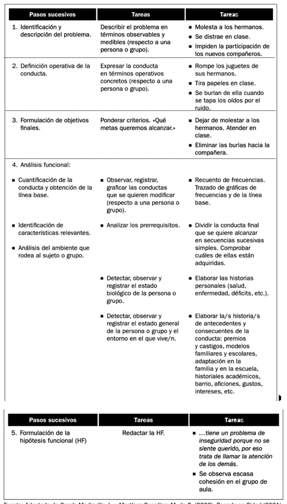
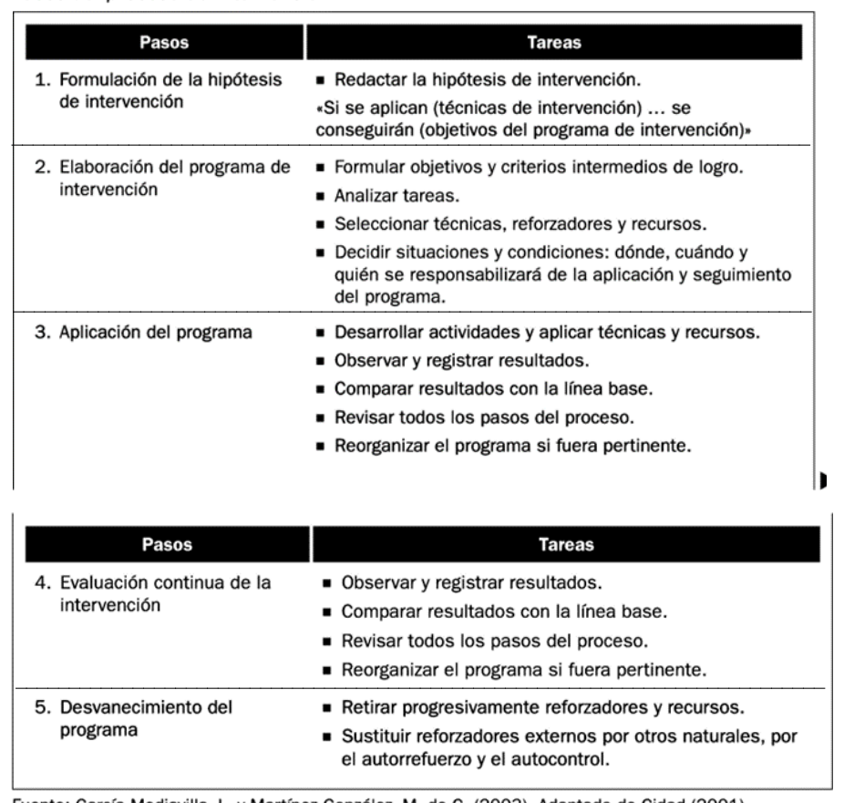
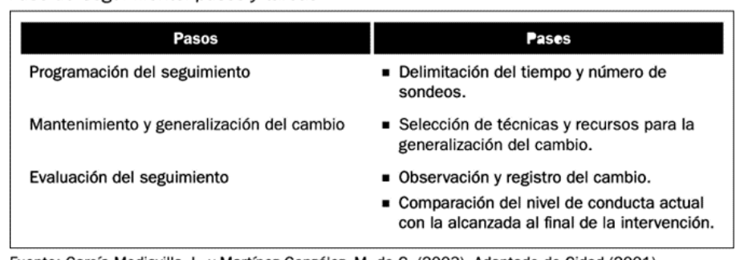
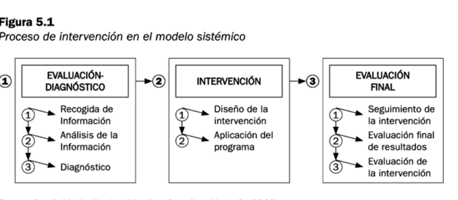
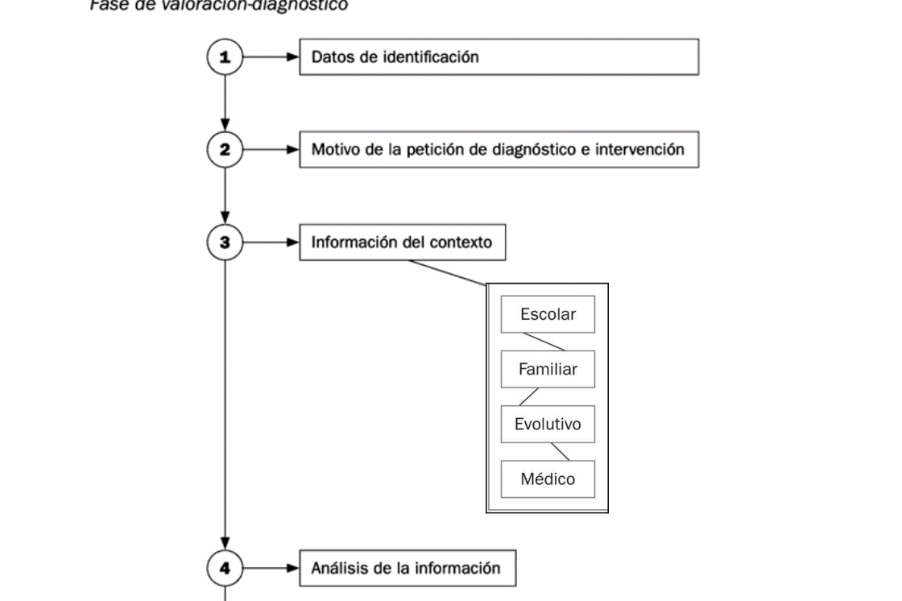
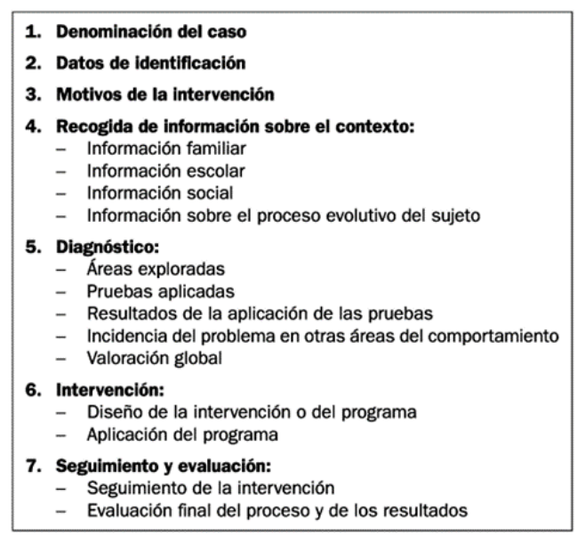

## 5.1. Evaluación e intervención desde el modelo cognitivo-conductual y sistémico

## Introducción

La intervención con familias en contextos educativos exige una mirada técnica, ética y contextualizada. Esta unidad desarrolla dos marcos complementarios. Por un lado, el modelo cognitivo-conductual, centrado en el análisis funcional de la conducta, la formulación de hipótesis de intervención y la evaluación sistemática de resultados. Por otro, el modelo sistémico o ecológico-contextual, que interpreta los problemas como fenómenos relacionales insertos en redes de interacción familiar, escolar y comunitaria.

Ambos enfoques son especialmente relevantes para la acción tutorial porque permiten pasar de explicaciones simplistas sobre el comportamiento del alumnado a procesos de valoración e intervención rigurosos, con seguimiento y corresponsabilidad entre profesionales y familias. La unidad se centra en cómo evaluar, intervenir y hacer seguimiento sin perder la perspectiva preventiva, inclusiva y orientada al desarrollo integral del niño o la niña.

**Imagen 5.1.** Portada del capítulo y delimitación del foco de trabajo: evaluación e intervención desde enfoques cognitivo-conductual y sistémico.

## Objetivos de aprendizaje

- Comprender la lógica de intervención con familias en el marco de la colaboración familia-escuela.
- Analizar los fundamentos del modelo cognitivo-conductual y su aplicación en contextos educativos.
- Aplicar las fases de evaluación, intervención y seguimiento desde un enfoque técnico y verificable.
- Interpretar el modelo sistémico como marco de intervención relacional y contextual.
- Diseñar propuestas tutoriales integradas que combinen prevención, intervención y evaluación final.
- Relacionar los contenidos de la unidad con el marco normativo y con evidencia pedagógica actual.

## Vocabulario clave

| Término | Definición didáctica |
|---|---|
| Línea base | Registro inicial de la conducta antes de intervenir, utilizado para comparar cambios. |
| Análisis funcional | Procedimiento para identificar antecedentes, conducta y consecuencias que mantienen un problema. |
| Hipótesis funcional | Explicación provisional del porqué de una conducta y de cómo se mantiene en el contexto. |
| Desvanecimiento | Retirada progresiva de apoyos o reforzadores externos para consolidar autonomía. |
| Generalización | Transferencia de los cambios conductuales a situaciones, personas y contextos diferentes. |
| Enfoque sistémico | Modelo que analiza problemas como resultado de interacciones entre miembros y subsistemas. |
| Valoración diagnóstica | Fase inicial de recogida y análisis de información para fundamentar decisiones de intervención. |
| Intervención tutorial | Conjunto de actuaciones planificadas de acompañamiento, orientación y coordinación educativa. |

## 1. Intervención con familias en el marco de la comunicación y colaboración familia-escuela

La intervención familiar en el contexto escolar no se reduce a una entrevista puntual ni a la derivación de un problema. Implica decidir cómo se distribuyen responsabilidades entre profesionales y familias, quién define objetivos y qué grado de protagonismo asume cada agente en el proceso.

**Tabla 5.1.** Comparación entre modelos de intervención: profesional experto, familia aliada, enfoque centrado en la familia y decisiones compartidas.

La tabla permite extraer tres ideas pedagógicas clave:

- Cuando el modelo es exclusivamente experto, la familia participa de forma pasiva y la intervención se concentra en el profesional.
- Los modelos colaborativos aumentan la capacidad de la familia para sostener cambios en el entorno natural del niño o la niña.
- La mayor eficacia educativa suele aparecer cuando existe consenso sobre objetivos, corresponsabilidad y seguimiento conjunto.

Esta lectura conecta con una tutoría orientada a la alianza educativa y no al control unilateral. El objetivo es que la intervención sea técnicamente sólida y socialmente sostenible.

## 2. Modelo cognitivo-conductual

### 2.1. Fundamentos teóricos

El modelo cognitivo-conductual integra aportes del conductismo clásico y del aprendizaje social-cognitivo. En educación, su valor reside en que permite trabajar sobre conductas observables sin desvincularlas de expectativas, creencias, autorregulación y contexto de aprendizaje.

**Figura 5.2.** Bandura y la autoeficacia como puente entre conducta observable y procesos cognitivos.

La noción de autoeficacia es especialmente útil en orientación familiar: cuando familias y alumnado perciben que pueden influir sobre los resultados, aumentan la persistencia, la adherencia a los acuerdos y la probabilidad de cambio estable.

### 2.2. Modificación de conducta conductual-cognitiva

La modificación de conducta en educación no debe confundirse con técnicas aisladas de refuerzo o castigo. Es un proceso planificado que requiere:

- definición precisa del problema,
- formulación de objetivos verificables,
- selección de técnicas coherentes con la hipótesis funcional,
- seguimiento sistemático de resultados,
- reajuste del programa cuando los datos lo exigen.

Desde un enfoque tutorial, la intervención conductual-cognitiva es más eficaz cuando se coordina entre aula y hogar, porque los patrones de conducta se mantienen o transforman en ambos escenarios.

### 2.3. Prevención en el aula

La prevención en el aula implica actuar antes de que la dificultad se cronifique. Esto incluye organización de normas, modelado, prácticas de autorregulación, uso de reforzadores sociales y diseño de rutinas que reduzcan disparadores de conducta problemática.

En Educación Infantil y primeros cursos de Primaria, la prevención eficaz combina claridad de expectativas, apoyo emocional, consistencia entre adultos y adaptación al desarrollo evolutivo.

### 2.4. Proceso de intervención

**Tabla 5.2.** Estructura global del proceso: evaluación, intervención y seguimiento.

La secuencia propuesta por el capítulo permite organizar la toma de decisiones con criterios de evidencia y trazabilidad profesional.

#### 2.4.1. Fase de evaluación inicial

**Tabla 5.3.** Procedimiento de evaluación inicial: identificación del problema, definición operativa, objetivos, análisis funcional e hipótesis funcional.

Esta fase es decisiva porque condiciona la calidad de todo el proceso. El error más frecuente en la práctica tutorial es formular intervenciones sin una definición operativa precisa de la conducta y sin línea base suficiente.

Aspectos técnicos que deben garantizarse en esta etapa:

- indicadores observables y medibles;
- análisis de antecedentes y consecuencias;
- identificación de variables del sujeto, la familia, el aula y el contexto;
- objetivos finales realistas y evaluables.

#### 2.4.2. Fase de intervención

**Tabla 5.4.** Fase de intervención: formulación de hipótesis de intervención, diseño del programa, aplicación, evaluación continua y desvanecimiento.

En esta fase se pasa de la hipótesis al diseño operativo. La coherencia interna del programa depende de que cada técnica elegida responda a una función identificada en la evaluación inicial. Intervenir sin esa coherencia produce mejoras aparentes, pero poco sostenibles.

Elementos críticos en la implementación:

- definir responsables de aplicación y seguimiento;
- acordar tiempos y condiciones de intervención;
- registrar resultados de forma periódica;
- revisar el programa con base en datos, no en impresiones.

#### 2.4.3. Fase de seguimiento

**Tabla 5.5.** Seguimiento: programación de sondeos, generalización del cambio y evaluación final del mantenimiento.

El seguimiento evita el efecto de recaída tras retirar apoyos intensivos. Su finalidad es comprobar si el cambio se mantiene en condiciones naturales y en distintos contextos (aula, hogar, actividades comunitarias).

## 2.5. Técnicas de intervención

Las técnicas se seleccionan en función de la hipótesis funcional y del contexto. Entre las más habituales en el ámbito educativo y familiar se encuentran:

- reforzamiento diferencial y economía de fichas adaptada a la edad;
- modelado y ensayo conductual;
- contratos conductuales con criterios explícitos;
- autorregistro y autorrefuerzo progresivo;
- reorganización de rutinas y control de estímulos.

Desde una perspectiva pedagógica, la técnica no es un fin en sí mismo. Su valor depende de la calidad del diagnóstico, de la consistencia entre escuela y familia y de la evaluación continua de resultados.

## 3. Modelo sistémico o ecológico-contextual

El modelo sistémico interpreta las dificultades de conducta y convivencia como fenómenos relacionales. No se centra únicamente en el individuo, sino en pautas de interacción, jerarquías familiares, límites, comunicación y condiciones del entorno.

**Figura 5.3.** Tres fases del modelo sistémico: evaluación-diagnóstico, intervención y evaluación final.

### 3.1. El proceso de intervención en el modelo sistémico

El proceso sistémico mantiene la lógica de secuenciación técnica, pero introduce una lectura relacional de la información. Esto supone analizar:

- cómo se organiza la comunicación entre miembros de la familia;
- qué patrones se repiten y con qué función;
- qué subsistemas están más tensionados;
- qué interacciones del contexto escolar refuerzan o amortiguan el problema.

#### 3.1.1. Primera fase: evaluación-diagnóstico

**Figura 5.4.** Organización de la valoración diagnóstica: identificación, motivo de petición, análisis contextual y síntesis de la información.

La figura pone el foco en cuatro ámbitos de información contextual que deben integrarse: escolar, familiar, evolutivo y médico. Esta estructura evita diagnósticos parciales y mejora la pertinencia de la intervención.

#### 3.1.2. Segunda fase: intervención

La intervención sistémica busca modificar patrones relacionales disfuncionales y fortalecer interacciones protectoras. En términos tutoriales, esto implica:

- redefinir objetivos de cambio compartidos con la familia;
- promover interacciones positivas y expectativas ajustadas;
- reorganizar rutinas y roles cuando bloquean el desarrollo;
- coordinar escuela, familia y recursos comunitarios.

A diferencia de un enfoque exclusivamente sintomático, el modelo sistémico trabaja sobre la estructura de relaciones que sostiene el problema.

#### 3.1.3. Tercera fase: seguimiento y evaluación final

La fase final valora resultados y estabilidad del cambio, no solo en el alumno o alumna, sino en la red de interacciones implicada. El criterio de éxito no es únicamente "disminuyó una conducta", sino "mejoró el funcionamiento relacional y la adaptación escolar".

**Tabla 5.6.** Guía de documentación técnica del caso: identificación, contexto, diagnóstico, intervención y evaluación final.

## 3.2. Conclusiones del modelo sistémico

El modelo sistémico aporta una ventaja pedagógica importante: permite comprender que muchas conductas escolares problemáticas no son hechos aislados, sino respuestas insertas en relaciones y contextos. Esta lectura evita culpabilizaciones simplistas y favorece una intervención más justa, colaborativa y eficaz.

## 4. Integración de ambos modelos en la acción tutorial

La práctica profesional suele requerir una integración funcional de enfoques. No se trata de elegir entre modelo cognitivo-conductual o sistémico, sino de articularlos según la naturaleza del caso:

- el modelo cognitivo-conductual aporta precisión operativa, medición y ajuste técnico;
- el modelo sistémico aporta comprensión contextual, relacional y ecológica;
- la acción tutorial integra ambos para intervenir con rigor y sostenibilidad.

Criterios para decidir el peso de cada enfoque:

1. Nivel de complejidad del caso.
2. Grado de implicación de variables familiares y de entorno.
3. Necesidad de intervención estructurada por pasos y registros.
4. Disponibilidad de coordinación interprofesional y familiar.

## 5. Aportes de fuentes externas (UNED, pedagogía y Educación Infantil)

La ampliación con fuentes institucionales y académicas en español permite reforzar tres líneas formativas:

### 5.1. Marco normativo y derecho a la orientación

La LOE y la LOMLOE consolidan la orientación educativa, la acción tutorial y la colaboración con las familias como elementos estructurales de la calidad del sistema. Desde esta base, la intervención no es opcional ni periférica: forma parte de las responsabilidades del centro.

### 5.2. Acción tutorial y trabajo con familias desde investigación pedagógica

La literatura pedagógica en Redined y en revistas académicas muestra que la tutoría efectiva requiere continuidad temporal, coordinación docente y comunicación con familias basada en objetivos compartidos. También advierte de barreras organizativas (tiempo, formación, sobrecarga) que deben abordarse desde la gestión de centro.

### 5.3. Especialización en Educación Infantil

Las orientaciones para Infantil subrayan que la prevención temprana, la claridad de normas, la regulación emocional y la coordinación hogar-escuela mejoran clima, adaptación y aprendizajes. Esto refuerza la pertinencia de iniciar el trabajo tutorial con familias desde los primeros niveles educativos.

## 6. Síntesis final

- La intervención con familias exige combinar rigor técnico y comprensión contextual.
- El modelo cognitivo-conductual aporta estructura para evaluar, intervenir y medir cambios.
- El modelo sistémico permite comprender y transformar dinámicas relacionales que sostienen el problema.
- La acción tutorial eficaz integra ambos enfoques con corresponsabilidad entre escuela y familia.
- En Educación Infantil, la prevención y la coordinación temprana son factores clave de éxito.

## Referencias básicas del tema

- Álvarez González, B. (2003). *Orientación Familiar. Intervención con familias en el ámbito de la diversidad*. Sanz y Torres.
- Martínez González, M. C., Álvarez González, B. y Fernández Suárez, A. P. (2015). *Orientación Familiar. Contextos, evaluación e intervención*. Sanz y Torres.
- Bandura, A. (1997). *Self-Efficacy: The Exercise of Control*. Freeman.
- Cidad, E. (2001). *Modificación de conducta en el aula e intervención con familias*. Material de referencia para programas conductuales en educación.

## Fuentes en internet consultadas

- BOE. Ley Orgánica 2/2006, de Educación (texto consolidado): https://www.boe.es/eli/es/lo/2006/05/03/2/con
- BOE. Ley Orgánica 3/2020 (LOMLOE): https://www.boe.es/eli/es/lo/2020/12/29/3
- Canal UNED. Serie de contenidos de Orientación Familiar y Acción Tutorial: https://canal.uned.es/series/63edf26761d0d261a91fdd05
- UNED (Educación XX1). Intervención con familias desde la orientación y el modelo sistémico: https://revistas.uned.es/index.php/educacionXX1/article/view/11491
- Redined. Pautas para la aplicación de técnicas de modificación de conducta en ámbitos educativos: https://redined.educacion.gob.es/xmlui/handle/11162/29224
- Redined. La función tutorial en Infantil y Primaria y sus implicaciones educativas: https://redined.educacion.gob.es/xmlui/handle/11162/102683
- Redined. Información y orientación a las familias en el proceso educativo del alumnado: https://redined.educacion.gob.es/xmlui/handle/11162/113786
- Ministerio de Educación y FP (EducaLAB/INTEF). Normas del cole: aprendizaje y convivencia: https://educalab.es/intef/recursos/infografia/primaria/educacion-emocional-social/normas-cole
- Portal de Educación (MEFPD). Educación Infantil y desarrollo por áreas de experiencia: https://www.educacionfpydeportes.gob.es/mc/lomloe/curriculo/nuevo-curriculo/infantil.html

**Fecha de actualización:** 01/03/2026
